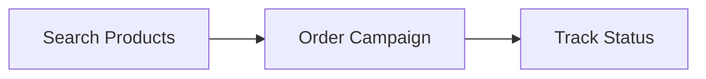

# Introduction

> Single-API access to 2000+ job boards, social platforms, and niche channels-so ATS partners can offer job advertising as a native feature without building individual integrations.

<!-- theme: info -->
> **These docs live in two places, with identical content-pick whichever fits your workflow:**
> - **[Stoplight](https://vonq.stoplight.io/docs/hapi-docs-v2)** - rendered and searchable, with the interactive OpenAPI reference. Best for browsing and exploring.
> - **[GitHub: `vonq/hapi-docs`](https://github.com/vonq/hapi-docs)** - the raw Markdown source. Clone it for offline reading, full-text search, or feeding into AI agents and code tools.

## What is HAPI?

The VONQ Hiring API (HAPI) is a single aggregation layer for global job advertising inventory. It gives ATS providers one REST API to post vacancies across 2000+ pre-contracted channels-job boards, social platforms, aggregators, diversity sites, and niche communities across 28+ countries.

Instead of negotiating contracts and building integrations with each job board individually, ATS partners integrate once with HAPI and gain access to VONQ's entire channel network. HAPI handles per-channel requirements, credential management, posting lifecycle, status tracking, and payments. The entire workflow is white-label-end-users never leave the partner's own UI.

## Who is it For?

HAPI is built for ATS software providers who want to embed job advertising as a native feature in their platform. It is used by 40+ ATS providers worldwide. The API is consumed server-to-server by the ATS backend, or client-side via JWT authentication when building recruiter-facing UIs.

## What HAPI Offers

- **2000+ channels**-search and filter job advertising products by location, industry, job function, and more
- **Contracts & campaigns**-let recruiters post vacancies using their own job board contracts, paid products through VONQ, or both in a single order
- **Lifecycle management**-track posting status, receive webhook notifications, validate data before ordering, edit or cancel live campaigns
- **Wallets & payments**-manage prepaid wallets, top-up flows, and direct charge payments
- **AI features**-auto-suggest vacancy fields (Smartfill) and screen and rank applications (Screening)

## Getting Started

### 1. Get Your Credentials

Contact your VONQ account manager to receive:
- A **secret key** (API token) for server-to-server authentication
- **Sandbox credentials** for safe testing-orders placed in sandbox are not executed or charged

### 2. Verify Your Setup

Confirm your credentials work by calling the ATS user endpoint:

```http
GET https://marketplace-sandbox.api.vonq.com/v3/ats/ats/me/ HTTP/1.1
X-Auth-Token: <your secret key>
```

```json
{
  "id": "f1a2b3c4-d5e6-7890-abcd-ef1234567890",
  "name": "HAPI - DEMO - IGB Prod",
  "hapi_partner_id": "f2a3b4c5-d6e7-8901-bcde-f12345678901"
}
```

### 3. Build Your Integration

The typical integration flow is:



1. **Search products**-find job advertising products filtered by location, job function, and budget. See [Products](./guides/05-products/01-introduction.md).
2. **Order a campaign**-submit vacancy details and selected products in a single call. See [Campaign Ordering](./guides/08-campaigns/ordering.md).
3. **Track status**-poll the campaign or subscribe to webhooks to monitor posting progress. See [Campaign Status](./guides/08-campaigns/status.md).

## Integration Options

| Format | Best For | Key Benefit |
|--------|----------|-------------|
| **HAPI REST API** | Partners with full dev resources | Maximum customization and control |
| **[HAPI Elements](https://docs.elements.hapi.vonq.com/)** | Faster time-to-market | Embeddable UI widgets, up to 80% faster integration |

These docs cover the REST API. HAPI Elements are production-ready, framework-agnostic JavaScript components that handle product search, contract management, and campaign ordering UI out of the box-see the [HAPI Elements docs](https://docs.elements.hapi.vonq.com/) for that integration path.

## Documentation Map

- **Getting Started**
  - [API Overview](./02-api-overview.md)-environments, versioning, pagination, rate limits, error codes
- **Authentication & Users**
  - [Introduction](./guides/03-authentication-and-users/01-introduction.md)-authentication methods overview
  - [Entities](./guides/03-authentication-and-users/entities.md)-ATS, ATSUser, Company, Partner relationships and scopes
  - [Authentication](./guides/03-authentication-and-users/authentication.md)-secret key vs JWT, generating tokens, `X-Customer-Id`
- **Taxonomy**
  - [Taxonomy](./guides/04-taxonomy.md)-job functions, job titles, education levels, seniority, industries, locations
- **Products**
  - [Introduction](./guides/05-products/01-introduction.md)-product types, search-to-delivery flow
  - [Marketplace](./guides/05-products/02-marketplace.md)-product search, details, attributes
  - [Special Products](./guides/05-products/03-special-products.md)-CPA+, bundles, my-contract products
  - [Posting Requirements](./guides/05-products/04-posting-requirements.md)-per-product posting requirement specs
  - [Product Favorites](./guides/05-products/05.favorites.md)-save favorite products and retrieve their details
- **Contracts**
  - [Introduction](./guides/06-contracts/01-introduction.md)-what contracts are, when to use them
  - [Managing Contracts](./guides/06-contracts/managing-contracts.md)-create, edit, delete, contract groups
  - [Ordering](./guides/06-contracts/ordering.md)-ordering with contracts
  - [Posting Requirements](./guides/06-contracts/posting-requirements.md)-per-contract posting requirement specs
  - [Notes](./guides/06-contracts/notes.md)-channel-specific caveats, OAuth, deletion edge cases
- **Posting Requirements**
  - [Introduction](./guides/07-posting-requirements/01-introduction.md)-what posting requirements are, how they surface channel integrations
  - [Facets](./guides/07-posting-requirements/facets.md)-facet object structure, properties, examples
  - [Autocomplete](./guides/07-posting-requirements/autocomplete.md)-dynamic options, dependent facets, multi-term search
  - [Validation](./guides/07-posting-requirements/validation.md)-validating posting requirement values
  - [Smartfill](./guides/07-posting-requirements/smartfill.md)-AI-powered posting requirement suggestions
- **Campaigns**
  - [Introduction](./guides/08-campaigns/01-introduction.md)-campaign types, lifecycle overview
  - [Vacancy Fields](./guides/08-campaigns/vacancy-fields.md)-vacancy object structure
  - [Validation](./guides/08-campaigns/validation.md)-pre-order validation
  - [Ordering](./guides/08-campaigns/ordering.md)-creating campaigns, request structure
  - [Status](./guides/08-campaigns/status.md)-status values, transitions, polling, per-product statuses
  - [Editing](./guides/08-campaigns/editing.md)-updating live campaigns
  - [Cancellation](./guides/08-campaigns/cancellation.md)-campaign vs product cancellation
  - [Webhooks](./guides/08-campaigns/webhooks.md)-campaign notifications
  - [CPA+ Campaigns](./guides/08-campaigns/cpa.md)-cost-per-application campaigns
  - [Bundles](./guides/08-campaigns/bundles.md)-bundle ordering
  - [Smartfill](./guides/08-campaigns/smartfill.md)-AI-powered vacancy field suggestions
- **CPA+**
  - [CPA+](./guides/09-cpa.md)-CPA+ campaigns, applications, attachment downloads
- **Direct Apply**
  - [Introduction](./guides/10-direct-apply/01-introduction.md)-how Direct Apply works
  - [Posting Requirements](./guides/10-direct-apply/posting-requirements.md)-configuring the questionnaire
  - [Webhooks](./guides/10-direct-apply/webhooks.md)-receiving applications
  - [Application Feedback](./guides/10-direct-apply/feedback.md)-sending status updates back to channels
- **Screening**
  - [Introduction](./guides/11-screening/01-introduction.md)-AI screening overview
  - [Jobs & Applications](./guides/11-screening/jobs-and-applications.md)-jobs, applications, dossiers
  - [Webhooks](./guides/11-screening/webhooks.md)-screening notifications
- **Wallets & Payments**
  - [Wallets & Payments](./guides/12-wallets-and-payments.md)-wallets, top-ups, billing portal, payment widget

## External Resources

- [OpenAPI Specification](https://vonq.stoplight.io/docs/hapi-docs-v2/e9ee9e37358b5-hapi)-full interactive API schema on Stoplight
- [Documentation Source on GitHub](https://github.com/vonq/hapi-docs)-the same docs as a cloneable Markdown repository
- [Changelog](./CHANGELOG.md) - notable API and documentation changes per release
- [HAPI Elements Documentation](https://docs.elements.hapi.vonq.com/)-embeddable UI widget integration guide
