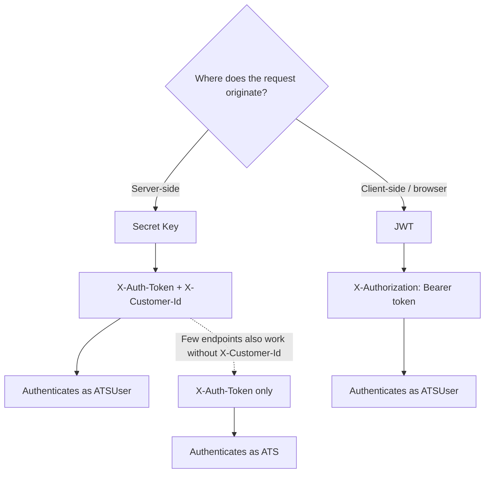

# Authentication & Users

> Two authentication methods, two entity levels-choose the right combination for your integration architecture.

## What is HAPI Authentication?

The VONQ Hiring API (HAPI) identifies who is making a request at two levels: the **partner** (your ATS platform) and the **customer** (an individual recruiter or company using your platform). Every API request must establish at least the partner identity. Most endpoints also require customer identity.

HAPI provides two authentication methods-**secret key** and **JWT**-and two entity levels-**ATS** and **ATSUser**-that combine to cover both server-side and client-side integration scenarios.

## How It Works

Almost all endpoints require customer-level authentication (ATSUser). A few endpoints-such as listing all campaigns across customers-also accept partner-level authentication (ATS) without `X-Customer-Id`.

## Key Concepts

**ATS**-your partner account. Represents your organization's integration with HAPI. Created by VONQ during onboarding. Authenticating as ATS gives partner-level access across all customers.

**ATSUser**-a customer within your partner account. Each unique `customer_id` you pass creates an ATSUser automatically on first use. Represents a recruiter, hiring manager, or company using your platform. Most API operations require this level of authentication.

**Secret key**-a static API token issued by VONQ. Passed via the `X-Auth-Token` header. You receive one key per environment (production and sandbox). Does not expire.

**JWT**-a short-lived signed token generated via the API. Passed via the `X-Authorization` header. Embeds both partner and customer identity into a single token, making it safe to use in client-side code. Must be provisioned for your partner account before use.

**Partner settings**-your partner account has configuration flags that influence how certain features behave (validation strictness, payment model, wallet access, and more). These are managed by VONQ-consult your account manager to review or adjust them.

## What's Next

- [Entities](./entities.md)-ATS and ATSUser relationships, scoping rules, auto-creation behavior
- [Authentication](./authentication.md)-secret key vs JWT in detail, generating tokens, endpoint reference
