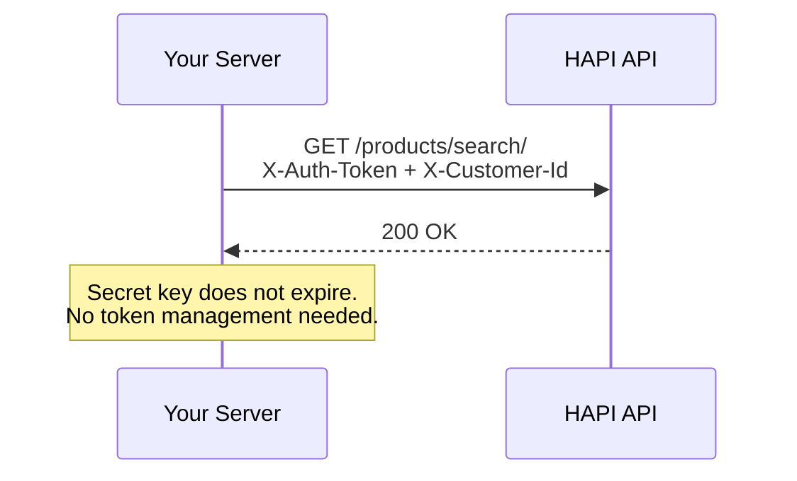
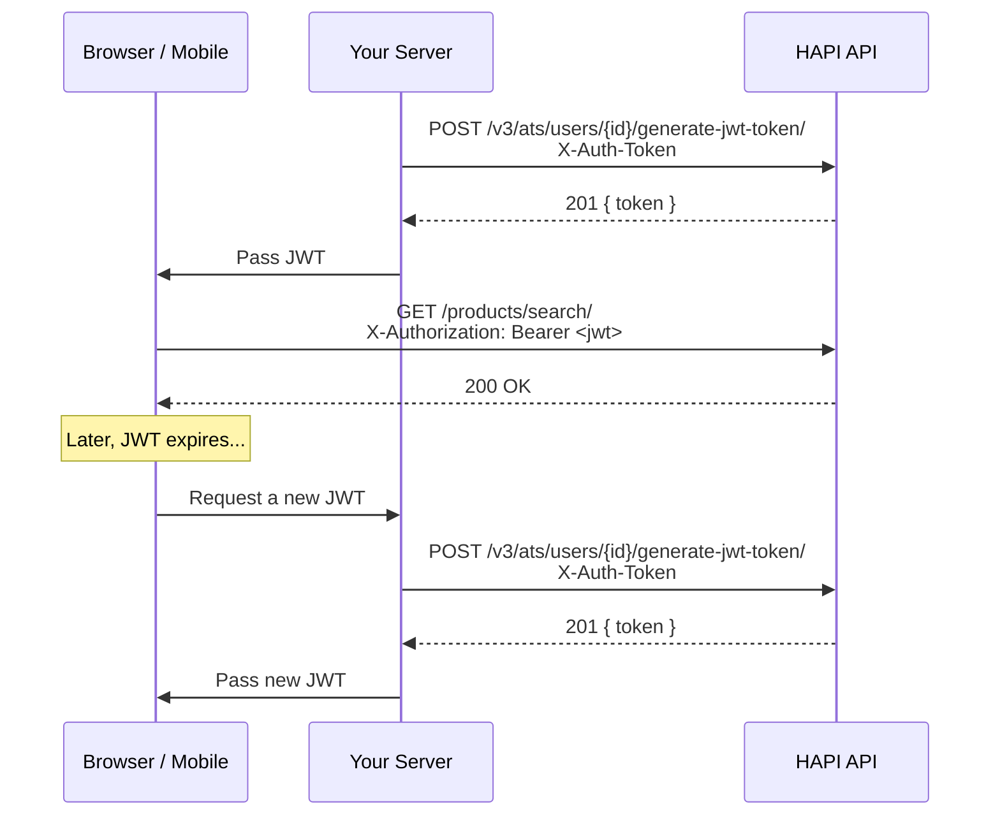

# Authentication

> Secret key for server-to-server, JWT for client-side-choose the method that fits where your requests originate.

## Overview

HAPI supports two authentication methods. The right choice depends on where the API call is made:

- **Secret key**-a static token in the `X-Auth-Token` header. Use from your backend where the key stays confidential.
- **JWT**-a short-lived signed token in the `X-Authorization` header. Use from browsers or mobile apps where exposing a static key would be a security risk.

Both methods identify the **partner** (your ATS). To scope requests to a specific **customer**, either add the `X-Customer-Id` header alongside a secret key, or use a JWT that already embeds the customer identity.

For background on these concepts, see [Authentication & Users-Introduction](./01-introduction.md). For real request/response examples showing each auth level, see [Authentication Examples](./examples/authentication.md).

See [Authentication - Endpoint Reference](./authentication.endpoints.md) for full request/response details.

## Secret Key Authentication

Your secret key is issued by VONQ during onboarding-one for production, one for sandbox. Keys from one environment do not work in the other. The key does not expire.

### Partner-Level (ATS)

Send only `X-Auth-Token` to authenticate as the **ATS**. This gives partner-wide access-for example, listing all campaigns across customers.

Few endpoints accept partner-level authentication. Most require customer-level.

### Customer-Level (ATSUser)

Add `X-Customer-Id` to scope the request to a specific customer. This is required by most endpoints.

The `customer_id` is your own identifier-whatever ID you use in your system (max 255 characters). The first time you pass a new `customer_id`, HAPI creates the ATSUser automatically.

<!-- theme: warning -->
> Omitting `X-Customer-Id` on an endpoint that requires it returns `403 Forbidden` with `"X-Customer-Id header required"`.

## JWT Authentication

JWT authentication is designed for client-side applications where the secret key cannot be safely stored. A JWT embeds both the partner and customer identity into a single signed token.

<!-- theme: info -->
> JWT must be provisioned for your partner account before use. Contact your VONQ account manager to enable it.

### Generating a JWT

Generate a JWT from your server by calling the token endpoint with your secret key. The `{customer_id}` in the path determines which customer the JWT is scoped to.

Treat the `token` value as opaque-store and pass the full string exactly as received.

### Using a JWT

Pass the JWT in the `X-Authorization` header with a `Bearer` prefix. No `X-Auth-Token` or `X-Customer-Id` headers are needed.

<!-- theme: info -->
> The API also accepts `Authorization: Bearer <token>`, but `X-Authorization` is preferred. `X-Authorization` is checked first.

### Expiration

JWTs expire after **7 days** by default. Contact your account manager to configure a custom expiration.

When a JWT expires, the API returns `401` with error code `auth_jwt_expired`:

```json
{
  "error": "JWT has expired"
}
```

When a JWT expires, request a new token from your backend. Your backend should call the generate endpoint again with the partner secret key and the same `customer_id`, then return the new JWT to the client.

## Endpoints

| Endpoint | Auth | Description |
|----------|------|-------------|
| `POST /v3/ats/users/{customer_id}/generate-jwt-token/` | Secret key | Generate a JWT scoped to a specific customer |
| `GET /v3/ats/atsuser/me/` | JWT or secret key + `X-Customer-Id` | Retrieve the authenticated customer's account information |
| `GET /v3/ats/ats/me/` | Secret key (no `X-Customer-Id`) | Retrieve the authenticated partner account information |
| `GET /v3/ats/atsuser/me/settings/` | JWT or secret key + `X-Customer-Id` | Retrieve settings for the authenticated customer |

See [Authentication - Endpoint Reference](./authentication.endpoints.md) for full request/response details.

## Workflows

### Server-to-Server Integration



Store your secret key securely in your backend configuration. Include `X-Auth-Token` on every request and `X-Customer-Id` to scope to a customer. No client-side token management is needed.

### Client-Side Integration (JWT)



### When to Use Which

| Scenario | Method | Headers |
|----------|--------|---------|
| Backend calling HAPI on behalf of a customer | Secret key | `X-Auth-Token` + `X-Customer-Id` |
| Backend listing all campaigns across customers | Secret key | `X-Auth-Token` only |
| JavaScript widget calling HAPI directly | JWT | `X-Authorization: Bearer <jwt>` |
| Mobile app calling HAPI directly | JWT | `X-Authorization: Bearer <jwt>` |

## Edge Cases & Gotchas

<!-- theme: warning -->
> ### Environment mismatch
> Production and sandbox use separate secret keys. A production key will not authenticate against the sandbox environment, and vice versa.

<!-- theme: warning -->
> ### Auto-creation on first use
> Passing a new `customer_id`-whether via `X-Customer-Id` header or in the JWT generate endpoint path-automatically creates the ATSUser. There is no separate "create user" step.

<!-- theme: warning -->
> ### JWT bearer format
> The `X-Authorization` header must follow the exact format `Bearer <token>` (capital B, single space). A malformed header returns `401` with error code `auth_jwt_invalid_bearer`.

## Errors

| Status | Error Code | Cause | Resolution |
|--------|------------|-------|------------|
| `401` | `authentication_failed` | Invalid or missing `X-Auth-Token` | Verify your secret key matches the environment |
| `401` | `auth_jwt_expired` | JWT has expired | Generate a new token from your server |
| `401` | `auth_jwt_invalid_bearer` | Malformed `X-Authorization` header | Use format `Bearer <token>` with exactly one space |
| `403` |-| Missing `X-Customer-Id` on a customer-scoped endpoint | Add the `X-Customer-Id` header |
| `400` |-| JWT not provisioned for partner | Contact your account manager to enable JWT |

## Related

- [Authentication & Users-Introduction](./01-introduction.md)-key concepts, decision diagram
- [Entities](./entities.md)-ATS and ATSUser relationships, scoping rules, auto-creation behavior
