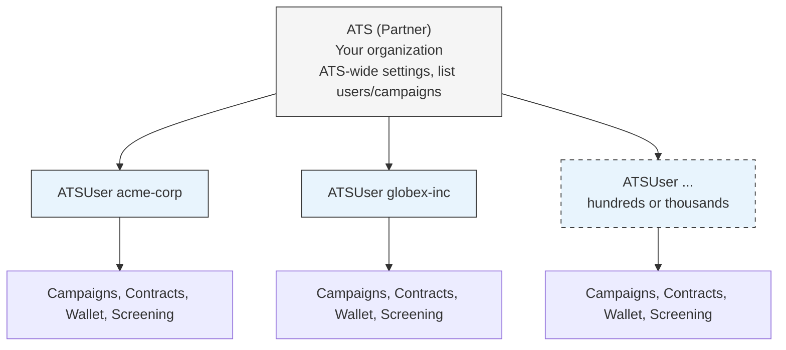
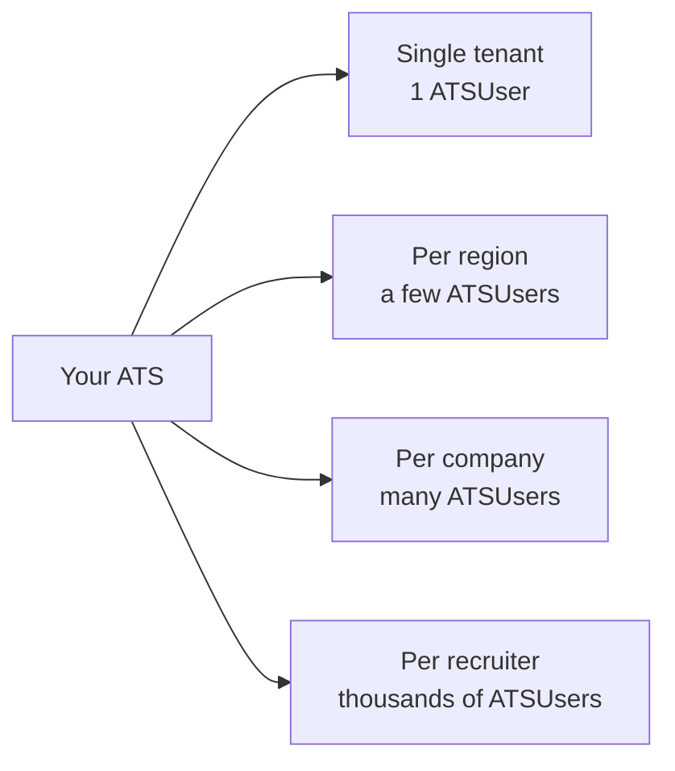

# Entities

> Two entity levels-ATS and ATSUser-determine how resources are scoped and who owns what.

## Overview

Every HAPI integration involves two entity levels: the **ATS** (your partner account) and **ATSUsers** (your customers). The ATS represents your organization. ATSUsers represent the individual recruiters, hiring managers, or companies using your platform. Understanding this relationship is key to correct API usage-it determines what each request can access and how resources like campaigns, contracts, and wallets are owned.

For how these entities map to authentication headers, see [Authentication](./authentication.md).

See [Entities - Endpoint Reference](./entities.endpoints.md) for full request/response details.

## ATS (Partner)

An **ATS** represents your partner account-the top-level entity for your integration with HAPI. VONQ creates your ATS during onboarding and issues a secret key per environment (production and sandbox).

There is one ATS per integration. It serves as the parent for all your customers and their resources.

Certain configurations are ATS-wide-they apply across all your customers. These are managed by VONQ and include things like:

- Payment model and wallet access
- Direct Apply enablement and postback (webhook) URLs
- Validation strictness and ordering restrictions
- Channel availability
- Feature flags (translations, AI suggestions, and more)

## ATSUser (Customer)

An **ATSUser** represents a customer within your partner account. Each ATSUser is identified by a `customer_id`-a string you define (max 255 characters), typically matching the user or account ID in your own system.

### Auto-Creation

ATSUsers are created automatically. The first time you pass an unknown `customer_id`-whether via the `X-Customer-Id` header or the JWT generate endpoint-HAPI creates the ATSUser on the spot. There is no separate provisioning step.

You can also create ATSUsers explicitly using the dedicated endpoint if you prefer to pre-provision them. If the `customer_id` already exists, the existing ATSUser is returned.

### Resource Ownership

Most resources in HAPI are owned by a specific ATSUser. One customer can never access another customer's data.

| Resource | Owned By | Description |
|----------|----------|-------------|
| Campaigns | ATSUser | Job postings ordered through the API |
| Contracts | ATSUser | Agreements with job board channels |
| Contract groups | ATSUser | Groupings of related contracts |
| Wallets | ATSUser | Payment balance for ordering |
| Screening jobs | ATSUser | Candidate screening configurations |

## Entity Hierarchy

Your ATS is the single parent for all ATSUsers. A typical integration has hundreds or thousands of ATSUsers-each one fully isolated with its own campaigns, contracts, and wallet.

The ATS level has access to a limited number of endpoints-primarily listing entities across multiple ATSUsers (e.g., all campaigns, all users). The ATSUser level is where the real work happens: ordering campaigns, managing contracts, checking wallets, and everything else.

## Data Isolation

HAPI enforces strict data isolation between ATSUsers. When you authenticate as a specific customer (via `X-Customer-Id` or JWT), you only see that customer's resources. One ATSUser can never access another's campaigns, contracts, or wallet.

A small number of endpoints support **ATS-level access**-authenticating with only `X-Auth-Token` (no `X-Customer-Id`). This gives a partner-wide view, useful for dashboards or managing users across customers.

| Auth Level | Scope | Use Case |
|------------|-------|----------|
| **ATSUser** (customer) | Only the customer's own resources | Most API calls-ordering, contracts, wallets |
| **ATS** (partner) | Data across all customers | Listing campaigns, managing users |

<!-- theme: warning -->
> ### Always authenticate as ATSUser
> A common integration mistake is making API calls at the ATS level (without `X-Customer-Id`) when you should be authenticating as a specific ATSUser. Most endpoints require customer-level authentication. Only use ATS-level access for cross-customer operations like listing all campaigns or managing users.

## Partitioning Strategies

How you assign `X-Customer-Id` values determines how data is partitioned in HAPI. There is no single right answer-it depends on your platform's architecture and how your customers are structured. The key trade-off: more granular partitioning gives better data isolation, but each ATSUser has its own wallet, contracts, and campaigns.

| Strategy | X-Customer-Id examples | Data isolation | Wallets & contracts |
|----------|----------------------|----------------|---------------------|
| **Single tenant** | `default` | None-all data shared | One wallet, one set of contracts |
| **Per region / datacenter** | `us-east`, `eu-west` | Regional separation | One wallet per region |
| **Per company** | `acme-corp`, `globex-inc` | Company-level-each client gets their own campaigns | One wallet per company |
| **Per recruiter** | `recruiter-jane-42`, `recruiter-bob-99` | Full isolation per person | One wallet per recruiter |

**Choose based on your needs:**

- **Single tenant**-simplest integration. All recruiters share the same campaigns, contracts, and wallet. Good for small platforms or when you don't need data separation in HAPI.
- **Per region**-useful for multi-datacenter platforms with data locality requirements. Each region operates independently.
- **Per company**-the most common strategy. Each of your client companies gets their own ATSUser with separate campaigns, contracts, and wallet. Recruiters within the same company share data.
- **Per recruiter**-maximum isolation. Each recruiter can only see their own campaigns. Useful when recruiters should not see each other's work, but means each recruiter needs their own wallet balance.

<!-- theme: warning -->
> ### Partitioning is effectively permanent
> ATSUsers cannot be deleted or renamed. You can always create new ATSUsers, but if you reorganize an existing user to a different `customer_id`, they lose access to their old campaigns, contracts, and wallet balance in HAPI. Plan your partitioning strategy before going to production.

<!-- theme: info -->
> ### Wallet implications
> Each ATSUser has its own wallet. When using per-recruiter or per-company partitioning, ensure wallets are funded for each ATSUser that needs to order campaigns. Unused wallet balances on inactive ATSUsers are easy to overlook.

## Endpoints

| Endpoint | Auth | Description |
|----------|------|-------------|
| `GET /v3/ats/ats/me/` | Secret key (no `X-Customer-Id`) | Retrieve the authenticated partner account information |
| `GET /v3/ats/atsuser/me/` | JWT or secret key + `X-Customer-Id` | Retrieve the authenticated customer's account information |
| `GET /v3/ats/users/` | Secret key (no `X-Customer-Id`) | List all ATSUsers under your partner account |
| `POST /v3/ats/users/` | Secret key (no `X-Customer-Id`) | Explicitly create an ATSUser |
| `GET /v3/ats/users/{customer_id}/` | Secret key (no `X-Customer-Id`) | Retrieve a specific ATSUser by customer ID |
| `GET /v3/ats/atsuser/me/settings/` | JWT or secret key + `X-Customer-Id` | Retrieve settings for the authenticated customer |

See [Entities - Endpoint Reference](./entities.endpoints.md) for full request/response details.

## Edge Cases & Gotchas

<!-- theme: warning -->
> ### ATSUsers cannot be deleted
> Once an ATSUser is created (whether automatically or explicitly), it cannot be deleted. Choose your `customer_id` values carefully.

<!-- theme: warning -->
> ### customer_id is immutable
> The `customer_id` cannot be changed after creation. If a user's ID changes in your system, you will need to create a new ATSUser.

<!-- theme: info -->
> ### /me/ vs /users/ endpoints
> Use `/me/` endpoints when acting as the authenticated entity (either ATS or ATSUser). Use `/users/` endpoints when managing ATSUsers from a partner-level perspective.

## Related

- [Authentication](./authentication.md)-secret key vs JWT and token generation
- [Authentication & Users-Introduction](./01-introduction.md)-key concepts, decision diagram
