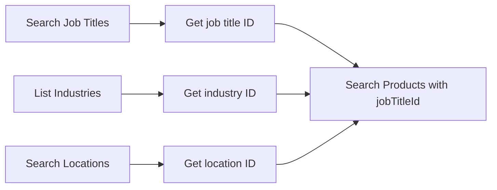

# Taxonomy & Locations

> Standardized classification data and geographic locations-used when searching products, ordering campaigns, and defining target groups.

## What is Taxonomy?

HAPI provides a set of standardized taxonomies that classify jobs by title, industry, education level, and seniority. You use these values in two key areas:

1. **Product search**-filter the marketplace to find job boards relevant to a specific role, industry, or location. See [Products](./05-products/01-introduction.md).
2. **Campaign ordering**-define the target group of a campaign so VONQ can optimize delivery. See [Campaigns](./08-campaigns/01-introduction.md).

Taxonomy values are managed by VONQ - you query them, select the appropriate IDs, and pass those IDs to other endpoints. You never create or modify taxonomy entries.

Locations work the same way: search for a geographic place, get its ID, and use that ID when filtering products or specifying a working location in a campaign.

## Key Concepts

- **Job Title**-a specific role name (e.g., "Software Engineer", "Account Manager"). Each job title belongs to a parent **job function** (e.g., "Engineering", "Sales"). Use job title IDs when searching for products relevant to a vacancy.
- **Industry**-a business sector (e.g., "Technology", "Healthcare"). Use industry IDs to filter products and to specify the target group when ordering a campaign.
- **Education Level**-the minimum educational attainment for a vacancy (e.g., "Bachelor", "Master / Post-Graduate / PhD"). Used in the campaign target group.
- **Seniority**-the career experience level (e.g., "Entry level", "Manager", "Executive/Director"). Used in the campaign target group.
- **Location**-a geographic place identified by an integer ID. Locations follow a hierarchy: a city sits within a region, which sits within a country. Use location IDs when filtering products by geography or specifying where a job is based.

### Localization

Taxonomy endpoints handle translations in two different ways:

| Endpoints | How translations work |
|-----------|----------------------|
| Job titles, industries | Pass an `Accept-Language` header. The response returns a single localized `name` string. See [Localization](../02-api-overview.md#localization). |
| Education levels, seniority | The response includes all translations at once in a multilingual `name` array. No header needed. |
| Locations | Pass an `Accept-Language` header to receive localized place names. See [Localization](../02-api-overview.md#localization). |

Job title search supports `sortBy` values for relevance, usage frequency, and name order. When sorting by name, the API uses the language resolved from `Accept-Language`, defaulting to the project default language.

## Endpoints

This guide covers the following endpoints. See [Taxonomy & Locations - Endpoint Reference](./04-taxonomy.endpoints.md) for full request/response details.

| Endpoint | Purpose |
|----------|---------|
| `GET /products/job-titles/` | Search job titles by text |
| `GET /products/industries/` | List all industries |
| `GET /products/job-functions/` | List job function tree |
| `GET /taxonomy/education-levels` | List education levels (multilingual) |
| `GET /taxonomy/seniority` | List seniority levels (multilingual) |
| `GET /products/location/search/` | Search locations by name |

## Workflows

### Using Taxonomy in Product Search

When searching for products, use taxonomy IDs to filter results by relevance:




Pass taxonomy and location IDs as query parameters to the product search endpoint:

```http
GET https://marketplace.api.vonq.com/products/search/?jobTitleId=2&industryId=8&includeLocationId=1234 HTTP/1.1
X-Auth-Token: <your Partner token here>
X-Customer-Id: customer-123
```

Two location filters are available:

| Parameter | Behavior |
|-----------|----------|
| `includeLocationId` | Matches products targeting this location **or** parent/nearby locations. Broader results. |
| `exactLocationId` | Matches only products targeting this **exact** location. Narrower results. |

See [Products](./05-products/02-marketplace.md) for the full product search documentation.

### Using Taxonomy in Campaign Ordering

When ordering a campaign, the `targetGroup` field references taxonomy values by their `vonqId` (the `id` from the respective taxonomy endpoint) and a `description` (the human-readable name). HAPI partners normally populate `educationLevel`, `seniority`, and `industry`; `jobCategory` is a compatibility field and should be left empty unless VONQ explicitly provides a value for your integration.

```json
{
  "targetGroup": {
    "educationLevel": [
      { "vonqId": "2", "description": "Bachelor / Graduate" }
    ],
    "seniority": [
      { "vonqId": "3", "description": "Mid-Senior level" }
    ],
    "industry": [
      { "vonqId": "48", "description": "Academic" }
    ],
    "jobCategory": []
  }
}
```

Each populated target group dimension is an array that enforces a maximum of **one item**. Pass an array with a single object where you have a supported taxonomy value.

<!-- theme: info -->
> ### `vonqId` type
> The `vonqId` value is numeric but should be passed as a **string** (e.g., `"12"`, not `12`). The API accepts both strings and integers, but the schema type is string.

<!-- theme: warning -->
> ### Use recognized labels for `description`
> The API validates `vonqId`; `description` is a display label and is not used for matching. Use the name returned by the corresponding taxonomy endpoint so downstream systems and users see the expected label. For example:
> - Seniority `3` expects `"Mid-Senior level"` (from `GET /taxonomy/seniority`)
> - Education level `2` expects `"Bachelor / Graduate"` (from `GET /taxonomy/education-levels`)
>
> When in doubt, validate with `POST /campaigns/validate-vacancy-info/`.

See [Campaign Ordering](./08-campaigns/ordering.md) for the full ordering workflow.

## Edge Cases & Gotchas

<!-- theme: warning -->
> ### Job titles require a search query
> `GET /products/job-titles/` requires the `text` parameter. You cannot list all job titles-you must search by text.

<!-- theme: info -->
> ### Job title name sorting follows `Accept-Language`
> Use `sortBy=name.asc` or `sortBy=name.desc` to sort matching job titles by localized name. The API chooses the sort language from `Accept-Language`; clients should only send these public sort values.

<!-- theme: info -->
> ### Location search
> `GET /products/location/search/` returns the full hierarchy with nested `within` objects, including geographic context via the `place_type` and `within` fields.

<!-- theme: info -->
> ### Multilingual response formats differ
> Job titles and industries return a single localized string controlled by the `Accept-Language` header. Education levels, seniority, and job categories return all translations at once in a multilingual array. Check which format the endpoint uses before parsing the response.

## Related

- [Products](./05-products/01-introduction.md)-product search using taxonomy filters (`jobTitleId`, `industryId`, `includeLocationId`)
- [Campaign Ordering](./08-campaigns/ordering.md)-using taxonomy IDs in the `targetGroup` field
- [Product Categories](./05-products/02-marketplace.md)-product type categories for filtering the marketplace
- [Smartfill](./07-posting-requirements/smartfill.md)-AI-powered suggestions for taxonomy values based on vacancy text
