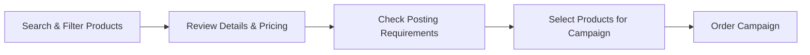

# Products

> Browse, filter, and select job advertising channels from VONQ's marketplace-the starting point for every campaign.

## What are Products?

In HAPI, a **product** represents a job advertising slot on a specific **channel**-a job board, social media platform, community site, or other publishing destination. When you order a campaign, you select one or more products to post your vacancy to. VONQ manages the relationship with the channels, handles delivery, and tracks performance.

Products come in two ordering models:

- **Job Marketing**-you pay VONQ per posting. No setup required with the channel itself. Most products work this way.
- **My Contract (MC)**-you use your own contract with a channel (e.g., your company's LinkedIn or Indeed account). You provide your credentials to VONQ, and VONQ posts on your behalf using your contract. See [Contracts](../06-contracts/01-introduction.md).

Beyond standard products, VONQ offers **bundles** (curated sets of channels sold together at a better price) and **CPA+ products** (cost-per-application pricing where you pay for received applications, not postings). See [Special Products](./03-special-products.md).

## How It Works

1. **Search the catalog**-filter by location, industry, job title, or channel name to find relevant products for your vacancy.
2. **Review product details**-check pricing, posting duration, delivery time, and channel information.
3. **Check posting requirements**-some channels require additional fields (e.g., office location, job category). Retrieve these before ordering.
4. **Select products**-add one or more products to your campaign.
5. **Order**-submit the campaign with your selected products. VONQ handles delivery to each channel.

## Key Concepts

- **Product**-a purchasable job advertising slot on a channel. Defined by pricing, duration, target audience, and posting requirements.
- **Channel**-the underlying job board or platform (e.g., Indeed, LinkedIn, Stepstone). A single channel can offer multiple products at different pricing tiers.
- **Job Marketing vs My Contract**-Job Marketing products are paid per posting through VONQ. My Contract products use your existing channel contract-the product has `mc_enabled: true`, and you provide contract credentials when ordering.
- **Posting requirements**-channel-specific fields (called **facets**) that must be filled when ordering a product. Examples: country, city, job description format. Not every product has them-check `has_product_specs` on the product object. See [Posting Requirements](../07-posting-requirements/01-introduction.md).
- **Bundle**-a curated set of products sold together, typically at a better price than ordering each individually. During ordering, a bundle is split into its individual products. See [Special Products](./03-special-products.md).
- **CPA+ product**-a cost-per-application product where you pay for actual applications rather than a fixed posting fee. See [Special Products](./03-special-products.md).

### Pricing

Products include two prices:

- **`vonq_price`**-the price VONQ charges the partner. This is your cost.
- **`ratecard_price`**-the suggested retail price. Partners typically display this to their end customers.

Each price entry includes an `amount` (in the currency's standard unit, e.g., euros, not cents) and a `currency` (ISO-4217 code). Products may have prices in multiple currencies.

### Product Availability

Not every product in VONQ's catalog is available to every partner:

- Products can be **removed or disabled** from the catalog at any time-they disappear from search results. Your integration should handle products becoming unavailable without prior notice.
- Some products are **seasonally or temporarily unavailable**. A product with `allow_orders: false` is visible in search results but cannot be ordered.
- Certain products may require **partner-level enablement**-they exist in the VONQ portfolio but are not available to your ATS until specific onboarding is completed. Contact your account manager if you see products in the marketplace that you cannot order.

## What's Next

| Page | What it covers |
|------|---------------|
| [Marketplace](./02-marketplace.md) | Searching, filtering, and retrieving product details-the product search endpoint, single/multiple product lookup, delivery time estimation |
| [Special Products](./03-special-products.md) | Bundles and CPA+ products |
| [Posting Requirements](./04-posting-requirements.md) | Product-level posting requirements (specs), facet types, and autocomplete |
