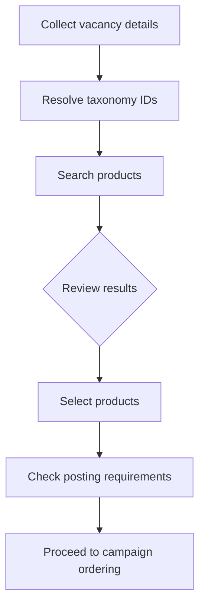

# Marketplace

> Search, filter, and retrieve products from VONQ's job advertising catalog.

## Overview

The marketplace is HAPI's product catalog-a searchable collection of job advertising channels available for campaign ordering. Use the product search endpoint to find relevant channels for a vacancy, then retrieve details for individual products or fetch multiple products at once.

For background on what products are and how they fit into the ordering flow, see [Products-Introduction](./01-introduction.md).

## Endpoints

| Endpoint | Description |
|----------|-------------|
| `GET /products/search/` | Search and filter the product catalog |
| `GET /products/single/{product_id}/` | Retrieve full details for a single product |
| `GET /products/multiple/{products_ids_or_portfolio_id}/` | Retrieve details for multiple products, favorites, top-ordered products, or a portfolio selector |
| `GET /products/delivery-time/{products_ids}/` | Retrieve combined delivery timing for one or more products |

See [Marketplace - Endpoint Reference](./02-marketplace.endpoints.md) for full request/response details.

## Product Search

Use `GET /products/search/` to find channels relevant to a vacancy. The endpoint accepts filters for location, job function, industry, duration, price, and more. Results are paginated and ranked by relevance.

Localized results are available via the `Accept-Language` header. See [Localization](../../02-api-overview.md#localization).

To find taxonomy IDs for search filters, see [Taxonomy & Locations](../04-taxonomy.md).

### Personalizing page 1: favorites & top-ordered

The product search can optionally prepend the authenticated ATS user's own products to the top of the first page. Two opt-in query parameters control this:

- `injectFavorites=true`-prepends the user's favorite products (most recently favorited first).
- `injectTopOrdered=<window>`-prepends the user's most-ordered products for a given time window. Accepted values: `1w`, `1m`, `6m`, `12m`.

Both parameters can be combined in the same request. When both are set, favorites come first, then top-ordered, with duplicates removed (a product that is both favorited and top-ordered appears once, in the favorites position).

Behavior notes:

- **ATS users only.** The parameters are silently ignored for JMP, HAPI, and unauthenticated requests.
- **Page 1 only.** Injection applies when `offset=0`. Later offsets do not prepend injected products; keep the inject parameters on pagination requests so promoted products stay excluded from the regular result stream.
- **Capped per source.** Each source is limited to at most 10 products (most recent for favorites, highest-count first for top-ordered). When both params are set the response injects at most 20 products (before dedup).
- **Filters are not applied to injected products.** A favorite or top-ordered product shows up on page 1 regardless of the other filters in the query (e.g., `jobFunctionId`, `includeLocationId`). Use this to ensure the user always sees their frequently-used channels.
- **Excluded from the main results to avoid duplicates.** An injected product that would also have matched the search is removed from the regular paginated result stream.
- **`count` reflects the non-injected results.** The paginated response's `count` does not include the injected products. If your UI needs a total, add the injected count on the client.

Example-search for products in a given job function, with the user's favorites prepended:

```http
GET /products/search/?jobFunctionId=18&limit=24&offset=0&injectFavorites=true
```

---

## Product Details

Use `GET /products/single/{product_id}/` to fetch full details for one product.

Use `GET /products/multiple/{products_ids_or_portfolio_id}/` when your UI needs a list of product objects from a known selector. The value is passed in the URL path, not as a query parameter.

Supported selector values:

| Selector | Example | Result |
|----------|---------|--------|
| Comma-separated product IDs | `/products/multiple/id-1,id-2/` | Product details for up to 50 IDs, returned in the requested order with duplicates removed |
| `favorites` | `/products/multiple/favorites/` | Product details for the authenticated ATS user's favorite products, newest favorite first |
| `orders-top-{window}` | `/products/multiple/orders-top-6m/` | Product details for the user's most-ordered products in the selected window |
| Portfolio selector UUID | `/products/multiple/550e8400-e29b-41d4-a716-446655440000/` | Product details for a pre-configured portfolio selector |

Top-ordered windows are `1w`, `1m`, `6m`, and `12m`: `orders-top-1w`, `orders-top-1m`, `orders-top-6m`, and `orders-top-12m`.

<!-- theme: warning -->
> Do not send `products_ids_or_portfolio_id` as a query parameter. The API expects this selector only in the URL path and returns `400` when it is also sent as a query parameter. The legacy typo `product_ids_or_portfolio_id` is rejected the same way.

Favorites and top-ordered selectors require ATS-user authentication. To add or remove favorites, use the dedicated [Product Favorites](./05.favorites.md) endpoints first; the multiple endpoint only returns the corresponding full product details.

---

## Product Object Reference

| Field | Type | Description |
|-------|------|-------------|
| `product_id` | string | Unique product identifier (UUID or numeric string) |
| `title` | string | Display name |
| `description` | string | Product description |
| `homepage` | string | Channel homepage URL |
| `type` | string | Channel type (see [Channel Types](#channel-types)) |
| `allow_orders` | boolean | Whether the product is currently orderable |
| `allows_edit` | boolean | Whether campaigns with this product can be edited after ordering |
| `mc_enabled` | boolean | Whether the channel supports [My Contract](../06-contracts/01-introduction.md) ordering |
| `mc_only` | boolean | Whether the product can **only** be ordered via a contract (see [Contract-Only Products](#contract-only-products)) |
| `has_product_specs` | boolean | Whether posting requirements are available via the `/specs/` endpoint |
| `product_specs` | object \| null | Validation configuration for posting requirements (see [Product Specs](#product-specs)) |
| `duration` | object | Posting duration-`period` (integer) and `range` (`"days"`) |
| `time_to_process` | object | Processing time after ordering-`period` (integer) and `range` (`"hours"` or `"days"`) |
| `time_to_setup` | object | First-order setup time-`period` (integer) and `range` (`"hours"` or `"days"`) |
| `vonq_price` | array | VONQ's price to the partner-`amount` (number) and `currency` (ISO-4217) |
| `ratecard_price` | array | Suggested retail price-`amount` (number) and `currency` (ISO-4217) |
| `channel` | object | Channel info-`id`, `name`, `url`, `type` |
| `locations` | array | Target locations-`id` and `canonical_name` |
| `job_functions` | array | Target job functions-`id` and `name` |
| `industries` | array | Target industries-`id` and `name` |
| `audience_group` | string | Target audience classification-`"generic"` (broad reach) or `"niche"` (specialized audience) |
| `cross_postings` | array | Other channels this product cross-posts to-the vacancy may appear on additional platforms beyond the primary channel |
| `logo_url` | array | Logo URLs-`url` |
| `logo_square_url` | array | Square logos-`url` and `size` (e.g., `"68x68"`) |
| `logo_rectangle_url` | array | Rectangle logos-`url` and `size` (e.g., `"270x90"`) |
| `cpa` | object \| null | CPA pricing info if applicable-see [Special Products](./03-special-products.md) |
| `bundle_products_ids` | array | Product IDs included in this bundle (empty for non-bundle products)-see [Special Products](./03-special-products.md) |

### Channel Types

| Value | Description |
|-------|-------------|
| `job board` | Traditional job board (e.g., Indeed, Stepstone) |
| `social media` | Social media platform (e.g., LinkedIn, Facebook) |
| `community` | Professional or niche community |
| `publication` | Online publication or magazine |
| `aggregator` | Job aggregator that collects listings from multiple sources |
| `service` | Recruitment service or agency |
| `product_bundle` | Bundle of multiple products sold together |

### Product Specs

The `product_specs` object provides validation configuration for a product's posting requirements. It is always present on the product object but can be `null`.

| Field | Type | Description |
|-------|------|-------------|
| `validation_disabled` | boolean | When `true`, posting requirements for this product are not validated during ordering |
| `validation_optional` | boolean | When `true`, posting requirements can be submitted but are not required-the order succeeds even without them |

Use these fields to decide whether to collect and validate posting requirements in your UI:

- `product_specs: null` and `has_product_specs: false`-no posting requirements exist for this product.
- `has_product_specs: true` and `validation_optional: false`-posting requirements exist and are enforced. Fetch them via `GET /products/{product_id}/specs/` and collect values before ordering.
- `has_product_specs: true` and `validation_optional: true`-posting requirements exist but are optional. You can skip them and still order successfully.
- `validation_disabled: true`-posting requirements are not validated at all, even if submitted.

See [Posting Requirements](./04-posting-requirements.md) for how to retrieve and work with product specs.

### Contract-Only Products

Products with `mc_only: true` can only be ordered through a [My Contract](../06-contracts/01-introduction.md) arrangement.

<!-- theme: danger -->
> ### MC-Only Products Are Not in the Marketplace Search
>
> The product search endpoint (`GET /products/search/`) filters out `mc_only` products server-side. You will not find them in search results. The only way to obtain an MC product's `product_id` is from the contract object: call `GET /contracts/{contract_id}/` (or compatibility alias `GET /contracts/single/{contract_id}/`) and read `product.product_id`. This is the UUID you use in `orderedProducts` and `orderedProductsSpecs` when ordering.

To find channels that support contracts, filter the product search with `mcEnabled=true`, or use the dedicated channel browsing endpoints described in [Contracts](../06-contracts/managing-contracts.md).

### Delivery Time

Each product includes estimated delivery timing:

| Field | Description |
|-------|-------------|
| `time_to_process` | How long VONQ takes to process the order after submission |
| `time_to_setup` | Additional setup time for first-time orders on a channel. Subsequent orders on the same channel typically have zero setup time. |
| `duration` | How long the job posting stays live on the channel |

These are per-product estimates. To retrieve the combined delivery time for a selected group of products, call `GET /products/delivery-time/{products_ids}/` with a comma-separated list of product IDs in the path. For how delivery timing fits into ordering, see [Campaign Ordering](../08-campaigns/ordering.md).

## Workflows

### Searching and Selecting Products



1. **Collect vacancy details**-job title, location, industry from the user. These map to HAPI taxonomy values, which have their own dedicated endpoints and IDs separate from your internal data model.
2. **Resolve taxonomy IDs**-use [Taxonomy](../04-taxonomy.md) endpoints to convert user input into HAPI taxonomy IDs (`jobTitleId`, `includeLocationId`, `industryId`). These IDs are also used separately in the campaign `targetGroup` when ordering.
3. **Search products**-call `GET /products/search/` with the taxonomy IDs as filters.
4. **Review results**-display products with pricing, duration, and channel info. Filter out products with `allow_orders: false`.
5. **Select products**-the user picks one or more products for their campaign.
6. **Check posting requirements**-for products with `has_product_specs: true`, fetch specs via `GET /products/{product_id}/specs/`. See [Posting Requirements](./04-posting-requirements.md).
7. **Proceed to ordering**-pass selected product IDs and filled posting requirements to the campaign order. See [Campaign Ordering](../08-campaigns/ordering.md).

## Edge Cases & Gotchas

<!-- theme: warning -->
> ### Products with `allow_orders: false`
> These products appear in search results but cannot be ordered. Always check this field before presenting a product as orderable.

<!-- theme: warning -->
> ### `mc_only` products require a contract
> Products with `mc_only: true` cannot be ordered as Job Marketing products. You must have an active contract for the channel. See [Contracts](../06-contracts/01-introduction.md).

<!-- theme: warning -->
> ### `jobFunctionId` and `jobTitleId` are mutually exclusive
> If both are provided in a search request, the API returns a `400` error. Use one or the other, never both.

<!-- theme: info -->
> ### Pricing in multiple currencies
> The `vonq_price` and `ratecard_price` arrays may contain entries in multiple currencies. Filter by the `currency` search parameter or select the appropriate entry from the array for your market.

## Related

- [Products-Introduction](./01-introduction.md)-overview of products, ordering models, and pricing
- [Special Products](./03-special-products.md)-bundles and CPA+ products
- [Posting Requirements](./04-posting-requirements.md)-retrieving and working with product specs and facets
- [Product Favorites](./05.favorites.md)-saving favorite products and retrieving their details
- [Taxonomy & Locations](../04-taxonomy.md)-resolving IDs for product search filters
- [Contracts](../06-contracts/01-introduction.md)-creating contracts for My Contract products
- [Campaign Ordering](../08-campaigns/ordering.md)-using products in campaign orders
