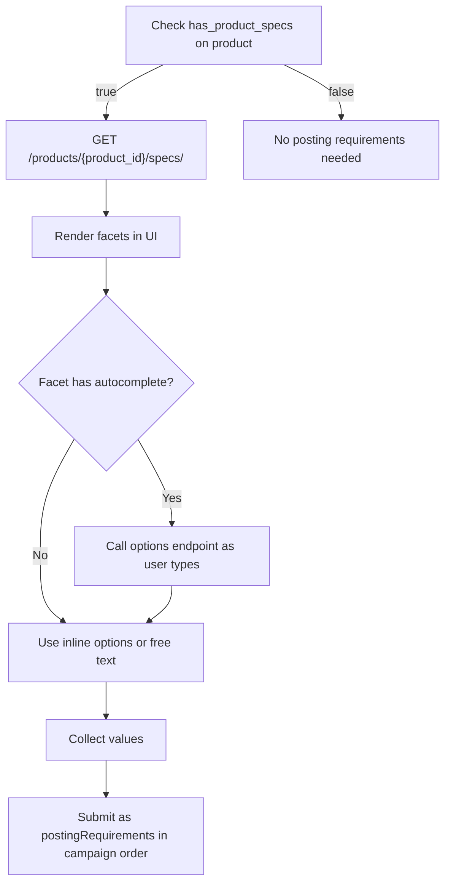

# Product Posting Requirements

> Retrieve channel-specific fields that must be filled when ordering a product-the bridge between selecting a product and submitting a campaign.

## Overview

Some HAPI products require additional channel-specific information before they can be ordered. These are called **posting requirements**-fields like country, city, job description format, or industry-specific categories that the channel needs to publish your job listing.

Not every product has posting requirements. Check the `has_product_specs` field on the [product object](./02-marketplace.md#product-object-reference) to determine whether a product requires them. Also check `product_specs` to understand whether filling them is mandatory or optional-see [Product Specs](./02-marketplace.md#product-specs).

For a detailed breakdown of facet types, validation rules, and display logic, see the dedicated [Posting Requirements](../07-posting-requirements/01-introduction.md) section.

## Endpoints

| Endpoint | Description |
|----------|-------------|
| `GET /products/{product_id}/specs/` | Retrieve posting requirements (facets) for a product |
| `GET/POST /products/{product_id}/specs/facets/{facet_name}/options/` | Fetch autocomplete suggestions for a facet field |

See [Product Posting Requirements - Endpoint Reference](./04-posting-requirements.endpoints.md) for full request/response details.

## Facet Structure

Each entry in `posting_requirements` describes a single field:

| Field | Type | Description |
|-------|------|-------------|
| `name` | string | Facet identifier-this is the key you use in `postingRequirements` when ordering a campaign |
| `label` | string | Display label for the UI |
| `sort` | string | Sort order for display (lower values first) |
| `required` | boolean | Whether this field must be filled |
| `type` | string | Facet type (see [Facet Types](#facet-types)) |
| `options` | array | Predefined options for selection types. May be empty for autocomplete or lazy-loaded facets. |
| `rules` | array | Validation rules (see [Validation](../07-posting-requirements/validation.md)) |
| `message` | string \| null | Help or instruction text to display to the user |
| `autocomplete` | object \| null | Autocomplete configuration. Non-null means the facet supports search-as-you-type via the options endpoint. |
| `display_rules` | object \| null | Conditional display rules-show/hide this facet based on other facet values (see [Facets - Display Rules](../07-posting-requirements/facets-display-rules.md)) |

### Facet Types

| Type | Description | UI Element |
|------|-------------|------------|
| `TEXT` | Free-text input | Single-line text field |
| `TEXTAREA` | Multi-line text input | Multi-line text area |
| `HTMLAREA` | Rich text input (HTML content) | Rich text editor |
| `TEXTEXPAND` | Expandable text field | Text field with expand option |
| `SELECT` | Single-select from predefined options | Dropdown |
| `MULTIPLE` | Multi-select from predefined options | Multi-select dropdown or checkboxes |
| `HIER` | Hierarchical select with parent-child options | Nested dropdown (e.g., "Italy > Lazio > Rome") |
| `AUTOCOMPLETE` | Search-as-you-type field backed by the options endpoint | Search input with suggestions |
| `DATE` | Date picker | Date input |
| `STATISCH` | Non-editable informational text-display only, do not submit | Static text display |
| `QUESTIONNAIRE` | Structured questionnaire format | Custom questionnaire UI |

For detailed guidance on rendering each facet type, handling options, display rules, and autocomplete patterns, see [Facets](../07-posting-requirements/facets.md).

## Workflows

### Retrieving and Using Product Specs

1. **Check the product**-if `has_product_specs` is `false`, the product has no posting requirements. If `product_specs.validation_optional` is `true`, posting requirements exist but are optional.
2. **Fetch specs**-call `GET /products/{product_id}/specs/` to get the list of facets.
3. **Render facets**-display each facet based on its `type`, ordered by `sort`. Show the `label` and any `message` text.
4. **Handle autocomplete**-for facets with a non-null `autocomplete` object, call the options endpoint as the user types.
5. **Apply display rules**-some facets are conditionally shown based on other facet values. See [Facets - Display Rules](../07-posting-requirements/facets-display-rules.md) for operators, cascading visibility, and implementation guidance.
6. **Collect and submit**-pass the collected values as `postingRequirements` in `orderedProductsSpecs` when ordering the campaign. See [Campaign Ordering](../08-campaigns/ordering.md).

## Edge Cases & Gotchas

<!-- theme: warning -->
> ### Always check `has_product_specs` first
> Calling `/specs/` on a product without posting requirements returns an empty or minimal response. Check `has_product_specs` before making the call.

<!-- theme: info -->
> ### `STATISCH` facets are display-only
> Facets with type `STATISCH` are informational text from the channel. Display them to the user but do not submit values for them.

<!-- theme: warning -->
> ### Autocomplete facets may depend on other fields
> Some autocomplete facets require values from other facets as context (e.g., a city autocomplete may depend on the selected country). Check the `autocomplete.required_parameters` to understand dependencies.

## Related

- [Marketplace](./02-marketplace.md)-product search and the `has_product_specs` / `product_specs` fields
- [Facets](../07-posting-requirements/facets.md)-detailed guide to facet types, options, and rendering
- [Facets - Display Rules](../07-posting-requirements/facets-display-rules.md)-conditional visibility, operators, cascading rules, implementation guide
- [Validation](../07-posting-requirements/validation.md)-validation rules and client-side validation
- [Smartfill](../07-posting-requirements/smartfill.md)-AI-powered autofill for posting requirement values
- [Campaign Ordering](../08-campaigns/ordering.md)-submitting posting requirements in `orderedProductsSpecs`
