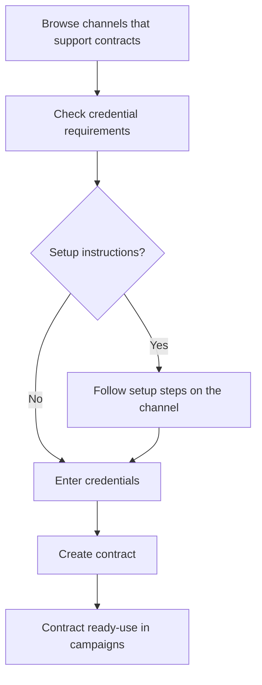

# Contracts

> Connect your own job board accounts to VONQ-store credentials, manage connections, and order using your existing channel subscriptions.

## What are Contracts?

A **contract** is a stored connection between an ATSUser and a job board channel. It holds the credentials needed to post jobs through that channel using your own account-this is the **My Contract** ordering model.

Not every channel requires a contract. Most products use the **Job Marketing** model, where VONQ manages the channel relationship and you simply pay per posting. Contracts are only needed for channels that support the My Contract flow-channels where you bring your own account (e.g., your company's SEEK, Indeed, or Stepstone subscription).

Contracts solve a practical problem: instead of entering channel credentials every time you order, you store them once and reuse them across campaigns. VONQ encrypts and secures the credentials, and handles the posting on your behalf.

## How It Works

1. **Discover channels**-browse channels that support My Contract ordering using the MOC (Multi-Order Channel) endpoints. Not all channels support this-only those with `mc_enabled: true`.
2. **Check requirements**-each channel has different credential fields (e.g., organization ID, API key, email). Some channels require manual setup steps before you can create a contract.
3. **Create the contract**-submit your credentials. VONQ can optionally validate them against the channel to catch errors early.
4. **Use in campaigns**-when ordering a campaign, reference the contract ID alongside the product. VONQ posts the job using your stored credentials.

## Key Concepts

- **Contract**-a stored set of encrypted credentials for a specific channel, owned by an ATSUser. Required when ordering My Contract products.
- **Channel MOC** (Multi-Order Channel)-a channel that supports the My Contract flow. The MOC endpoints provide credential field definitions and setup instructions.
- **Contract credentials**-the authentication fields a channel requires (e.g., `organization_id`, `email`, `api_key`). These vary per channel and are defined in the channel MOC details.
- **Credential validation**-VONQ can validate credentials against the channel during contract creation by setting `credentials_validation: "if_supported"`. If the channel doesn't support validation, the contract is created anyway.
- **Contract group**-an organizational container for contracts. Every ATSUser has a default group, and additional groups can be created. When ordering a campaign, all contracts used must belong to the same group.
- **Posting requirements**-contracts also expose channel-specific posting requirement fields (facets) that must be filled when ordering. These use a dedicated autocomplete endpoint separate from the product specs endpoint.
- **`mc_enabled` / `mc_only`**-`mc_enabled` on a channel means it supports contracts. `mc_only` on a product means it can **only** be ordered via a contract, not as a Job Marketing product.

## What's Next

| Page | What it covers |
|------|---------------|
| [Managing Contracts](./managing-contracts.md) | Browsing channels (MOC endpoints), creating, updating, and deleting contracts, contract groups |
| [Ordering](./ordering.md) | How to order campaigns using contracts-`contractId` in `orderedProductsSpecs`, posting requirements |
| [Posting Requirements](./posting-requirements.md) | Contract-specific posting requirements and the autocomplete endpoint |
| [Notes](./notes.md) | Channel-specific caveats, OAuth credentials, deletion edge cases |
