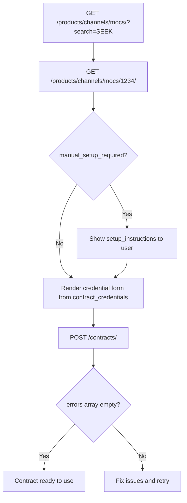
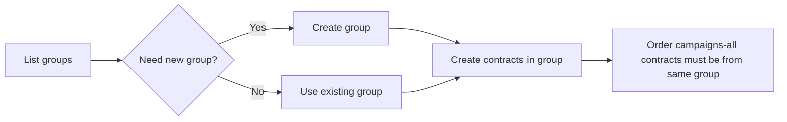

# Managing Contracts

> Browse channels that support contracts, create and manage contract connections, and organize them into groups.

## Overview

This page covers the full lifecycle of contracts: discovering which channels support the My Contract flow, creating contracts with credentials, updating and deleting them, and organizing contracts into groups. For background on what contracts are, see [Contracts-Introduction](./01-introduction.md).

See [Managing Contracts - Endpoint Reference](./managing-contracts.endpoints.md) for full request/response details.

## Channel Discovery (MOC Endpoints)

Before creating a contract, you need to find which channels support My Contract ordering and what credentials they require. The MOC (My Own Contract) endpoints provide this.

Use `GET /products/channels/mocs/` to list channels that support contracts, then `GET /products/channels/mocs/{id}/` to retrieve full details including credential field definitions, setup instructions, and posting requirements. The detail call is essential before creating a contract - it tells you exactly what the user needs to provide.

**Rendering the credential form** from the `contract_credentials` array returned by the detail endpoint:
- `url` is present → use an OAuth redirect flow (see [Notes](./notes.md))
- `options` is present → render a dropdown select
- Otherwise → render a text input

| Endpoint | Purpose |
|----------|---------|
| `GET /products/channels/mocs/` | List channels that support contracts (supports `search`, `limit`, `offset`) |
| `GET /products/channels/mocs/{id}/` | Full channel details: credential fields, setup instructions, posting requirements |

## Contract CRUD

Every contract belongs to a customer and stores encrypted credentials for a specific channel. The list endpoint returns summary objects; use the single or multiple detail endpoints for full contract objects including `credentials` and `posting_requirements`.

| Endpoint | Purpose |
|----------|---------|
| `GET /contracts/` | List all contracts (supports `channel_id`, `channel_name`, `label`, `group_id` filters) |
| `POST /contracts/` | Create a new contract |
| `GET /contracts/single/{contract_id}/` | Full contract details including masked credentials and posting requirements |
| `GET /contracts/multiple/{contracts_ids}/` | Full details for multiple contracts (comma-separated IDs, max 50) |
| `PATCH /contracts/single/{contract_id}/` | Update `alias`, `credentials`, `labels`, `credentials_validation`, `posting_requirements_defaults`, or `posting_duration_days` |
| `DELETE /contracts/{contract_id}/` | Delete a contract (irreversible - see Edge Cases) |

Key behaviors:
- Credentials are stored encrypted. The API returns encrypted values for text-input credentials and plaintext for dropdown-selection credentials.
- Each channel requires different credential fields. Always check the channel MOC details first.
- The `credentials_validation: "if_supported"` option validates credentials against the channel at creation time.
- `followed_instructions: true` is required when the channel has `manual_setup_required: true`.
- Only `alias`, `credentials`, `labels`, `credentials_validation`, `posting_requirements_defaults`, and `posting_duration_days` can be updated after creation. All other fields are immutable.

## Contract Groups

Contract groups organize contracts into named categories. Every ATSUser has a default group (idx `0`). When ordering a campaign with multiple My Contract products, all contracts used must belong to the same group.

| Endpoint | Purpose |
|----------|---------|
| `GET /igb/contracts/groups/` | List all contract groups |
| `POST /igb/contracts/groups/` | Create a new group |
| `GET /igb/contracts/groups/{group_idx}/` | Retrieve a single group by index |
| `PUT /igb/contracts/groups/{group_idx}/` | Replace a group's name |
| `PATCH /igb/contracts/groups/{group_idx}/` | Partially update a group |
| `DELETE /igb/contracts/groups/{group_idx}/` | Delete a group (not the default; no contracts may exist in it) |

## Workflows

### Setting Up a New Contract

1. **Search for channels** - `GET /products/channels/mocs/?search=SEEK`
2. **Get channel details** - `GET /products/channels/mocs/1234/` to see credential fields and setup instructions
3. **Show setup instructions** if `manual_setup_required` is `true` - display the `setup_instructions` HTML and wait for confirmation
4. **Render the credential form** - use `contract_credentials` to build the form. Check each field for `url` (OAuth), `options` (dropdown), or plain text input.
5. **Create the contract** - `POST /contracts/` with credentials, `credentials_validation: "if_supported"`, and `followed_instructions: true` if applicable
6. **Check the response** - an empty `errors` array means the contract is ready

### Managing Contract Groups

## Edge Cases & Gotchas

<!-- theme: warning -->
> ### Same-group constraint for campaigns
> When ordering a campaign with multiple My Contract products, all contracts must belong to the same contract group. You cannot mix contracts from different groups in a single campaign.

<!-- theme: warning -->
> ### `followed_instructions` must match the channel
> Setting `followed_instructions: true` for a channel where `manual_setup_required` is `false` returns a `400` error. Only set it when the channel requires it.

<!-- theme: info -->
> ### Credential validation is safe to always use
> Setting `credentials_validation: "if_supported"` works for all channels. If the channel doesn't support validation, the contract is created anyway without error.

<!-- theme: info -->
> ### List endpoint returns summaries only
> `GET /contracts/` does not include `credentials` or `posting_requirements`. Use `GET /contracts/single/{contract_id}/` or `GET /contracts/multiple/{contracts_ids}/` for the full contract object.

## Related

- [Contracts-Introduction](./01-introduction.md) - overview of what contracts are and how they work
- [Ordering](./ordering.md) - using contracts in campaign orders
- [Posting Requirements](./posting-requirements.md) - contract-specific posting requirements and autocomplete
- [Notes](./notes.md) - OAuth credentials, deletion caveats, channel-specific issues
- [Products-Marketplace](../05-products/02-marketplace.md) - finding `mc_enabled` and `mc_only` products
