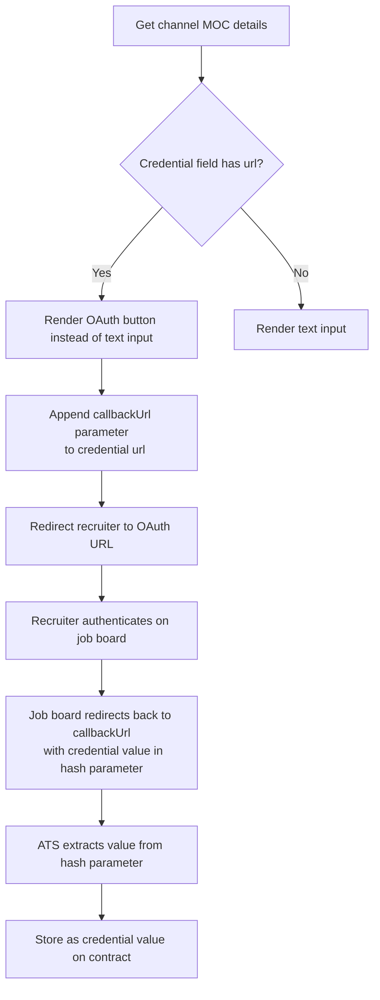
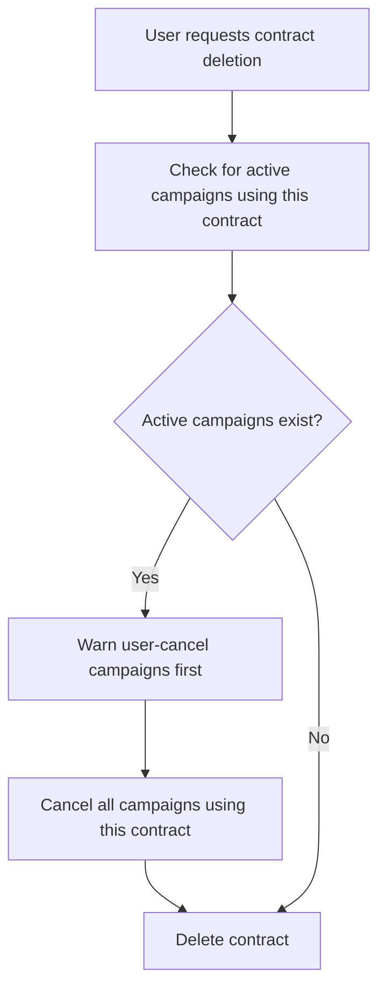

# Contract Caveats & Channel-Specific Notes

> Important edge cases, OAuth credential flows, deletion risks, and validation behaviors to be aware of when working with contracts.

## Overview

This page covers contract behaviors that don't fit neatly into the CRUD or ordering pages - OAuth-based credentials, the risks of deleting contracts with active campaigns, credential validation, and setup instructions. Read this before building a contract management UI.

See [Contract Caveats & Notes - Endpoint Reference](./notes.endpoints.md) for full request/response details.

## OAuth Credentials

Some channels require OAuth-based authentication instead of simple text credentials. When a credential field in the channel's MOC definition has a `url` property, it indicates an OAuth flow. Credentials are stored AES-encrypted and are never returned in clear text - text-input credentials are returned as base64-encoded encrypted strings, while dropdown-selection credentials are returned as plaintext.

### How It Works

1. **Detect OAuth** - In the `contract_credentials` array from `GET /products/channels/mocs/{id}/`, check each credential field for a `url` property.

2. **Build the OAuth redirect URL** - Append a `callbackUrl` parameter to the credential's `url`. This should point to a landing page in your ATS. For example: `{credential.url}?callbackUrl=https://your-ats.example.com/oauth/callback`.

3. **Redirect the recruiter** - Open the OAuth URL. The recruiter authenticates on the job board (or VONQ's OAuth proxy).

4. **Capture the credential** - After authentication, the recruiter is redirected back to your `callbackUrl` with the credential value in a `hash` query parameter. Extract this value and store it as the credential field value when creating the contract.

5. **Additional credentials may still be required** - Some channels need both OAuth and manual credentials. For example, XING requires OAuth authentication *and* a separate `organization_id` entered manually.

### Credential Field Rendering Rules

Determine how to render each credential field from the MOC definition:

| Condition | Render as |
|-----------|-----------|
| `url` property present | OAuth redirect button |
| `options` property present | Dropdown select |
| Neither | Text input |

## Deleting Contracts with Active Campaigns

<!-- theme: danger -->
> **Do not delete contracts that have active or online campaigns.** Deleting a contract permanently removes the stored job board credentials. Campaigns using that contract will become unmanageable - editing will fail and taking the campaign down will also fail. The job posting may remain live on the job board with no way to control it through HAPI.

The `DELETE /contracts/{contract_id}/` endpoint does not block deletion when active campaigns exist - it succeeds with `204 No Content`. The problems surface later when you try to manage those campaigns.

### Recommended Flow

**Best practice**: Before allowing deletion in your UI, check whether any campaigns reference the contract and warn the user. Cancel campaigns first, then delete.

## Credential Validation

When creating a contract, you can request that HAPI validates the credentials against the job board by setting `credentials_validation` in the request body.

### `credentials_validation` Values

| Value | Behavior |
|-------|----------|
| `"if_supported"` | Attempt to validate credentials with the job board. If the channel doesn't support validation, the request still succeeds - it's failsafe. |
| Omitted / not set | No validation. Credentials are stored as-is without checking if they're valid. |

**Recommendation**: Always pass `credentials_validation: "if_supported"`. It catches invalid credentials early for channels that support it, and does nothing for channels that don't - there's no downside.

<!-- theme: info -->
> Only **SEEK** supports credential validation. More channels may add support over time. Using `"if_supported"` ensures your integration automatically benefits as validation support expands.

For a request/response example, see [Contract Caveats & Notes - Endpoint Reference](./notes.endpoints.md).

## Channels Requiring Manual Feed Setup

Some channels require a manual XML feed setup before the contract can function. These channels include a `feed_url` property in their MOC details - a unique URL per customer that the recruiter must register on the job board's side.

### How It Works

1. **Check the MOC** - `GET /products/channels/mocs/{id}/` returns a `feed_url` if the channel requires it.
2. **Display the feed URL** - Show the `feed_url` to the recruiter and instruct them to register it on the job board.
3. **Set `followed_instructions: true`** - The contract creation must include `followed_instructions: true` to confirm the feed was set up.

<!-- theme: warning -->
> ### Campaigns Will Fail Without Feed Setup
> If the recruiter does not register the feed URL on the job board before campaigns are ordered, the job postings will not appear on the board. There is no error from HAPI - the campaign will show `not processed` after delivery fails.

## Setup Instructions & `followed_instructions`

Some channels require manual setup before a contract can be created - for example, creating an advertiser account on the job board first. These channels have `manual_setup_required: true` in their MOC details.

### How It Works

1. **Check the MOC** - `GET /products/channels/mocs/{id}/` returns `manual_setup_required` and `setup_instructions` (HTML content explaining what the recruiter needs to do).

2. **Display instructions** - If `manual_setup_required` is `true`, show the `setup_instructions` to the user and require them to confirm they've completed the steps.

3. **Set `followed_instructions: true`** - Include this in the `POST /contracts/` request body.

### Validation Rules

| Scenario | Result |
|----------|--------|
| Channel requires setup, `followed_instructions: true` sent | Contract created |
| Channel requires setup, `followed_instructions` not sent | `400` - instructions must be followed |
| Channel does **not** require setup, `followed_instructions: true` sent | `400` - field should not be passed |
| Channel does **not** require setup, `followed_instructions` omitted | Contract created |

<!-- theme: warning -->
> **Only pass `followed_instructions` when the channel requires it.** Sending `followed_instructions: true` for a channel that doesn't have `manual_setup_required: true` returns a validation error.

## Credential Masking

Credentials are stored AES-encrypted. When you retrieve a contract, text-input credential values are returned as base64-encoded encrypted strings (e.g., `"organization_id": "EXvFEpB9RMqfpX..."`), while dropdown-selection credentials are returned as plaintext (e.g., `"agency_or_company": "Company"`). Your integration cannot read back the original text-input credential values.

If a user needs to update credentials, they must provide the full new value via `PATCH /contracts/single/{contract_id}/`.

## Contract Immutability

After creation, most contract fields **cannot be changed**. Only a few fields are updatable via `PATCH`:

| Updatable | Immutable |
|-----------|-----------|
| `alias` | `channel_id` |
| `credentials` | `group_id` |
| `credentials_validation` | `credits` |
| `labels` | `expiry_date` |
| `posting_requirements_defaults` | |
| `posting_duration_days` | |

Core fields like `channel_id` and `group_id` are immutable because job boards require consistent credentials and channel configuration to manage already-posted jobs. If these were changed, campaigns posted with the original settings would become unmanageable - you could not edit or take down those postings through HAPI. Credential updates should also be done carefully for the same reason.

If you need to change an immutable field, delete the contract and create a new one - but only after handling any active campaigns (see above).

## Edge Cases & Gotchas

<!-- theme: warning -->
> **Credential field names are case-sensitive and channel-specific.** Always fetch the MOC details first to discover the exact field names. SEEK uses `agency_or_company` + `organization_id`, Stepstone uses different fields, etc.

<!-- theme: warning -->
> **Contract groups cannot be deleted if they have contracts.** Move or delete the contracts first. The default group (index 0) can never be deleted.

<!-- theme: info -->
> **Contract `errors` array** - A contract object may include an `errors` array indicating issues that arose *after* creation (e.g., `"The channel is not active anymore"`). This is different from creation validation errors - it signals the contract has become invalid.

## Related

- [Managing Contracts](managing-contracts.md) - MOC details, contract CRUD, credential fields
- [Ordering with Contracts](ordering.md) - using contracts in campaign orders
- [Contract Posting Requirements](posting-requirements.md) - autocomplete and posting requirement defaults
- [Contracts Introduction](01-introduction.md) - high-level overview of the contract model
