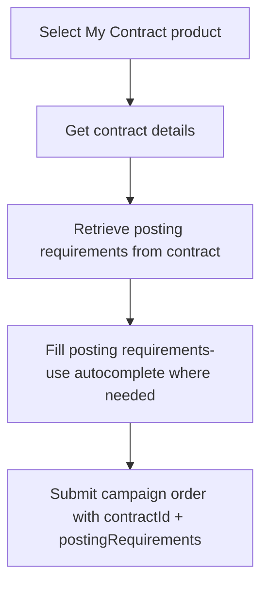

# Ordering with Contracts

> How to use My Contract products when ordering a campaign - referencing contracts, filling posting requirements, and mixing contract and Job Marketing products.

## Overview

When you order a campaign with a My Contract product, you need to reference the contract that holds your channel credentials. This page covers the contract-specific parts of campaign ordering. For the full campaign ordering flow, see [Campaign Ordering](../08-campaigns/ordering.md).

See [Ordering with Contracts - Endpoint Reference](./ordering.endpoints.md) for full request/response details.

## How Contract Ordering Works

Standard Job Marketing products only need a `productId` in the campaign order. My Contract products additionally require a `contractId` and typically have channel-specific `postingRequirements`.

<!-- theme: danger -->
> ### Where to Find the Product ID for My Contract Products
> My Contract products (`mc_only: true`) are **not returned by the marketplace search** (`GET /products/search/`). The only way to obtain the product ID is from the contract: call `GET /contracts/single/{contract_id}/` and use the `product.product_id` value. This is the same UUID you place in both `orderedProducts` and `orderedProductsSpecs[].productId`.

### The `orderedProductsSpecs` Object

My Contract products are specified in the `orderedProductsSpecs` array of a campaign order. Each entry links a product to its contract and posting requirement values. The fields accepted per entry are:

| Field | Type | Required | Description |
|-------|------|----------|-------------|
| `productId` | string (UUID) | yes | The My Contract product ID |
| `contractId` | string (UUID) | yes | The contract ID that holds credentials for this channel |
| `postingRequirements` | object | depends | Channel-specific fields. Keys match the `name` field from the contract's posting requirements. |
| `utm` | string | no | UTM tracking parameters appended to the job listing URL |

**Notes**:
- Every product listed in `orderedProducts` that is a My Contract product must have a corresponding entry in `orderedProductsSpecs` with its `contractId`.
- Job Marketing products listed in `orderedProducts` do not need an entry in `orderedProductsSpecs` (unless they have product-level posting requirements - see [Product Posting Requirements](../05-products/04-posting-requirements.md)).

See [Ordering with Contracts - Endpoint Reference](./ordering.endpoints.md) for full `orderedProductsSpecs` request examples, including mixing My Contract and Job Marketing products in a single campaign.

## Retrieving Contract Posting Requirements

Contract posting requirements come from the contract itself, not the product specs endpoint. Fetch them via `GET /contracts/single/{contract_id}/` - the `posting_requirements` array contains the facet definitions.

The response includes a `posting_requirements` array with the same facet structure as product specs (`name`, `label`, `type`, `required`, `options`, `autocomplete`, etc.). See [Contract Posting Requirements](./posting-requirements.md) for details on filling these fields, including the contract-specific autocomplete endpoint.

## Mixing Contract and Job Marketing Products

A single campaign can include both My Contract and Job Marketing products. In that case:
- My Contract products must have a `contractId` in their `orderedProductsSpecs` entry.
- Job Marketing products with product-level posting requirements have an `orderedProductsSpecs` entry without a `contractId`.

See [Ordering with Contracts - Endpoint Reference](./ordering.endpoints.md) for a mixed-product request example.

## Edge Cases & Gotchas

<!-- theme: warning -->
> ### Same-group constraint
> When ordering a campaign with multiple My Contract products, all contracts used must belong to the same contract group. You cannot mix contracts from different groups in a single campaign order.

<!-- theme: warning -->
> ### Contract posting requirements vs product posting requirements
> My Contract products get their posting requirements from the **contract** (`GET /contracts/single/{contract_id}/`), not from the product specs endpoint (`GET /products/{product_id}/specs/`). The contract's channel may expose different or additional fields compared to the product spec. Always use the contract as the source of truth for My Contract products.

<!-- theme: info -->
> ### UTM tracking
> The `utm` field in `orderedProductsSpecs` appends tracking parameters to the job listing URL on the channel. This is optional and only relevant if you want to track traffic from specific channels.

## Related

- [Campaign Ordering](../08-campaigns/ordering.md) - the full campaign ordering flow and request format
- [Managing Contracts](./managing-contracts.md) - creating and managing contracts
- [Posting Requirements](./posting-requirements.md) - contract-specific posting requirements and autocomplete
- [Product Posting Requirements](../05-products/04-posting-requirements.md) - product-level posting requirements (for Job Marketing products)
