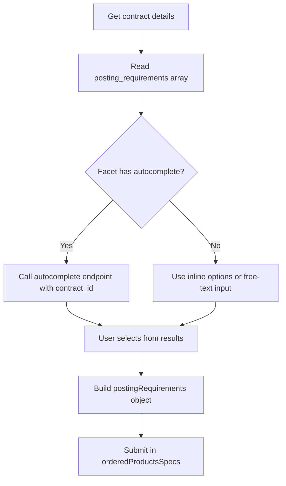
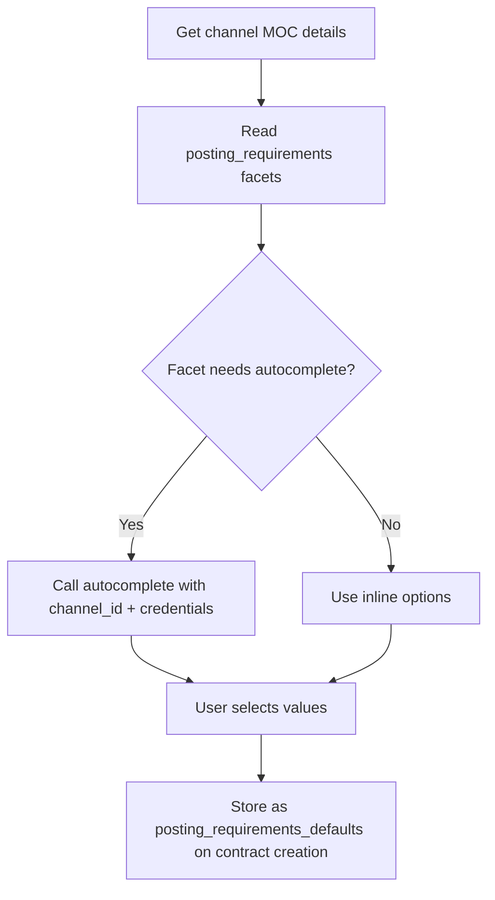

# Contract Posting Requirements

> How to retrieve and fill posting requirements for My Contract products - including autocomplete for dynamic fields like location and job category.

## Overview

My Contract products have channel-specific posting requirements that must be filled when ordering a campaign. These posting requirements use the same facet structure as [product posting requirements](../05-products/04-posting-requirements.md), but are retrieved from the contract (not the product) and have a dedicated autocomplete endpoint that handles credential context.

For the full facet model, types, and validation rules, see the [Posting Requirements](../07-posting-requirements/01-introduction.md) section.

See [Contract Posting Requirements - Endpoint Reference](./posting-requirements.endpoints.md) for full request/response details.

## Where Contract Posting Requirements Come From

Contract posting requirements are defined by the channel and returned as part of the contract object. There are two ways to see them:

1. **Before creating a contract** - the channel's MOC details endpoint includes the posting requirements facets:
   ```
   GET /products/channels/mocs/{id}/
   ```

2. **After creating a contract** - the contract detail endpoint returns fully populated posting requirements:
   ```
   GET /contracts/single/{contract_id}/
   ```

The `posting_requirements` array on a contract contains the same [facet objects](../07-posting-requirements/facets.md) used by product specs - including `type`, `options`, `required`, `rules`, `display_rules`, and `autocomplete`.

## Posting Requirement Defaults

When creating or updating a contract, you can store default values for posting requirements using the `posting_requirements_defaults` field:

```json
{
  "channel_id": 1234,
  "credentials": { ... },
  "posting_requirements_defaults": {
    "location": "sydney-cbd",
    "JobCategory": "engineering"
  }
}
```

<!-- theme: warning -->
> **Defaults are not auto-applied.** `posting_requirements_defaults` is a key-value store on the contract - the API stores whatever you write and returns it verbatim, but it does **not** inject these values into campaign orders. The typical use case is for a frontend to read the defaults and pre-populate the posting requirements form, so the user doesn't have to re-enter the same values for every order on that contract.

**Example integration pattern:**

```
┌─ Contract creation / update ──────────────────────────┐
│  User fills posting requirements form                  │
│  Frontend saves selected values to the contract:       │
│    PATCH /contracts/single/{contract_id}/                       │
│    { "posting_requirements_defaults": {                │
│        "location": "seekAnz:location:seek:2vArz...",   │
│        "JobCategory": "seekAnz:jobCategory:seek:...",  │
│        "seekAnzWorkTypeCode": "FullTime"               │
│    }}                                                  │
└────────────────────────────────────────────────────────┘

┌─ Campaign ordering ───────────────────────────────────┐
│  Frontend reads defaults from contract:                │
│    GET /contracts/single/{contract_id}/                         │
│    → posting_requirements_defaults                     │
│                                                        │
│  Pre-populate the form with these values               │
│  User adjusts if needed, then submit order with:       │
│    orderedProductsSpecs[].postingRequirements = {      │
│      ...defaults,    ← from contract                   │
│      ...userEdits    ← overrides from form             │
│    }                                                   │
└────────────────────────────────────────────────────────┘
```

## Endpoints

The `POST /contracts/posting-requirements/{channel_id_or_contract_id}/{posting-requirement-name}/` endpoint searches for autocomplete options for a contract posting requirement facet.

| Variant | When to use |
|---------|-------------|
| Use a **contract UUID** as the first path segment | After the contract exists - credentials are already stored, no need to pass them |
| Use a **numeric channel ID** as the first path segment | Before the contract exists (e.g., during setup) - must pass `credentials` in the request body |

See [Contract Posting Requirements - Endpoint Reference](./posting-requirements.endpoints.md) for full request/response examples for both variants, multi-term autocomplete, and error codes.

## Workflows

### Filling Contract Posting Requirements During Ordering



### Autocomplete During Contract Setup

When setting up a new contract, you may need to fill posting requirement defaults before the contract exists. Use the **channel ID** variant:



## Contract vs. Product Posting Requirements

| Aspect | Product | Contract |
|--------|---------|----------|
| **Source** | `GET /products/{product_id}/specs/` | `GET /contracts/single/{contract_id}/` |
| **Autocomplete endpoint** | `POST /products/{product_id}/specs/facets/{facet_name}/options/` | `POST /contracts/posting-requirements/{channel_id_or_contract_id}/{posting-requirement-name}/` |
| **Credentials needed** | No (VONQ-managed) | Only when using channel_id (not contract_id) |
| **Defaults storage** | N/A | `posting_requirements_defaults` on contract |
| **Campaign edit context** | N/A | Pass `campaignId` in autocomplete request |

For the complete guide to facet types, validation, and autocomplete patterns, see the [Posting Requirements](../07-posting-requirements/01-introduction.md) section.

## Edge Cases & Gotchas

<!-- theme: warning -->
> **Channel ID vs. contract ID** - Using a channel ID without passing `credentials` in the request body returns a 400 error. Once a contract is created, always use the contract UUID instead.

<!-- theme: warning -->
> **Lazy-loaded options** - Some `SELECT` or `HIER` facets have a non-null `autocomplete` object but an empty `options` array. These options must be loaded via the autocomplete endpoint before the user can interact with the facet.

<!-- theme: info -->
> **Display rules and required fields** - If a facet has `required: true` but is hidden by `display_rules`, you should omit it from the campaign order. Server-side validation skips hidden facets. See [Facets - Display Rules](../07-posting-requirements/facets-display-rules.md) for the full operator reference, cascading visibility, and implementation guidance.

<!-- theme: info -->
> **Posting requirements in ordering** - When submitting a campaign order, the keys in the `postingRequirements` object must exactly match the facet `name` values. See [Ordering with Contracts](ordering.md) for the full `orderedProductsSpecs` structure.

## Related

- [Managing Contracts](managing-contracts.md) - MOC details, contract CRUD, credential fields
- [Ordering with Contracts](ordering.md) - how to include contract posting requirements in a campaign order
- [Product Posting Requirements](../05-products/04-posting-requirements.md) - the product-side equivalent
- [Posting Requirements (deep dive)](../07-posting-requirements/01-introduction.md) - complete facet model, autocomplete patterns, validation
- [Facets - Display Rules](../07-posting-requirements/facets-display-rules.md) - conditional visibility operators, cascading rules, implementation guide
