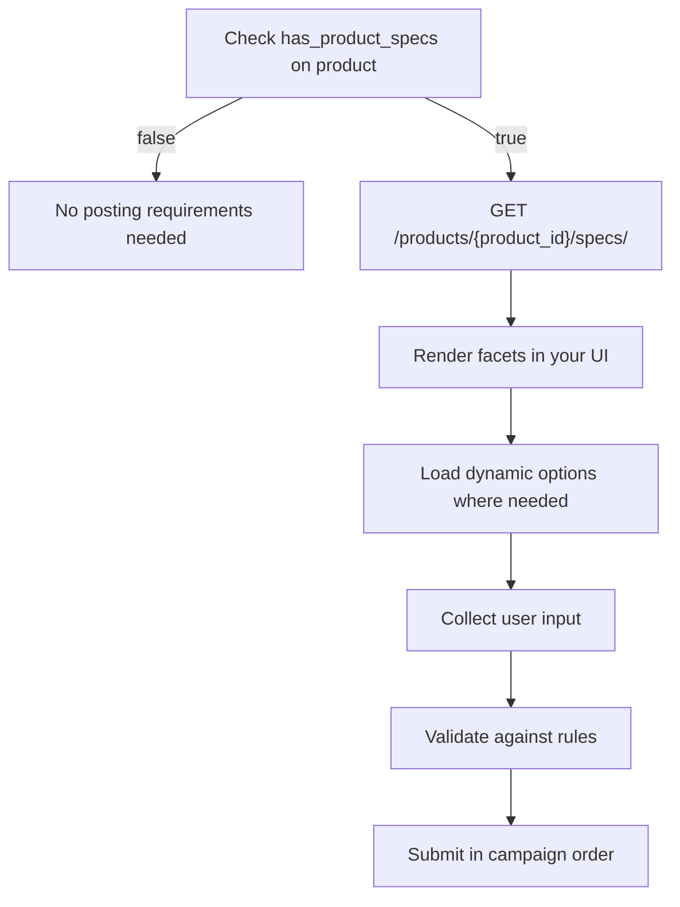

# Posting Requirements

> Channel-specific fields that define what ends up on the job board-from location dropdowns to rich text descriptions, each channel has its own requirements.

## What Are Posting Requirements?

Every job board has its own set of fields beyond the standard vacancy information (title, description, salary, etc.). These channel-specific fields are called **posting requirements**-they represent the data a job board needs to publish a vacancy on its platform.

Examples include:
- A **location** field with autocomplete search (e.g., SEEK requires selecting from their location taxonomy)
- An **employment type** dropdown (full-time, part-time, contract)
- A **job category** with hierarchical sub-categories
- A **rich text description** with channel-specific formatting rules
- A **start date** in a particular date format

Posting requirements are exposed as **facets**-structured field definitions that tell your integration what to render, how to validate, and what values to submit.

## Not All Products Have Posting Requirements

Only some products have channel-specific posting requirements. Before attempting to fetch specs, check the `has_product_specs` field on the product object:

- `has_product_specs: false` - this product has no posting requirements. Do not call the `/specs/` endpoint.
- `has_product_specs: true` - this product has posting requirements. Fetch them with `GET /products/{product_id}/specs/` and collect values before ordering.

When `has_product_specs` is `true`, also check `product_specs.validation_optional`:
- `validation_optional: false` - posting requirements are **enforced**. The order will fail without them.
- `validation_optional: true` - posting requirements exist but are **optional**. You can order without filling them.

<!-- theme: warning -->
> Calling `GET /products/{product_id}/specs/` on a product where `has_product_specs` is `false` returns a `404 Not Found` error - not an empty response.

## How It Works

Whether you're ordering a Job Marketing product or posting through a My Contract channel, the flow is the same:

The facet model is **identical** for products and contracts-the same types, the same validation rules, the same display logic. Only the endpoints differ:

| Source | Retrieve facets | Autocomplete options |
|--------|----------------|---------------------|
| **Product** (Job Marketing) | `GET /products/{product_id}/specs/` | `POST /products/{product_id}/specs/facets/{facet_name}/options/` |
| **Contract** (My Contract) | `GET /contracts/single/{contract_id}/` | `POST /contracts/posting-requirements/{channel_id_or_contract_id}/{posting-requirement-name}/` |

## Key Concepts

**Facet**-A single posting requirement field. Identified by a machine `name` (case-sensitive), with a `type` that determines rendering, optional validation `rules`, and optional `display_rules` for conditional visibility.

**Facet Type**-Determines the UI control and value format. HAPI supports 11 types: `TEXT`, `TEXTAREA`, `HTMLAREA`, `TEXTEXPAND`, `SELECT`, `MULTIPLE`, `HIER`, `AUTOCOMPLETE`, `DATE`, `STATISCH`, and `QUESTIONNAIRE`.

**Options**-Predefined choices for selection-based facets (`SELECT`, `MULTIPLE`, `HIER`). Each option has a `key` (value to submit) and `label` (display text). Some facets come with options pre-loaded; others require fetching them via autocomplete.

**Autocomplete**-A configuration object on facets that enables dynamic, search-as-you-type options. When a facet has a non-null `autocomplete` field, your integration must call the autocomplete endpoint to fetch options.

**Display Rules**-Conditional logic that shows or hides a facet based on the value of another facet. A facet hidden by display rules should be omitted from submission-even if marked `required`.

**Validation Rules**-Constraints like `maxlength`, `regex`, `date` format, and `minitems` that should be enforced in your UI. Server-side validation is always enforced on submission.

**Smartfill**-An AI-powered endpoint that can auto-fill posting requirement values based on vacancy information, reducing manual input for recruiters.

## What's Next

| Page | Description |
|------|-------------|
| [Facets](facets.md) | The facet object in detail-all 11 types, field reference, options, rendering rules |
| [Facets - Display Rules](facets-display-rules.md) | Conditional visibility-operators, cascading rules, implementation guide |
| [Autocomplete](autocomplete.md) | Dynamic options-parameter sources, dependent facets, multi-term search, lazy-loaded options |
| [Validation](validation.md) | Client-side rules, server-side validation endpoints, error handling |
| [Smartfill](smartfill.md) | AI-powered autofill-async create-then-poll pattern, vacancy fields, limitations |

For how posting requirements are used during ordering, see [Campaign Ordering](../08-campaigns/ordering.md). For full campaign validation (vacancy + all products at once), see [Campaign Validation](../08-campaigns/validation.md). For contract-specific posting requirements and autocomplete, see [Contract Posting Requirements](../06-contracts/posting-requirements.md).
