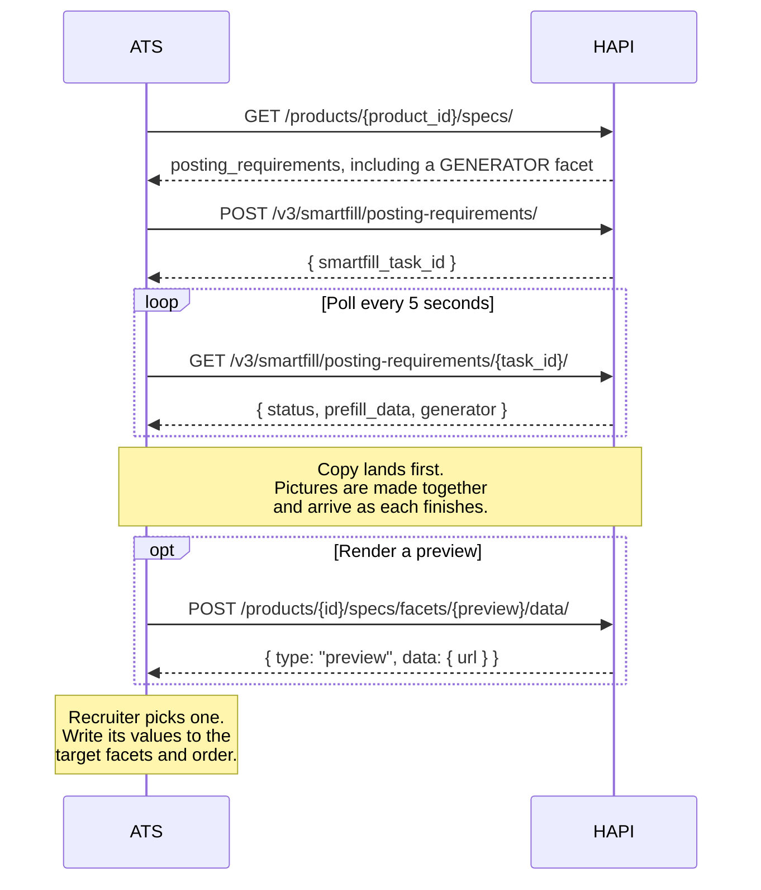
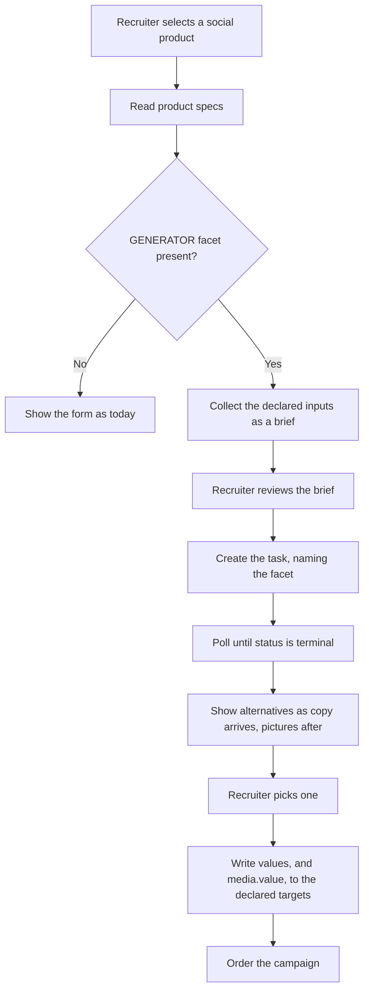

# AI Ad Creatives

> Let a recruiter generate complete adverts for a social product, compare a few alternatives, and commit one to the posting requirements without leaving your flow.

## Overview

Some products advertise a job rather than list it. Their posting requirements are the advert itself: a headline, a body, a link description, a picture. Writing those well is slower than filling a form, and the quality depends entirely on the recruiter's copywriting.

For products that support it, HAPI can write them. Your integration sends the job context it already holds, receives several complete alternatives, and applies whichever the recruiter picks.

Nothing about this is specific to one channel or one set of field names. The product tells you which posting requirements feed the brief, which ones receive the result, which one renders a preview, and which angles a regeneration can lean on. Read that from the product's specs rather than hardcoding it, and a new channel will not need a change on your side.

<!-- theme: info -->
> **Feature gating.** AI ad creatives are not enabled by default. Partners must contact their VONQ Account Manager to enable it. Once enabled, `smartfill.generators` is `true` in `GET /v3/ats/atsuser/me/settings/`. When the feature is off, the generator facet is absent from the product's specs and nothing else changes.

## How It Works



1. **Discover** the generator facet in the product's posting requirements.
2. **Generate** alternatives from job context.
3. **Poll** until the generation is finished, showing copy as soon as it arrives.
4. **Preview** an alternative, if you want to show the advert as it will appear.
5. **Apply** the chosen one to the posting requirements and order as usual.

## Discovering the Generator

A product that supports this carries an extra posting requirement of type `GENERATOR`. It is not a field the recruiter fills in. Its `generator` block describes what the generator reads, writes and offers:

```json
{
  "name": "__ad_creatives__",
  "type": "GENERATOR",
  "label": "Ad Wizard",
  "required": false,
  "generator": {
    "targets": ["headline1", "message1", "image1"],
    "preview": { "facet": "__preview__" },
    "media": { "facet": "image1", "platform": "facebook" },
    "inputs": [
      { "field": "title", "label": "Job title" },
      { "field": "description", "label": "Job description" }
    ],
    "angles": [
      { "key": "benefit_led", "label": "More benefit-led" },
      { "key": "urgency", "label": "More urgent" }
    ],
    "count": 3
  }
}
```

| Key | Meaning |
|-----|---------|
| `targets` | The posting requirements a chosen alternative is written into. Nothing outside this list is ever written. Required. |
| `preview` | `{ "facet": "..." }`, naming the facet that turns a set of values into a preview URL. See [Rendering a Preview](#rendering-a-preview). |
| `media` | Present when the generator also produces a picture. `facet` says which target receives it, and is always one of `targets`. `platform` says what the picture is framed for, and `size`, `format` and `quality` shape the render. See [How Long It Takes](#how-long-it-takes). |
| `inputs` | What briefs the generator, as `{ "facet": "..." }` for a sibling posting requirement or `{ "field": "..." }` for a campaign field, with an optional `label`. |
| `angles` | The slants a regeneration can lean on. Send an angle's `key` back as `generator.angle` to ask for one. |
| `count` | How many alternatives a run produces. |

<!-- theme: warning -->
> **Do not hardcode these names.** They are configuration, not contract. Reading them from the specs response is what allows a new channel, or a change to which fields receive the result, to reach you without a release on your side.

## Generating

Create a task on the Smartfill endpoint you may already use for posting requirements, naming the generator facet:

```json
POST /v3/smartfill/posting-requirements/
{
  "product_id": "085db062-4d4a-47f2-bf33-5d511bd089bd",
  "context": {
    "structured": { "job_title": "Senior Care Assistant" },
    "unstructured": "<the full job description>"
  },
  "generator": { "facet": "__ad_creatives__" },
  "language": "nl"
}
```

`generator.facet` is the only required part. Add `generator.angle` with one of the declared angle keys to ask a rerun for a different slant. `language` takes an ISO 639-1 code; leave it out and the copy is written in the language the job description is written in. A location in another country does not change that: an English description for a role in Amsterdam gets English copy.

A run writes the facet's `count` of alternatives. Send `generator.count` to ask for fewer, for example one to replace an alternative the recruiter turned down. Asking for more than the facet's `count` is rejected with `400`.

The response is the usual `{ "smartfill_task_id": "..." }`.

### Asking for One Part

A task runs the form fill, the generation, or both. Naming neither runs both when the request carries a generator and the fill alone when it does not, so a request that leaves `jobs` out behaves as it always has.

```json
{
  "product_id": "085db062-4d4a-47f2-bf33-5d511bd089bd",
  "context": { "unstructured": "<the full job description>" },
  "generator": { "facet": "__ad_creatives__", "angle": "urgency" },
  "jobs": ["generator"]
}
```

Ask for `["generator"]` alone when the recruiter wants another set of adverts and already has the form filled: a second fill would cost a request and produce values nobody reads. `prefill_data` comes back empty on such a task. Ask for `["fill"]` to fill the form on a product whose channel offers a generator without running one.

## Polling

Poll the task as you would any Smartfill task. The response carries the ordinary form fill in `prefill_data` and the generation in `generator`:

```json
{
  "id": "c4f0cd15-e160-476e-a94e-e18bec1e5531",
  "status": "started",
  "prefill_data": { "headline1": "...", "display_url": "..." },
  "generator": {
    "status": "started",
    "alternatives": [
      {
        "angle": "benefit_led",
        "values": {
          "headline1": "Care that fits your life",
          "message1": "..."
        }
      }
    ],
    "media": { "status": "started", "completed": 1, "total": 3 }
  }
}
```

`status` covers every job the task was asked for, so polling it until it is terminal waits for the adverts as well as the form fill. A task asked for nothing but the fill reports the fill, exactly as a Smartfill task always has.

`generator.status` is the narrower answer: the generation alone, copy and pictures together. Read it when you want to show the form the moment it is filled without waiting for the deck.

<!-- theme: warning -->
> **A task that ran no generator carries no `generator` key at all.** It is absent rather than null, so a response for a product without one is the same shape it has always been. Check for the key before reading it.

Copy arrives well before pictures. Alternatives therefore appear with their `values` filled in and no `media` yet, then gain one as each render lands. Show the copy as soon as it arrives rather than waiting for a complete deck: `generator.media` reports `completed` of `total` if you want to say how far along the pictures are.

### How Long It Takes

Measured against a three-alternative generator, as a shape to design around rather than a guarantee:

| | roughly |
|---|---|
| copy, all alternatives at once | 10 to 15 seconds |
| one picture | 50 to 60 seconds at the default quality, 20 seconds at `quality: "low"` |
| a whole deck | about as long as one picture |

Pictures are rendered concurrently, so a deck of three costs about what one costs rather than three times as much. Above a handful of alternatives they render in waves, so the deck grows with `count` in steps rather than smoothly.

`quality` is the one setting that moves this materially, and it is a trade against how the picture looks. A generator that declares no `quality` renders at the service default.

A run that produced no usable alternatives ends with `generator.status` of `errored` and an empty `alternatives`, however many pictures were made, since a picture is only shown with the copy written for it. When the generation was the task's only job, `status` is `errored` too. Say so and offer the form; do not leave a spinner running.

## Rendering a Preview

Showing the advert as the end user will see it is optional. You already hold the values, so you can render your own card and ignore this entirely.

If you would rather not rebuild each channel's chrome, ask the facet named in `preview`. That is an ordinary derived facet, so it works exactly as described in [Derived Facets](facets.md#derived-facets): post a set of values to the facet data endpoint and frame the URL that comes back.

```json
POST /products/{product_id}/specs/facets/__preview__/data/
{
  "values": {
    "headline1": "Care that fits your life",
    "message1": "...",
    "pending": "image1"
  }
}
```

Send only the facets the preview declares in its own `autocomplete.parameters_source`. Those are not the same as the generator's `targets`: a preview usually draws fields no generator writes, such as the display URL, and unknown names are rejected. Values may be omitted, so a partially filled form still previews.

`pending` is the exception to that rule, and the answer to a picture that is still being made. List the facet names whose values are on their way, comma separated, and the preview draws them as under way instead of missing. Without it, an advert whose render has not landed yet shows an empty-image placeholder for as long as a minute, which reads as a failure while everything is on track.

<!-- theme: warning -->
> **Sandbox the frame with `allow-same-origin`.** The preview is an ordinary web page and reads its own storage while rendering. A sandbox of `allow-scripts` alone gives it an opaque origin, every such read throws, and the frame renders nothing at all. `sandbox="allow-scripts allow-same-origin"` is safe here because the page is served from another origin than yours, and so cannot reach into the embedding document.

## Applying a Result

Write the chosen alternative's `values` into the facets listed in `targets`, exactly as if the recruiter had typed them, and leave every other posting requirement untouched. Order the campaign as you do today. Nothing downstream changes.

<!-- theme: warning -->
> **Filling the fields is not the same as submitting them.** In most form implementations the values on screen and the values the campaign is ordered from are two different pieces of state, kept in step by whatever runs when a recruiter types. An advert applied straight into the fields skips that, and the order goes out missing the copy the recruiter picked while the form in front of them looks complete. Report an applied result through the same path a typed value takes.

An alternative that has a picture carries it separately:

```json
{
  "angle": "benefit_led",
  "values": { "headline1": "...", "message1": "..." },
  "media": {
    "facet": "image1",
    "value": "https://assets.vonq.io/generated/9f2c1e.png",
    "file": { "filename": "ad.png", "handle": "9f2c1e", "mimetype": "image/png", "size": 184320 }
  }
}
```

<!-- theme: warning -->
> **Write `media.value` into `media.facet`, and nothing else.** That posting requirement holds a URL, and the job board is handed whatever it contains, verbatim. The `file` block describes the picture for your own interface, its size and type; writing the object rather than the URL is rejected at ordering time or, worse, delivered as nonsense.

The URL is hosted by VONQ for as long as the campaign runs. Nothing needs uploading on your side.

## Endpoints

| Method | Path | Description |
|--------|------|-------------|
| GET | `/products/{product_id}/specs/` | Posting requirements, including any generator facet |
| POST | `/v3/smartfill/posting-requirements/` | Create a task: the form fill, a generation, or both |
| GET | `/v3/smartfill/posting-requirements/{task_id}/` | Poll status and retrieve alternatives |
| POST | `/products/{product_id}/specs/facets/{facet_name}/data/` | Derive a preview URL from a set of values |

## Workflows

### Suggested Integration



### Without a User Interface

Nothing in this flow requires one. A bulk integration can read the specs, generate for every open vacancy on a schedule, apply the first alternative or queue results for review in its own tooling, and never call the preview endpoint at all.

## Edge Cases and Gotchas

<!-- theme: warning -->
> **Results are best-effort.** Always let the recruiter review and edit before ordering. Never submit a generated advert without confirmation.

<!-- theme: warning -->
> **Some facets are not fields.** A facet carrying `is_data: true`, and the generator facet itself, are configuration rather than input. Do not render them as form fields. Clients that render every returned facet will show an empty control to the recruiter. See [Derived Facets](facets.md#derived-facets).

- **Check the length rules on your targets.** A target's `rules` may carry a `maxlength`, and generated copy has to fit it. An alternative that overruns is discarded rather than trimmed, and a run whose alternatives all overrun fails outright. A target with a very short limit is a poor thing to generate.
- **Write only the declared targets.** A product's posting requirements include fields the generator does not produce, such as page selection or the display URL. Those stay with the recruiter.
- **Language follows the campaign.** Copy is written in the requested language rather than translated afterwards. Send the context in the language you want back, or name it in `language`.
- **Adverts must comply.** Generated copy is filtered for employment advertising rules. Copy the recruiter adds by hand is not, so keep your own validation.
- **A picture can fail on its own.** Copy that arrived is still usable when a render did not: an alternative simply has no `media`. Let the recruiter supply an image themselves rather than discarding the alternative.
- **Expect fewer alternatives than `count`.** Ask for three and plan to render however many arrive.

## Related

- [Facets](facets.md), the field types and value formats a posting requirement can have
- [Smartfill](smartfill.md), the create-then-poll pattern this reuses
- [Campaign Ordering](../08-campaigns/ordering.md), submitting the campaign once values are applied
