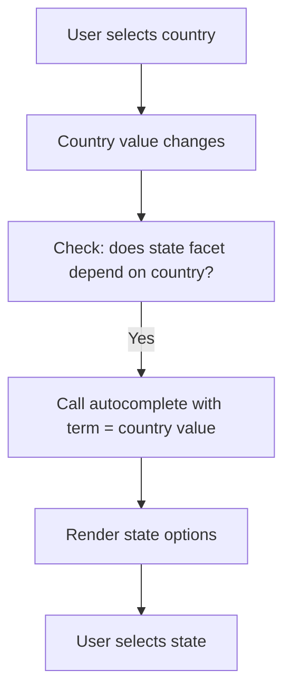
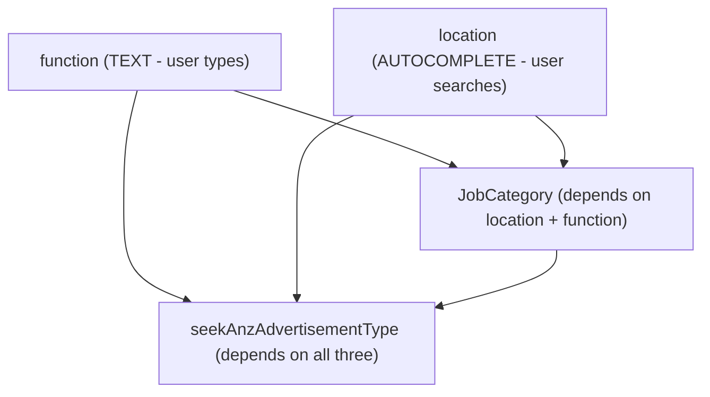
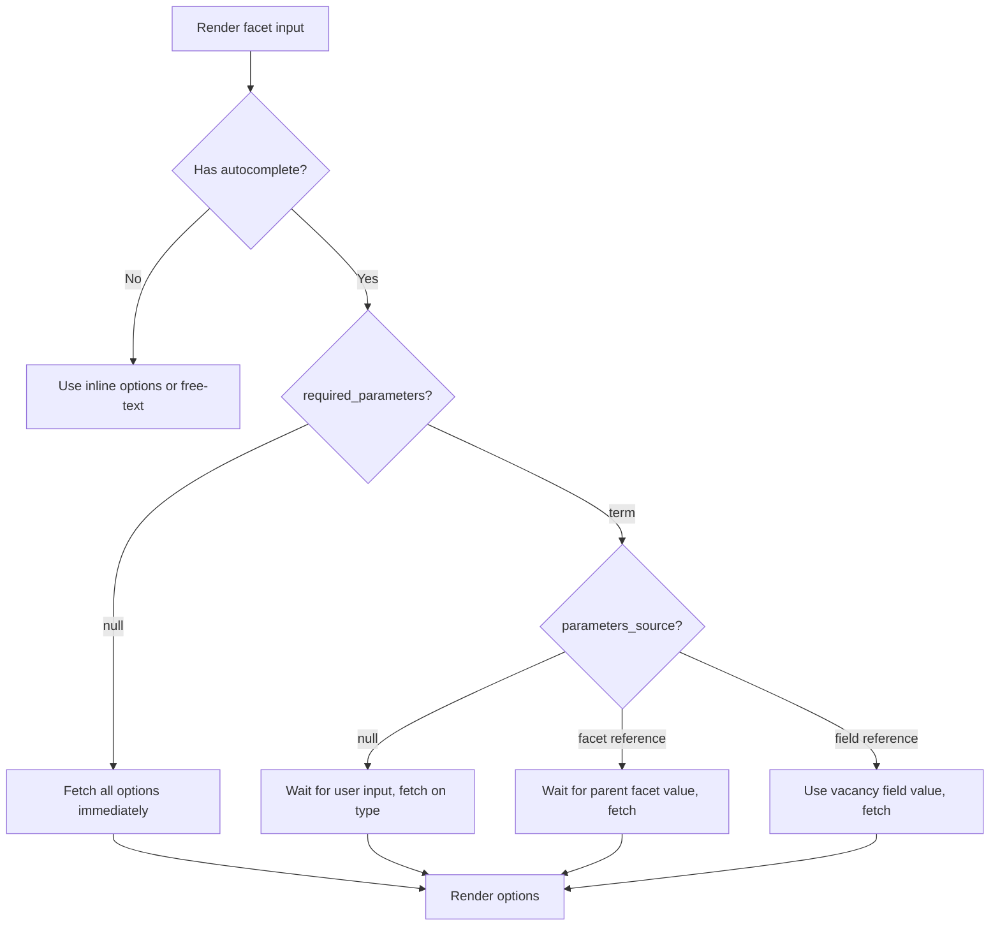

# Autocomplete & Lazy-Loaded Options

> How dynamic options work-parameter sources, dependent facets, multi-term search, and differences between product and contract autocomplete.

## Overview

Many posting requirement facets don't come with pre-loaded options. Instead, options are fetched dynamically-either as the user types (search-based autocomplete) or on facet render (lazy-loaded dropdowns). This page covers the autocomplete mechanics, all four parameter source patterns, and the endpoints involved.

For the facet object structure and types, see [Facets](facets.md). For how autocomplete fits into ordering, see [Campaign Ordering](../08-campaigns/ordering.md).

## When Is Autocomplete Used?

A facet uses autocomplete when its `autocomplete` field is **non-null**:

```json
{
  "name": "location",
  "type": "AUTOCOMPLETE",
  "options": [],
  "autocomplete": {
    "required_parameters": ["term"],
    "parameters_source": null
  }
}
```

This applies to:
- **`AUTOCOMPLETE` type**-always dynamic, search-as-you-type
- **`SELECT` with empty options**-lazy-loaded dropdown; fetch options before the user can interact
- **`HIER` with empty options**-lazy-loaded hierarchical dropdown; fetch full tree or search

## Endpoints

| Endpoint | Description |
|----------|-------------|
| `POST /products/{product_id}/specs/facets/{facet_name}/options/` | Fetch filtered/searched autocomplete options for a product facet |
| `POST /contracts/posting-requirements/{channel_id_or_contract_id}/{posting-requirement-name}/` | Fetch autocomplete options for a contract posting requirement facet |

See [Autocomplete & Lazy-Loaded Options - Endpoint Reference](./autocomplete.endpoints.md) for full request/response details.

## Parameter Sources

The `autocomplete` object on a facet tells you what parameters are needed and where they come from. There are four patterns.

### Pattern 1: No Parameters (Lazy-Load All)

```json
{
  "autocomplete": {
    "required_parameters": null,
    "parameters_source": null
  }
}
```

No dependencies on other facets - the options are self-contained but too large to embed inline. Used for `SELECT` and `HIER` facets with large option sets.

```json
{ "term": "AUD" }
```

**When to fetch**: On facet render, or when the facet becomes visible via display rules. Pass a search `term` to filter results.

<!-- theme: info -->
> ### Fetching all options without a search term
> Some facets with `required_parameters: null` have a small, fixed set of options (e.g., `applicationMethod` with only 2–3 values). For these, you can send a request with an empty JSON body `{}` (omitting `term` entirely) to retrieve all options at once. However, most facets reject an empty or missing `term` with `400 Bad Request` - in that case, pass a non-empty search string (e.g., a currency code for `salaryCurrency`). Try the empty-body approach first; fall back to a search term if you get a 400.

### Pattern 2: User Input (Search-Based)

```json
{
  "autocomplete": {
    "required_parameters": ["term"],
    "parameters_source": null
  }
}
```

The `term` comes from what the user types. This is the standard search-as-you-type pattern.

```json
{ "term": "Amsterdam" }
```

**When to fetch**: As the user types-debounce to avoid excessive requests.

### Pattern 3: Dependent Facet (Values from Other Facets)

The `term` is sourced from one or more other facets' **currently selected values**. The `required_parameters` array tells you **how many** values are needed, and `parameters_source.term` tells you **which facets** to pull them from.

#### Single dependency

```json
{
  "autocomplete": {
    "required_parameters": ["term"],
    "parameters_source": {
      "term": { "facet": "country_id" }
    }
  }
}
```

One `"term"` in `required_parameters` → pass a single string. The value comes from the `country_id` facet:

```json
{ "term": "usa" }
```

#### Two dependencies

```json
{
  "autocomplete": {
    "required_parameters": ["term", "term"],
    "parameters_source": {
      "term": [
        { "facet": "location" },
        { "facet": "function" }
      ]
    }
  }
}
```

Two `"term"` entries → pass an **array** with two values, **in the order listed** in `parameters_source.term`:

```json
{ "term": ["seekAnz:location:seek:2vArzkyio#Sydney NSW 2000 AU", "Software Engineer"] }
```

The first element is the selected `location` key, the second is the `function` value.

#### Three dependencies

```json
{
  "autocomplete": {
    "required_parameters": ["term", "term", "term"],
    "parameters_source": {
      "term": [
        { "facet": "function" },
        { "facet": "location" },
        { "facet": "JobCategory" }
      ]
    }
  }
}
```

Three `"term"` entries → pass an array with three values:

```json
{ "term": ["Software Engineer", "seekAnz:location:seek:2vArzkyio#Sydney NSW 2000 AU", "seekAnz:jobCategory:seek:2BGarNJkf§seekAnz:jobCategory:seek:2FkXR4jWF#Engineering - Software"] }
```

<!-- theme: danger -->
> ### Reading the autocomplete config - summary
> 1. Count the entries in `required_parameters` - that's how many values you need
> 2. If `parameters_source.term` is an **object** → single dependency, pass `term` as a string
> 3. If `parameters_source.term` is an **array** → multiple dependencies, pass `term` as an array in the same order
> 4. Each `{ "facet": "..." }` entry tells you which facet's **currently selected value** (the `key` from autocomplete results, or the text value for `TEXT` facets) to use
> 5. All referenced facets must be resolved **before** you can call this autocomplete endpoint

**When to fetch**: When all parent facet values are available. If any parent facet has no value yet, the dependent facet cannot load options.

### Pattern 4: Vacancy Field (Value from Campaign Data)

```json
{
  "autocomplete": {
    "required_parameters": ["term"],
    "parameters_source": {
      "term": { "field": "title" }
    }
  }
}
```

The `term` is sourced from a vacancy/campaign field - not a facet, but a field from the campaign object (e.g., job title). Pass the vacancy field value to filter available options.

Note that `required_parameters` may also include `"credentials"` - this tells the endpoint to use the contract's stored credentials when fetching options from the channel:

```json
{
  "autocomplete": {
    "required_parameters": ["credentials", "term"],
    "parameters_source": {
      "term": { "field": "title" }
    }
  }
}
```

In this example, the facet options depend on the vacancy title **and** the contract credentials. Pass the vacancy title as `term`:

```json
{ "term": "Fullstack Developer" }
```

The credentials are sent automatically when using the contract posting requirements endpoint (`POST /contracts/posting-requirements/{channel_id_or_contract_id}/{posting-requirement-name}/`).

**When to fetch**: After the referenced vacancy fields are filled, or when the facet becomes visible.

## Dependent Facets

When a facet depends on another facet's value, you need to wire up the relationship in your UI:



A dependent facet often combines `autocomplete.parameters_source` with `display_rules`:

```json
{
  "name": "state",
  "type": "AUTOCOMPLETE",
  "autocomplete": {
    "required_parameters": ["term"],
    "parameters_source": {
      "term": { "facet": "country_id" }
    }
  },
  "display_rules": {
    "show": [
      { "facet": "country_id", "value": "usa", "op": "equal" }
    ]
  }
}
```

This facet is only visible when `country_id` is "usa", and its options are loaded using the country value as the search term.

<!-- theme: info -->
> **Reset dependent facets when the parent changes.** If the user changes the country selection, clear the state value and re-fetch options for the new country.

## Multi-Term Autocomplete

Multi-term autocomplete is a direct consequence of Pattern 3 above. When `parameters_source.term` is an array, you pass `term` as an array. The rule is straightforward:

| `required_parameters` | `parameters_source.term` | Request body |
|------------------------|-------------------------|-------------|
| `["term"]` | `{ "facet": "x" }` | `{ "term": "value_of_x" }` |
| `["term", "term"]` | `[{ "facet": "x" }, { "facet": "y" }]` | `{ "term": ["value_of_x", "value_of_y"] }` |
| `["term", "term", "term"]` | `[{ "facet": "x" }, { "facet": "y" }, { "facet": "z" }]` | `{ "term": ["value_of_x", "value_of_y", "value_of_z"] }` |

Real-world example - SEEK's `seekAnzAdvertisementType` depends on three facets:

```json
{
  "autocomplete": {
    "required_parameters": ["term", "term", "term"],
    "parameters_source": {
      "term": [
        { "facet": "function" },
        { "facet": "location" },
        { "facet": "JobCategory" }
      ]
    }
  }
}
```

To call this endpoint, the user must first fill in `function` (text), resolve `location` (autocomplete), and resolve `JobCategory` (which itself depends on `location` + `function`). This creates a resolution chain:



<!-- theme: info -->
> Multi-term is uncommon. Most facets use a single string `term`. Check the facet's `required_parameters` count and `parameters_source` to determine the exact format.

## Campaign Editing Context

When editing an existing campaign, pass `campaignId` in the autocomplete request body to signal you're editing an existing job rather than creating a new one. Some channels return different options for edits. See [Autocomplete & Lazy-Loaded Options - Endpoint Reference](./autocomplete.endpoints.md) for the request format.

## Lazy-Loaded SELECT and HIER

Not all autocomplete facets are `AUTOCOMPLETE` type. `SELECT` and `HIER` facets can also be lazy-loaded:

**How to identify**: The facet has `type: "SELECT"` or `type: "HIER"`, an empty `options` array, and a non-null `autocomplete` field.

**How to handle**:

| Scenario | Action |
|----------|--------|
| `SELECT` + `autocomplete` + no `required_parameters` | Call endpoint with a search term → render as dropdown |
| `SELECT` + `autocomplete` + `required_parameters: ["term"]` | Call endpoint with search term → render as searchable dropdown |
| `HIER` + `autocomplete` + no `required_parameters` | Call `/options/` endpoint with a search term - render as cascading dropdown |
| `HIER` + `autocomplete` + `required_parameters: ["term"]` | Call `/options/` endpoint with search - render as search field |

<!-- theme: warning -->
> **Don't render empty dropdowns.** If a `SELECT` or `HIER` facet has an empty `options` array and non-null `autocomplete`, you must fetch options before the user can interact with it. Show a loading state while fetching.

## Workflows

### Standard Autocomplete Flow



## Edge Cases & Gotchas

<!-- theme: warning -->
> **Facet names are case-sensitive in endpoint paths.** `POST .../facets/JobCategory/options/` is not the same as `.../facets/jobcategory/options/`. Use the exact `name` from the facet definition.

<!-- theme: warning -->
> **Empty term handling varies by facet.** Facets with a small fixed option set (e.g., `applicationMethod`) accept an empty body `{}` and return all options. Most other facets reject an empty or missing `term` with `400 Bad Request` - pass a non-empty search string for those.

<!-- theme: info -->
> **Contract autocomplete needs credentials when using channel_id.** When the contract doesn't exist yet, pass `credentials` in the request body. Once the contract is created, use the contract UUID and omit credentials. See [Contract Posting Requirements](../06-contracts/posting-requirements.md).

<!-- theme: info -->
> **Debounce search requests.** For search-as-you-type fields, debounce API calls (e.g., 300ms) to avoid flooding the endpoint with requests on every keystroke.

## Related

- [Facets](facets.md)-the facet object, all 11 types, validation rules
- [Facets - Display Rules](facets-display-rules.md)-conditional visibility, operators, cascading rules
- [Validation](validation.md)-validating facet values before submission
- [Product Posting Requirements](../05-products/04-posting-requirements.md)-product specs endpoints overview
- [Contract Posting Requirements](../06-contracts/posting-requirements.md)-contract autocomplete with credentials
- [Campaign Ordering](../08-campaigns/ordering.md)-submitting posting requirements in a campaign order
