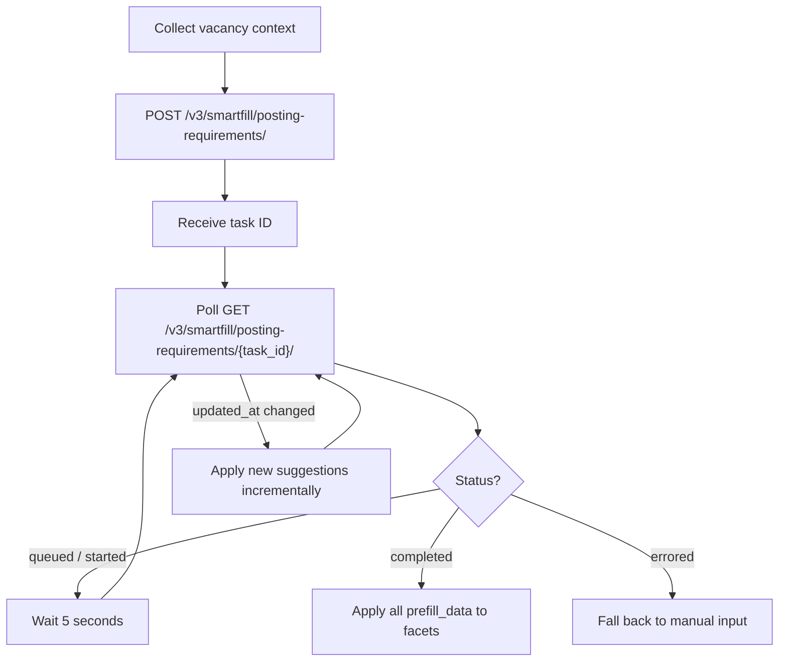
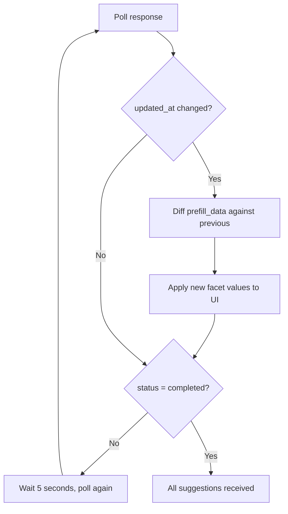
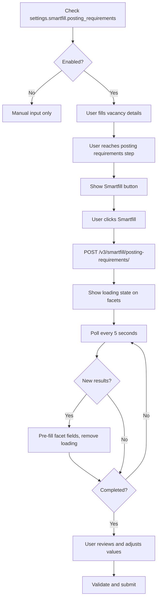

# Smartfill

> AI-powered autofill for posting requirements-provide job context once, get channel-specific field values suggested automatically.

## Overview

Smartfill uses AI to pre-fill posting requirement values based on vacancy context (job title, description, skills, etc.). Instead of manually filling every facet for every channel, your integration sends context to Smartfill and receives suggested values that match each facet's expected format.

Smartfill for posting requirements is an **async, create-then-poll** operation: you create a task, then poll until results are ready. Results arrive incrementally-you can apply partial suggestions while the task is still processing.

<!-- theme: info -->
> **Feature gating.** Smartfill is not enabled by default. Partners must contact their VONQ Account Manager to enable it. Once enabled, check availability via `GET /v3/ats/atsuser/me/settings/`-the response includes a `settings.smartfill` object with a `posting_requirements` boolean.

For the facet types and value formats that Smartfill returns, see [Facets](facets.md). For vacancy fields and product search filters smartfill, see [Campaign Smartfill](../08-campaigns/smartfill.md).

## How It Works

1. **Create task**-Send vacancy context + contract or product ID
2. **Poll**-Check status every 5 seconds; apply incremental results as they arrive
3. **Complete**-Apply all suggestions; let the user review and adjust before submission

## Endpoints

| Endpoint | Description |
|----------|-------------|
| `POST /v3/smartfill/posting-requirements/` | Create a smartfill task; returns a task ID for polling |
| `GET /v3/smartfill/posting-requirements/{task_id}/` | Poll status and results of a smartfill task |

See [Smartfill - Endpoint Reference](./smartfill.endpoints.md) for full request/response details.

## Context Object

The `context` object provides the vacancy information Smartfill uses to generate suggestions. It has two fields-provide both for best results.

| Field | Type | Required | Constraints | Description |
|-------|------|----------|-------------|-------------|
| `structured` | object | Conditional | Max 20,000 chars serialized, min 1 property | Key-value vacancy data (title, description, skills, etc.) |
| `unstructured` | string | Conditional | Min 32 chars, max 20,000 chars | Free-text job description or posting content |

At least one of `structured` or `unstructured` must be provided. Providing both gives the best results-structured data gives precise field values, unstructured text gives the AI broader context.

**Recommended structured fields**: `title`, `description`, `skills`, `location`, `company`, `salary`, `employmentType`, `industry`, `jobFunction`, `recruiterName`, `recruiterEmail`.

<!-- theme: warning -->
> **Short or vague context reduces accuracy.** The more relevant detail you provide, the better the suggestions. A title-only context will produce fewer and less accurate results than a full job description with skills and location.

## Prefill Data Formats

Smartfill returns values in the format expected by each facet type. Apply the value directly to the corresponding facet in your UI.

| Facet type | Prefill format | Example |
|------------|---------------|---------|
| `TEXT`, `TEXTAREA`, `HTMLAREA`, `DATE` | string | `"Senior Developer"` |
| `SELECT`, `HIER` | string or `{"key": "...", "label": "..."}` | `{"key": "fulltime", "label": "Full Time"}` |
| `AUTOCOMPLETE` | `{"key": "...", "label": "..."}` | `{"key": "amsterdam", "label": "Amsterdam"}` |
| `MULTIPLE`, `TEXTEXPAND` | array | `["java", "python"]` |
| `AREACOUNT` | string (integer) | `"3"` |

Note: `SELECT`, `HIER`, or `MULTIPLE` facets can at any time be transformed into custom facets by the channel, in which case they behave like `AUTOCOMPLETE` facets-Smartfill returns `{"key": "...", "label": "..."}` objects for these as well.

When the value is an object with `key` and `label`, use `key` as the submission value and `label` as the display text.

## Incremental Results

Smartfill results arrive incrementally. On each poll response, check the `updated_at` timestamp-if it changed since the last poll, new facet suggestions have been added to `prefill_data`.

Previously returned suggestions are **not modified**-only new facets are added. This means you can safely apply results to your UI as they arrive without worrying about overwriting earlier suggestions.

## Workflows

### Integration Flow

### Error Handling

- **`403` on create**-Smartfill not enabled. Hide the Smartfill button or show a message directing the partner to contact their Account Manager.
- **`errored` status**-AI processing failed. No error details are provided. Fall back to manual input-do not retry the same task.
- **Empty `prefill_data`**-Smartfill may return no suggestions if the context is insufficient or the channel's facets don't match the provided data. This is not an error.

## Edge Cases & Gotchas

<!-- theme: warning -->
> **Smartfill is best-effort.** Not all facets will receive suggestions. Some channels have facets that don't map to common vacancy fields. Always allow the user to manually fill or correct any field.

<!-- theme: warning -->
> **`product_id` Smartfill can be partial.** When no marketplace or validation contract is configured for a product, Smartfill still runs against the product's specs, but credential-dependent autocomplete facets may be skipped.

<!-- theme: warning -->
> **Don't skip validation after smartfill.** Suggested values should still be validated-both client-side (facet rules) and server-side (validation endpoints). Smartfill values may not satisfy all channel-specific constraints.

<!-- theme: warning -->
> ### Always Handle Empty Results
> Smartfill may return no suggestions at all if the context is insufficient or the channel's facets don't map to common vacancy fields. Your integration should always fall back to manual input gracefully-never block the user on Smartfill results.

<!-- theme: info -->
> **No rate limits currently**, but they may be introduced in the future. Implement `429` handling with retry and backoff as a precaution.

<!-- theme: info -->
> **Typical completion time is 5–60 seconds** depending on context size, number of posting requirements for each channel, and the complexity of each posting requirement. Show a loading/progress indicator so the user knows processing is happening.

## Related

- [Facets](facets.md)-facet types and value formats that Smartfill populates
- [Validation](validation.md)-validate smartfill values before submission
- [Autocomplete](autocomplete.md)-dynamic options for facets Smartfill may reference

---

**Additional notes:**

- **Smartfill handles display rule dependencies**-when a posting requirement becomes mandatory because another posting requirement is set to a certain value, Smartfill accounts for these dependencies and returns the appropriate values regardless of display rule complexity.
- [Campaign Smartfill](../08-campaigns/smartfill.md)-vacancy fields and product search filters smartfill
- [Campaign Ordering](../08-campaigns/ordering.md)-submitting posting requirements in a campaign order
