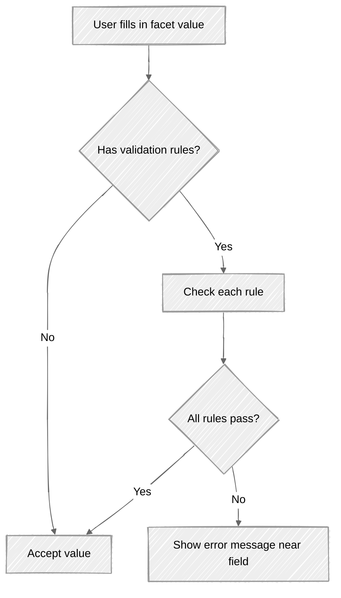

# Validation

> How to validate posting requirements-client-side rules for real-time UI feedback and server-side validation endpoints for pre-submission checks.

## Overview

Posting requirement validation happens at two levels:

1. **Client-side**-Apply facet validation rules (`maxlength`, `regex`, `date`, etc.) in your UI for real-time feedback as the user fills in fields
2. **Server-side**-Call dedicated validation endpoints to verify posting requirements against the channel before ordering

Client-side validation is optional but improves UX. Server-side validation is always enforced-both by the validation endpoints and during campaign ordering.

For validating vacancy fields and full campaigns (including posting requirements), see [Campaign Validation](../08-campaigns/validation.md).

## Client-Side Validation

Each facet can include a `rules` array with validation constraints. Applying these in your UI catches errors early, before the user submits.

For the full list of rule types and their data formats, see [Facets-Validation Rules](facets.md#validation-rules).

### Applying Rules



**Example**: A `TEXT` facet with `maxlength` and `regex` rules:

```json
{
  "name": "postal_code",
  "type": "TEXT",
  "required": true,
  "rules": [
    { "rule": "maxlength", "data": "10" },
    { "rule": "regex", "data": "/^[0-9]{4,6}$/" }
  ],
  "message": "Enter a valid postal code (4-6 digits)"
}
```

Your UI should:
1. Restrict input to 10 characters
2. Validate against the regex pattern
3. Show the `message` field as help text

### Display Rules Affect Validation

If a facet is hidden by `display_rules`, skip validation entirely-even if `required: true`. Hidden facets should be omitted from the submission. See [Facets - Display Rules](facets-display-rules.md).

## Server-Side Validation Endpoints

| Endpoint | Description |
|----------|-------------|
| `POST /campaigns/validate-channel-posting/` | Validate posting requirements for a specific product + contract combination |
| `POST /campaigns/validate-questionnaire/` | Validate a questionnaire configuration for Direct Apply channels |

See [Validation - Endpoint Reference](./validation.endpoints.md) for full request/response details.

## Edge Cases & Gotchas

<!-- theme: warning -->
> **Format difference between endpoints.** `validate-channel-posting` uses `posting_requirements` as an array of `{name, value}` objects. The campaign ordering endpoint uses `postingRequirements` as a flat key-value object inside `orderedProductsSpecs`. Don't mix the formats.

<!-- theme: warning -->
> **Credential errors in validate-channel-posting.** If the response includes `credentials` errors, the contract's stored credentials are invalid or incomplete. The contract needs to be updated-this is not a posting requirements issue.

<!-- theme: info -->
> **Loose validation.** Both endpoints support `?loose=true`, allowing configured vacancy fields to be omitted from the validation payload. The configured fields are exposed in ATS settings; see [Campaign Validation](../08-campaigns/validation.md) for details.

## Related

- [Facets-Validation Rules](facets.md#validation-rules)-client-side rule types and data formats
- [Facets - Display Rules](facets-display-rules.md)-hidden facets skip validation
- [Campaign Validation](../08-campaigns/validation.md)-vacancy field validation, full campaign validation, `?validateOnly`, loose validation
- [Campaign Ordering](../08-campaigns/ordering.md)-submitting campaigns, `?validateOnly`, `?loose` modes
- [Contract Posting Requirements](../06-contracts/posting-requirements.md)-contract-specific posting requirement retrieval
- [Direct Apply-Posting Requirements](../10-direct-apply/posting-requirements.md)-questionnaire configuration and validation
