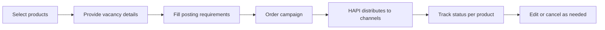
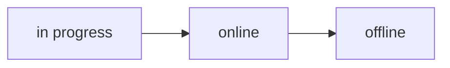

# Campaigns
> Order, track, edit, and cancel job postings across multiple channels-all in a single API call.

## What is a Campaign?

A **campaign** is a request to post a vacancy on one or more job board channels. It is the core of HAPI-everything in the API (products, contracts, taxonomy, posting requirements) feeds into creating and managing campaigns.

You build a campaign by selecting products (job boards), providing vacancy details (title, description, location), filling in any channel-specific posting requirements, and submitting the order. HAPI handles the rest-distributing the posting to each channel, tracking delivery status, and reporting back.

A campaign can contain:
- **One product**-post to a single job board.
- **Multiple products**-post to several job boards in one order.
- **A bundle**-a curated package of products ordered as one item. After ordering, the bundle is split into its individual products, so the campaign detail response shows multiple products even though you ordered one. See [Special Products](../05-products/03-special-products.md).

## Campaign Types

Campaigns are classified by the type of products they contain:

| Type | Description | Products Used |
|------|-------------|---------------|
| **Job Marketing (JM)** | Post using VONQ's marketplace inventory. No contracts needed-pay per posting. | Marketplace products |
| **Job Post (JP)** | Post using your own job board contracts/credits. Requires contracts to be set up first. | Contract-based products |
| **Mixed** | Combine marketplace and contract-based products in a single campaign. | Both |

Job Marketing campaigns are the simplest to integrate-select products, provide vacancy details, and order. Job Post campaigns require [contracts](../06-contracts/01-introduction.md) to be configured before ordering. Mixed campaigns combine both in a single order.

## How It Works

The typical campaign flow:

1. **Select products**-choose which job boards to post on from the [marketplace](../05-products/02-marketplace.md) or your [contracts](../06-contracts/01-introduction.md).
2. **Provide vacancy details**-job title, description, location, salary, employment type, and other [vacancy fields](./vacancy-fields.md).
3. **Fill posting requirements**-channel-specific fields required by each product (e.g., job category for Indeed, remote work options for LinkedIn). See [Posting Requirements](../07-posting-requirements/01-introduction.md).
4. **Validate**-optionally [validate](./validation.md) the campaign before ordering to catch errors early.
5. **Order**-submit the campaign via `POST /campaigns/order`. See [Ordering](./ordering.md).
6. **Track**-monitor [campaign and product status](./status.md) as each channel processes the posting.
7. **Edit**-update vacancy details or posting requirements on live campaigns, if the channel supports it. See [Editing](./editing.md).
8. **Cancel**-take the entire campaign or individual products offline. See [Cancellation](./cancellation.md).

## Campaign Lifecycle

Every campaign moves through three statuses:

| Status | Meaning |
|--------|---------|
| `in progress` | Campaign ordered, channels are processing the posting |
| `online` | At least one product is live on its job board |
| `offline` | All products have finished or been cancelled |

Each product within the campaign has its own status and transitions independently. A campaign is `online` when at least one product is live, and `offline` when all products are done.

Individual products can also reach a `not processed` status-a permanent failure meaning the channel could not publish the posting (e.g., invalid credentials, channel-side error). Check product-level status to catch these. See [Status & Lifecycle](./status.md).

## Key Concepts

**Vacancy Fields**-job-level information shared across all products in the campaign: title, description, location, salary, employment type, and more. See [Vacancy Fields](./vacancy-fields.md).

**Posting Requirements**-channel-specific fields that vary by product. Each job board has its own requirements (e.g., job categories, application methods, remote work options). Fetched dynamically from the API. See [Posting Requirements](../07-posting-requirements/01-introduction.md).

**Loose Validation**-a query parameter (`?loose=true`) on the ordering endpoint that allows configured vacancy fields to be omitted from the campaign payload. Validation still applies to the rest of the payload. Useful for quick integrations or when not all vacancy data is available. See [Ordering](./ordering.md).

**Labels**-custom tags you can attach to campaigns for filtering and organization. Use labels to group campaigns by team, department, or hiring initiative, then filter with the campaign list endpoint.

**Editability**-not all campaigns can be edited after ordering. A campaign is editable only if it is not offline and at least one product's channel supports editing. Check the `isEditable` flag on the campaign response. See [Editing](./editing.md).

**CPA+**-campaigns containing CPA+ products include AI-screened candidate applications. The campaign response includes `cpaResults` with application counts. See [CPA+](../09-cpa.md).

## What's Next

| Page | Description |
|------|-------------|
| [Vacancy Fields](./vacancy-fields.md) | Job-level fields: title, description, location, salary, and more |
| [Validation](./validation.md) | Validate campaigns before ordering to catch errors early |
| [Ordering](./ordering.md) | Submit campaign orders-request structure, payment, and response |
| [Status & Lifecycle](./status.md) | Track campaign and product status, delivery dates, and job board links |
| [Editing](./editing.md) | Update live campaigns-editable fields and channel support |
| [Cancellation](./cancellation.md) | Cancel entire campaigns or individual products |
| [Webhooks](./webhooks.md) | Receive campaign status updates via webhooks |
| [CPA+](./cpa.md) | CPA+ campaign-specific details within the campaigns context |
| [Bundles](./bundles.md) | Ordering bundles and how they appear in campaign responses |
| [Smartfill](./smartfill.md) | AI-powered autofill for vacancy fields and posting requirements |
