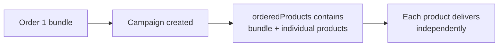

# Bundles
> Order a curated package of products as a single item-after ordering, it expands into its individual products.

## Overview

In HAPI, a **bundle** is a product that contains multiple job boards packaged together at a discounted price. You order it like any other product-by its product ID-but after ordering, the campaign response shows the individual bundled products alongside the bundle itself.

Bundles are visually distinct in the product catalog (different naming, logos suggesting multiple boards) but functionally they go through the same ordering flow as regular products. For how to identify bundles in the catalog, see [Special Products](../05-products/03-special-products.md).

## How Bundles Work in Campaigns

### Ordering

You order a bundle by including its product ID in `orderedProducts`-exactly the same as any other product. You can mix bundles with regular products and contract-based (My Contract) products in the same campaign.

See [Bundles in Campaigns - Endpoint Reference](./bundles.endpoints.md) for full request/response examples.

### After Ordering

When you retrieve the campaign (`GET /campaigns/{campaignId}`), the `orderedProducts` array contains **both** the bundle ID and the individual bundled product IDs. If a bundle contains three products, you see four product IDs in total.

The bundle product ID persists in the response alongside the individual products. Each bundled product has its own status, delivery date, and job board link-they transition independently just like any other product in a campaign.

There are no bundle-specific fields in the campaign response. The bundled products appear as regular entries in `orderedProductsSpecs` and `postings`.

See [Bundles in Campaigns - Endpoint Reference](./bundles.endpoints.md) for full response examples.

## Pricing

Bundles are priced lower than ordering the individual products separately. The bundle's `vonq_price` in the product catalog reflects this discounted price. See [Special Products](../05-products/03-special-products.md) for details on bundle pricing.

## Edge Cases & Gotchas

<!-- theme: info -->
> ### No Special Restrictions
> Bundles have no special restrictions for editing or cancellation. A campaign containing a bundle follows the same rules as any other campaign-check `isEditable` for editing, cancel individual products or the entire campaign as usual.

- **Product count increases after ordering**-if you order one bundle and one regular product, the campaign response may show five or more products (bundle + bundled products + regular product). Build your UI to handle a dynamic product count.
- **Each bundled product has its own status**-one might be `online` while another is still `in progress` or `not processed`. Track each individually.
- **Bundle ID stays in the response**-the original bundle product ID remains in `orderedProducts` alongside the individual products. You can use this to group the bundled products in your UI.

## Related

- [Special Products](../05-products/03-special-products.md)-identifying bundles in the product catalog, pricing
- [Ordering](./ordering.md)-campaign ordering flow
- [Status & Lifecycle](./status.md)-per-product status tracking
