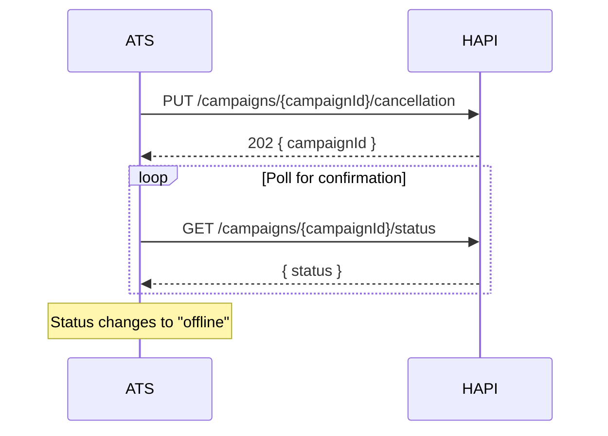

# Cancellation
> Take entire campaigns or individual products offline.

## Overview

HAPI supports two levels of cancellation:

- **Campaign cancellation**-takes all products offline and ends the campaign.
- **Product cancellation**-takes a single product offline while the rest of the campaign remains active.

Both operations are asynchronous-the API accepts the request and processes the cancellation in the background. Poll the status endpoint or use [webhooks](./webhooks.md) to confirm completion.

## Endpoints

| Method | Path | Description |
|--------|------|-------------|
| PUT | `/campaigns/{campaignId}/cancellation` | Cancel an entire campaign |
| PUT | `/campaigns/{campaignId}/product_cancellation` | Cancel a single product within a campaign |

See [Campaign Cancellation - Endpoint Reference](./cancellation.endpoints.md) for full request/response details.

## Campaign vs Product Cancellation

| | Campaign Cancellation | Product Cancellation |
|---|---|---|
| **Scope** | All products go offline | Single product goes offline |
| **Campaign status after** | `offline` | Stays `online` (if other products remain live) |
| **Editable after?** | No-`isEditable` becomes `false` | Yes-campaign remains editable |
| **Product requirement** | Campaign must be online | Specific product must be `online` |

## Workflows

### Cancelling and Confirming

1. Submit cancellation request.
2. Poll `GET /campaigns/{campaignId}/status` until the campaign (or product) status is `offline`.
3. Alternatively, use [webhooks](./webhooks.md) to receive a notification when the status changes.

## Edge Cases & Gotchas

### Cancelling a Non-Online Campaign

What happens when you cancel a campaign that is not `online` depends on the `errorOnCancelCampaign` partner setting:

| Setting | Behavior |
|---------|----------|
| `false` (default) | Request is silently accepted-idempotent, no error returned |
| `true` | Returns `400` with `{"campaignId": ["The campaign is not online."]}` |

Contact your VONQ account manager to enable `errorOnCancelCampaign` if you want explicit errors when cancelling non-online campaigns.

<!-- theme: warning -->
> ### Cancellation Is Asynchronous
> A `202` response means the cancellation request was accepted, not that the posting has been removed from job boards. The actual removal happens in the background. Poll the status endpoint or use webhooks to confirm.

<!-- theme: warning -->
> ### Product Cancellation Requires Online Status
> You can only cancel a product that is currently `online`. Products that are `in progress`, `offline`, or `not processed` cannot be cancelled via this endpoint.

- **No undo**-once a campaign or product is cancelled, it cannot be reactivated. You must create a new campaign order.
- **Campaign goes offline when all products are done**-if you cancel the last remaining `online` product via product cancellation, the campaign status transitions to `offline`.
- **Cancellation does not guarantee refund**-whether costs are refunded depends on the product and job board. Contact your VONQ account manager for refund policies.

## Related

- [Status & Lifecycle](./status.md)-track status changes after cancellation
- [Editing](./editing.md)-editing is unavailable after campaign cancellation
- [Webhooks](./webhooks.md)-receive notifications when cancellation completes
- [Ordering](./ordering.md)-create a new campaign to replace a cancelled one
