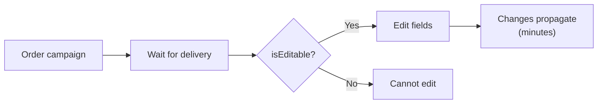
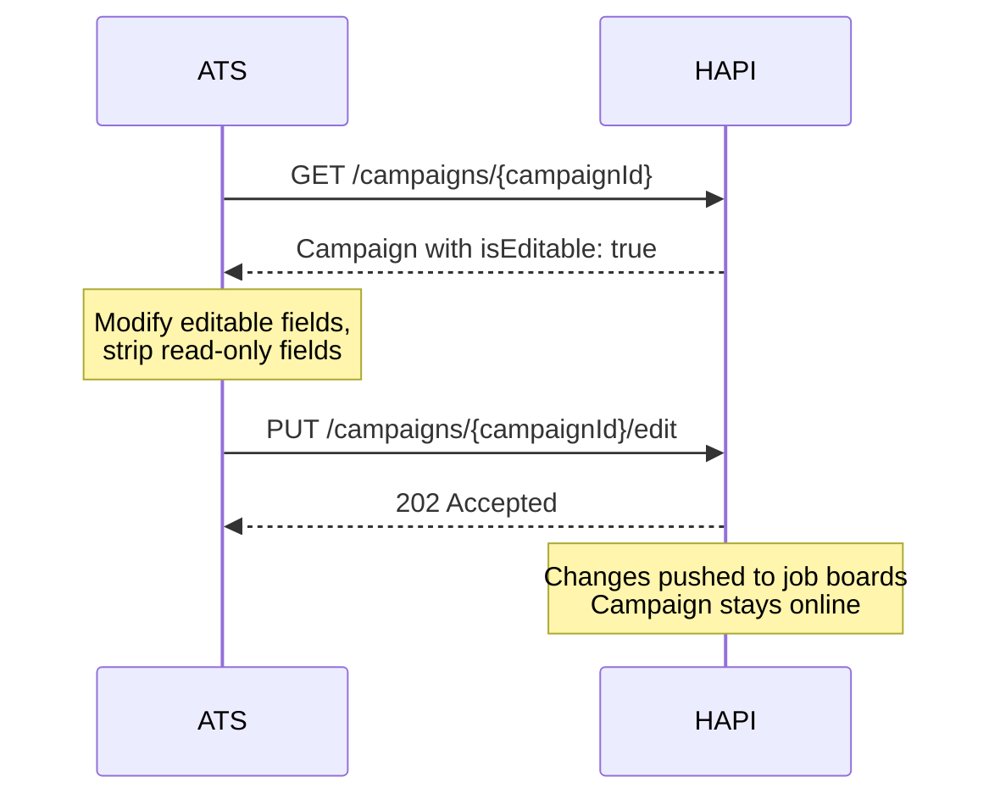

# Editing
> Update vacancy details and posting requirements on live campaigns.

## Overview

After ordering a campaign, you can edit vacancy fields and posting requirements while the campaign is still live. The edit endpoint accepts the full campaign payload and pushes changes to all active job boards.

Campaign editing is a **gated feature**-contact your VONQ account manager to enable it for your account.

The typical flow: after ordering, wait until at least one product has been delivered to its job board. Once the campaign's `isEditable` flag is `true`, you can submit edits. Changes are pushed to the job boards and typically propagate within minutes.

<!-- theme: info -->
> ### Some Edits Require Manual Processing
> Most edits are processed automatically and propagate within minutes. However, some channels require manual processing by VONQ operations, which may take longer. There is no API signal to distinguish between the two-if timing is critical, contact your VONQ account manager.

## When Is a Campaign Editable?

A campaign is editable when all three conditions are met:

1. The campaign is **not `offline`** (not cancelled or expired)
2. **At least one product has been delivered** to a job board (has a `deliveredOn` date)
3. **At least one product was marked as editable** at the time of ordering (the product's `allows_edit` property is `true`)

Check the `isEditable` flag on the campaign response (`GET /campaigns/{campaignId}`) to determine whether editing is available. Use this flag to show or hide the edit option in your UI.

<!-- theme: warning -->
> ### X-Customer-Id Must Match
> The `isEditable` flag is `true` only when you authenticate with the same `X-Customer-Id` that was used when the campaign was created. With a different customer ID, `isEditable` is always `false`.

<!-- theme: info -->
> ### Timing
> Campaigns become editable once the first product is delivered to its job board-typically within minutes of ordering. The campaign stays `online` during edit processing; it does **not** revert to `in progress`.

## What Can Be Edited?

### Editable Fields

| Section | Fields |
|---------|--------|
| `campaignName` | Campaign display name |
| `recruiterInfo` | `name`, `emailAddress` |
| `postingDetails` | `title`, `description`, `organization` (name, companyLogo), `workingLocation`, `contactInfo`, `yearsOfExperience`, `employmentType`, `weeklyWorkingHours`, `salaryIndication` |
| `targetGroup` | `educationLevel`, `seniority`, `industry`, `jobCategory` |
| `orderedProductsSpecs[].postingRequirements` | Channel-specific posting requirement values |

### Non-Editable Fields

These fields **must be included** in the edit payload but **must match their original values**. Sending different values results in a `400` error:

| Field | Error If Changed |
|-------|-----------------|
| `companyId` | `companyId cannot be updated` |
| `orderReference` | `orderReference cannot be updated` |
| `currency` | `currency cannot be updated` |
| `orderedProducts` | `Product IDs passed in request do not match with the product IDs in the campaign` |
| `orderedProductsSpecs[].contractId` | `Contract ID cannot be changed for product {id}` |
| `orderedProductsSpecs[].utm` | `utm cannot be changed for product {id}` |
| `orderedProductsSpecs[].postingDurationDays` | `postingDurationDays cannot be changed for product {id}` |
| `postingDetails.jobPageUrl` | `jobPageUrl cannot be updated` |
| `postingDetails.applicationUrl` | `applicationUrl cannot be updated` |

You **cannot add or remove products** from a live campaign. To stop a specific product, use cancellation instead-see [Cancellation](./cancellation.md).

## Endpoints

| Method | Path | Description |
|--------|------|-------------|
| PUT | `/campaigns/{campaignId}/edit` | Update a live campaign's vacancy fields and posting requirements |

See [Campaign Editing - Endpoint Reference](./editing.endpoints.md) for full request/response details.

## Workflows

### Editing a Live Campaign

## Edge Cases & Gotchas

<!-- theme: warning -->
> ### Edit Debouncing: 5-Minute Window
> HAPI introduces a 5-minute waiting period before processing an edit request. If you submit another edit within that window, the previous edit is discarded and the timer resets. Only the last edit submitted within the window is processed. Design your UI to batch changes into a single edit submission rather than sending rapid successive edits.

<!-- theme: warning -->
> ### CPA+ Campaigns Cannot Be Edited
> Campaigns containing CPA+ products do not support editing. The `isEditable` flag is always `false` for these campaigns.

<!-- theme: warning -->
> ### Editing May Incur Additional Costs
> Some job boards charge for modifications to live postings. The cost depends on the product and channel-some offer free edits or allow certain changes (like job title) without additional charges, while others charge per edit. For My Contract (JP) products, the recruiter may be charged separately by the job board. Check with your VONQ account manager for product-specific pricing.

<!-- theme: warning -->
> ### Validation Is Applied on Edit
> The edit endpoint validates the payload the same way as the ordering endpoint. Both vacancy field validation and channel-specific posting requirement validation are applied. Use the [validation endpoints](./validation.md) to pre-validate changes before submitting.

- **The campaign stays `online` during editing**-there is no intermediate status transition. Changes are processed and pushed to job boards in the background.
- **Products cannot be added or removed**-the `orderedProducts` array must match the original exactly. To stop a product, use [Cancellation](./cancellation.md).
- **Pre-validate before editing**-use `POST /campaigns/validate-campaign/` with the edit payload to catch errors before submitting.

## Related

- [Status & Lifecycle](./status.md)-`isEditable` flag and campaign statuses
- [Vacancy Fields](./vacancy-fields.md)-field reference for editable vacancy fields
- [Validation](./validation.md)-pre-validate edit payloads
- [Cancellation](./cancellation.md)-cancel products you can't remove via editing
- [Ordering](./ordering.md)-edit payload mirrors the ordering structure
