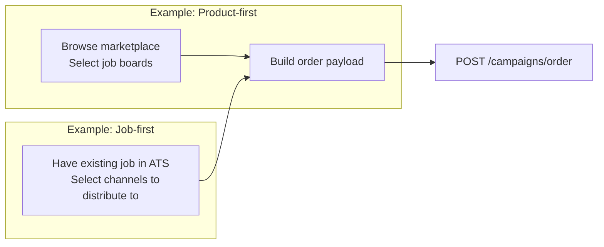
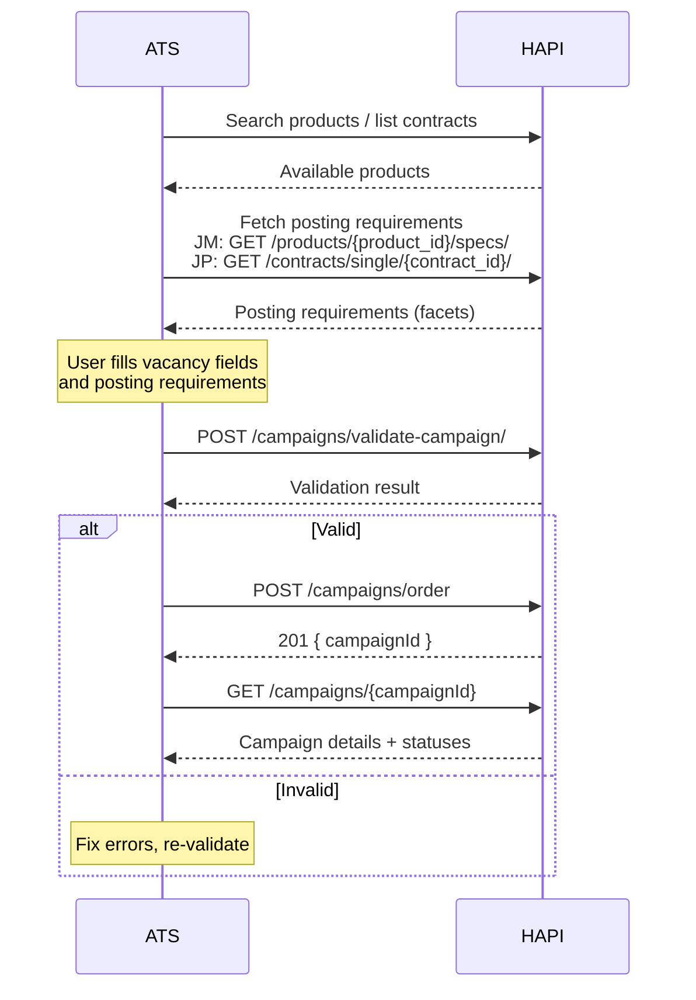

# Ordering
> Submit a campaign to post a vacancy on one or more job boards-the core action in HAPI.

## Overview

Campaign ordering is the endpoint where everything comes together: vacancy fields, product selection, posting requirements, and payment. A single `POST /campaigns/order` call creates a campaign that distributes your vacancy to all selected channels.

How you get to the ordering step depends on your workflow:



**Product-first**-you start by browsing the [marketplace](../05-products/02-marketplace.md) to find relevant job boards, then build the vacancy details and order. Common when a recruiter is deciding where to advertise a new vacancy.

**Job-first**-you already have a job in your ATS with all vacancy details. You select one or more channels to distribute it to and submit the order. Common when a job is already live on some boards and you want to extend reach to additional channels-you reuse the existing vacancy payload and just pick new products.

Both paths converge at the same endpoint: `POST /campaigns/order`.

### After Ordering


1. **[Validate](./validation.md)**-optionally validate the payload before ordering to catch errors early.
2. **Order**-submit via `POST /campaigns/order`. Returns a `campaignId`.
3. **[Poll status](./status.md)**-check campaign and per-product status until all products are live (or failed). Or receive updates via [webhooks](./webhooks.md).
4. **[Edit](./editing.md)** / **[Cancel](./cancellation.md)**-update vacancy details or take products offline as needed.

### Campaign Types

The products you include determine the campaign type:

| Type | Products | Posting Requirements | Payment |
|------|----------|---------------------|---------|
| **Job Marketing (JM)** | Marketplace products | Optional or product-dependent-include `orderedProductsSpecs` when the product has posting requirements or UTM tracking | Pay per posting |
| **Job Post (JP)** | Contract-based products | Required-`contractId` + `postingRequirements` in `orderedProductsSpecs` | Uses contract credits |
| **Mixed** | Both | Required for JP products and for any JM products with product-level posting requirements | Both |

## Endpoints

| Method | Path | Description |
|--------|------|-------------|
| POST | `/campaigns/order` | Create a campaign to post a vacancy on one or more job boards |

See [Campaign Ordering - Endpoint Reference](./ordering.endpoints.md) for full request/response details.

## orderedProducts

A flat array of product IDs. Include all products you want in the campaign-both JM and JP:

```json
"orderedProducts": [
  "d1e2f3a4-b5c6-7890-abcd-ef1234567890",
  "d2e3f4a5-b6c7-8901-bcde-f12345678901"
]
```

- For JM products, use the product ID from the [marketplace search](../05-products/02-marketplace.md).
- For JP products, use the `product.product_id` from the [contract](../06-contracts/managing-contracts.md).

## orderedProductsSpecs

Per-product configuration. Required for JP products; optional for JM products unless the product has product-level posting requirements or you are adding UTM tracking.

| Field | Type | Required | Description |
|-------|------|----------|-------------|
| `productId` | string | Yes | Must match an ID in `orderedProducts` |
| `contractId` | string (UUID) | JP only | Contract to use for this product |
| `postingRequirements` | object | Conditional | Channel-specific field values as key-value pairs. Required when the selected JP contract or JM product has posting requirements. |
| `postingRequirementsLabels` | object | No | Human-readable labels for posting requirement values |
| `utm` | string | No | UTM tracking parameters |
| `postingDurationDays` | integer | No | Override posting duration (JP only) |

<!-- theme: info -->
> ### postingRequirementsLabels
> When using autocomplete facets, you submit the selected option's `key` as the posting requirement value. The `postingRequirementsLabels` field lets you store the corresponding human-readable `label` alongside it. This is useful because you cannot retrieve a label from a key after the fact-the autocomplete endpoint only searches forward, not by key lookup.

<!-- theme: info -->
> ### UTM Tracking
> Add UTM parameters to track clicks from specific job boards back to your application page. The `utm` field accepts a query string (e.g., `utm_source=vonq&utm_medium=jobboard&utm_campaign=senior-dev`). This is appended to your `applicationUrl` when the posting goes live. Use UTMs to consolidate click tracking across channels.

<!-- theme: info -->
> ### Posting Duration Override
> For JP (contract-based) products, you can override the posting duration with `postingDurationDays`. Allowed values are `-1` (no custom expiration-the job stays up until the channel's default or until manually taken offline) or between `7` and `365`. If omitted, the duration falls back to the contract's `posting_duration_days` setting, or the channel's default if that is also unset.

## Labels

**Labels** are optional key-value pairs you attach to a campaign for filtering and organization. Use them to group campaigns by team, department, hiring initiative, or any other dimension relevant to your workflow.

```json
"labels": {
  "department": "engineering",
  "region": "EMEA",
  "hiring_manager": "jane.doe"
}
```

After ordering, filter campaigns by label using the list endpoint:

```
GET /campaigns?label[department]=engineering
```

You can filter on multiple labels simultaneously.

## Payment Methods

| Method | Required Fields | Description |
|--------|----------------|-------------|
| `ats_managed` | None | Default. VONQ invoices your organization separately. |
| `wallet` | `walletId` | Deduct the campaign cost from a pre-funded wallet balance. See [Wallets & Payments](../12-wallets-and-payments.md). |
| `direct_charge` | `walletId` | Charge the wallet's configured payment method directly for this campaign. No pre-funded balance is required. |
| `purchase_order` | `poNumber` | Create a purchase order to be invoiced separately. |

For `wallet`, `direct_charge`, and `purchase_order`, the order must contain at least one product with a price greater than `0`. If `paymentMethod` is omitted, HAPI uses `ats_managed`.

For details on wallet setup and payment flows, see [Wallets & Payments](../12-wallets-and-payments.md).

## Loose Validation

Adding `?loose=true` to the ordering endpoint relaxes validation, making certain vacancy fields optional:

- `postingDetails.yearsOfExperience`
- `postingDetails.workingLocation.addressLine1`
- `targetGroup.educationLevel`
- `targetGroup.seniority`
- `targetGroup.industry`
- `targetGroup.jobCategory`

<!-- theme: warning -->
> ### Restrictions
> - Your account must have the `allowOmitCampaignOrderingFields` flag enabled. Contact your VONQ account manager.
> - Loose validation is **not allowed** when any ordered product is a My Contract (MOC) product. The API returns `400` if attempted.

See [Vacancy Fields-Loose Validation](./vacancy-fields.md#loose-validation) for the full field list.

## Workflows

### Ordering Flow



## Edge Cases & Gotchas

<!-- theme: warning -->
> ### JM Products Usually Don't Need Specs
> Do not include `orderedProductsSpecs` entries for JM (marketplace) products unless you are adding UTM tracking or the product has product-level posting requirements, such as Direct Apply facets. Only JP (contract-based) products require `contractId`.

<!-- theme: warning -->
> ### Contract Customer Group
> When ordering multiple JP products, all contracts must belong to the same customer group. If they don't, the API returns `403 Forbidden`.

<!-- theme: warning -->
> ### postingRequirements Format
> In `orderedProductsSpecs`, posting requirements use a flat key-value object: `{ "location": "berlin-mitte" }`. This differs from the `{ name, value }` array format used by `validate-channel-posting`. See [Validation](./validation.md).

- **Campaign ordering can take time**-the API processes each product's posting. Expect response times up to 30 seconds for campaigns with many products.
- **The response is minimal**-only `campaignId` is returned. Fetch full details with `GET /campaigns/{campaignId}` after ordering.
- **`Accept-Language` affects error messages**-set this header to get validation error messages in the user's language. See [Localization](../../02-api-overview.md#localization).
- **Posting duration varies by product type**-JM products have a predetermined duration set by the channel. JP products use `postingDurationDays` from the order, the contract's `posting_duration_days`, or the channel's default (in that priority order).

## Related

- [Vacancy Fields](./vacancy-fields.md)-field reference for `postingDetails`, `targetGroup`, `recruiterInfo`
- [Validation](./validation.md)-validate before ordering, `?validateOnly=true`, error formats
- [Status & Lifecycle](./status.md)-track campaign and product status after ordering
- [Products](../05-products/01-introduction.md)-marketplace search and product details
- [Contracts](../06-contracts/01-introduction.md)-contract setup for JP products
- [Posting Requirements](../07-posting-requirements/01-introduction.md)-channel-specific fields
- [Facets - Display Rules](../07-posting-requirements/facets-display-rules.md)-which posting requirements to show/omit based on other values
- [Wallets & Payments](../12-wallets-and-payments.md)-wallet and payment method details
- [Direct Apply](../10-direct-apply/01-introduction.md)-Direct Apply webhook configuration
