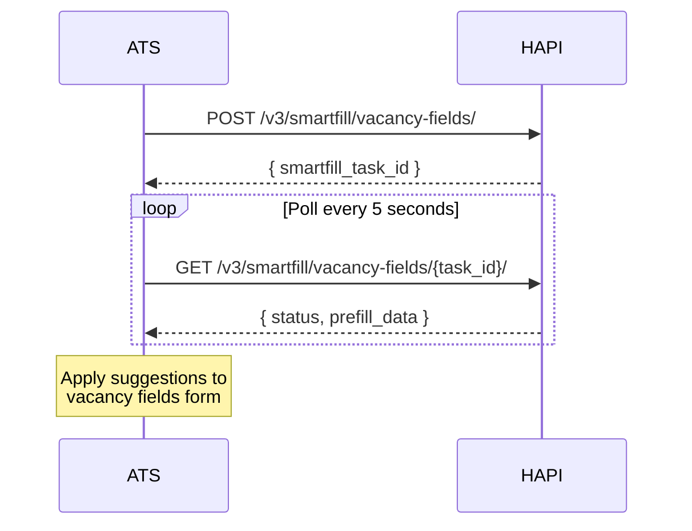
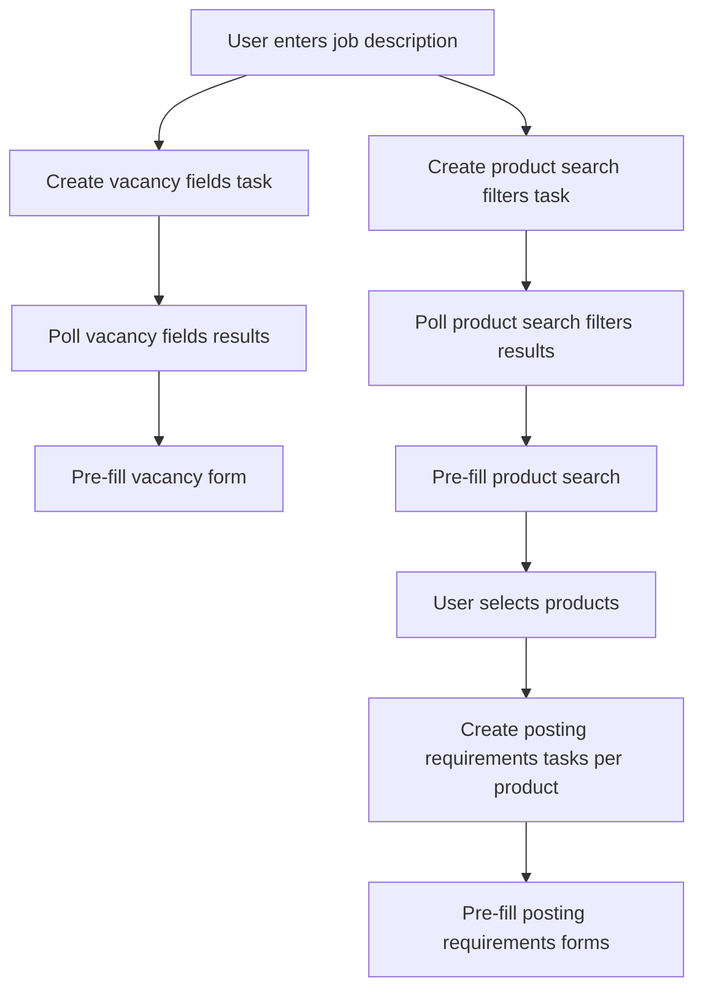

# Smartfill for Vacancy Fields
> AI-powered suggestions for vacancy fields-let Smartfill propose job details, taxonomy, and recruiter info based on your job context.

## Overview

HAPI's Smartfill can auto-fill vacancy fields (posting details, target group, recruiter info) based on context you provide-typically the job description and any structured data you already have. This reduces manual data entry when building a campaign.

This page covers Smartfill for **vacancy fields** specifically. Smartfill also supports:
- **Posting requirements**-channel-specific fields per product. See [Posting Requirements-Smartfill](../07-posting-requirements/smartfill.md).
- **Product search filters**-suggestions for product search parameters (job title, location, industry). See [Product Search Filters](#product-search-filters) below.

<!-- theme: info -->
> ### Feature Gating
> Smartfill is not enabled by default. Contact your VONQ account manager to enable it. Check availability via `GET /v3/ats/atsuser/me/settings/`-the `settings.smartfill.vacancy_fields` boolean indicates whether vacancy field Smartfill is active for your account.

## How It Works

Smartfill uses the same async create-then-poll pattern as posting requirements Smartfill:

1. **Create** a Smartfill task with job context.
2. **Poll** for results every ~5 seconds.
3. **Apply** suggestions to pre-fill the vacancy fields form.

Use the `smartfill_task_id` returned by the create response as the `{task_id}` value in the polling URL.

Results are returned incrementally-`prefill_data` grows as the AI processes more fields. Previously returned suggestions are not modified; only new fields are added. Check `updated_at` to detect changes.

## Endpoints

| Method | Path | Description |
|--------|------|-------------|
| POST | `/v3/smartfill/vacancy-fields/` | Create a Smartfill task for vacancy fields |
| GET | `/v3/smartfill/vacancy-fields/{task_id}/` | Retrieve status and results of a vacancy fields Smartfill task |
| POST | `/v3/smartfill/product-search-filters/` | Create a Smartfill task for product search filters |
| GET | `/v3/smartfill/product-search-filters/{task_id}/` | Retrieve status and results of a product search filters Smartfill task |

See [Campaign Smartfill - Endpoint Reference](./smartfill.endpoints.md) for full request/response details.

## Product Search Filters

Smartfill can also suggest product search parameters-job title, location, industry, and job function-to help users find relevant products in the marketplace. This uses a separate endpoint but the same create-then-poll pattern.

Use the `POST /v3/smartfill/product-search-filters/` endpoint to create a task, then poll `GET /v3/smartfill/product-search-filters/{task_id}/` for results. The `id` values in the response can be passed directly to the product search endpoint filters.

See [Campaign Smartfill - Endpoint Reference](./smartfill.endpoints.md) for full request/response examples.

## Workflows

### Suggested Integration

Trigger Smartfill tasks early-as soon as you have job context-so results are ready by the time the user reaches each form:

Start all three Smartfill types (vacancy fields, product search filters, posting requirements) as early as possible. The posting requirements task requires a `product_id` or `contract_id`, so it can only be created after product selection.

## Edge Cases & Gotchas

<!-- theme: warning -->
> ### Suggestions Are Best-Effort
> Smartfill may not return suggestions for all fields. Always allow the user to review and override suggestions. Never submit Smartfill results without user confirmation.

<!-- theme: warning -->
> ### Taxonomy Names May Be Multilingual
> Some taxonomy suggestions (seniority, education level) return an array of translations instead of a single string. Select the appropriate locale for your user.

- **Provide as much context as possible**-the quality of suggestions depends on the richness of the context. Include job description, company details, and any structured data you have.
- **Start early**-create the Smartfill task at the beginning of the job posting flow so results are ready when the user reaches the form.
- **Partial results are usable**-you can apply suggestions from `prefill_data` even while the task is still `started`. New fields are added incrementally.

## Related

- [Vacancy Fields](./vacancy-fields.md)-field reference for the vacancy object
- [Posting Requirements-Smartfill](../07-posting-requirements/smartfill.md)-Smartfill for channel-specific posting requirements
- [Products-Marketplace](../05-products/02-marketplace.md)-product search filters
- [Taxonomy](../04-taxonomy.md)-taxonomy values used in suggestions
