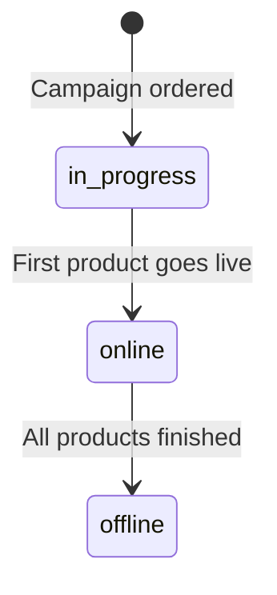
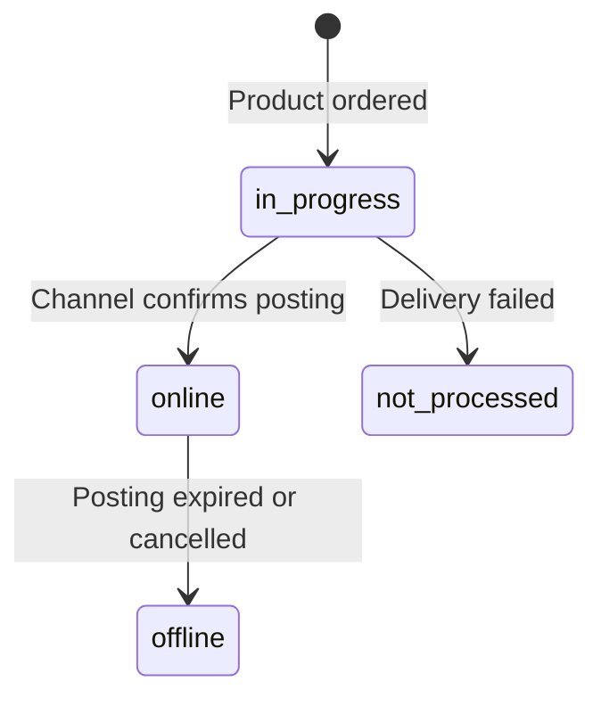
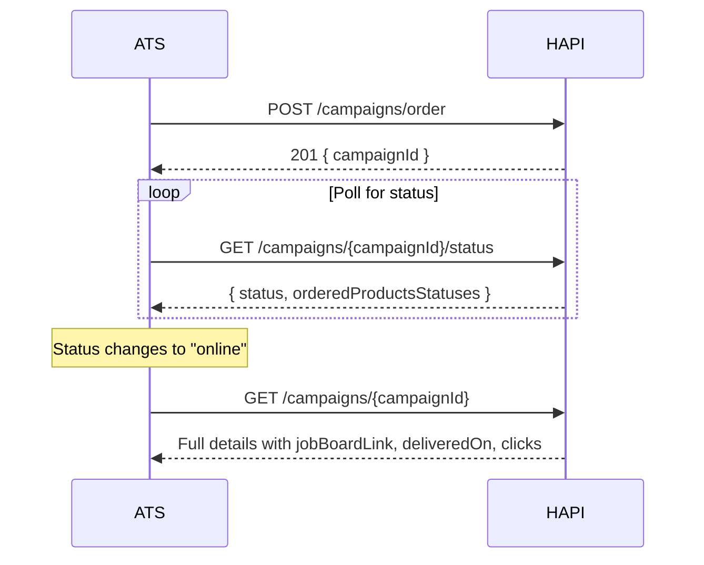

# Status & Lifecycle
> Track campaign and product status, delivery dates, job board links, and click metrics.

## Overview

After ordering a campaign, each product is processed independently-delivered to its job board, going live, and eventually expiring or being cancelled. HAPI tracks status at two levels: the **campaign** (aggregate) and each **ordered product** (individual).

You can check status by polling the API or by receiving webhook notifications. For webhooks, contact your VONQ account manager to opt in-see [Webhooks](./webhooks.md).

## Campaign Status

A campaign has three statuses:



| Status | Meaning |
|--------|---------|
| `in progress` | Campaign ordered, products are being processed and delivered to channels |
| `online` | At least one product is live on its job board |
| `offline` | All products have finished, expired, or been cancelled |

The campaign status is an aggregate-it reflects the best state across all its products. A campaign is `online` as soon as one product goes live, even if others are still `in progress` or have failed.

## Product Status

Each ordered product transitions independently:



| Status | Meaning |
|--------|---------|
| `in progress` | Product is being processed and delivered to the job board |
| `online` | Posting is live on the job board |
| `offline` | Posting has expired, been cancelled, or taken offline |
| `not processed` | **Permanent failure**-the channel could not publish the posting |

### not processed

The `not processed` status is a terminal state. The product cannot be retried-you must create a new campaign order to re-attempt posting on that channel.

Common causes:
- Invalid or expired contract credentials
- Channel-side error (e.g., job board API outage)
- Posting rejected by the channel (e.g., content policy violation)

When a product reaches `not processed`, check the status fields for details:

| Field | Description |
|-------|-------------|
| `statusDescription` | Human-readable explanation of the failure |
| `statusSolution` | Suggested action for the user-may contain HTML, display as a raw string for safety (do not render) |
| `statusRawError` | Raw error from the job board (JSON or XML string)-for debugging only, display as a raw string |

A campaign can remain `online` even if one or more products are `not processed`, as long as at least one other product is `online`.

## Endpoints

| Method | Path | Description |
|--------|------|-------------|
| GET | `/campaigns/{campaignId}/status` | Lightweight status check for a single campaign |
| GET | `/campaigns/{campaignId}` | Full campaign details including status, delivery dates, job board links, and metrics |
| GET | `/campaigns` | List campaigns with filtering and pagination |
| PATCH | `/campaigns/{campaignId}/edit` | **Sandbox only.** Simulate campaign and product status transitions for integration testing |

See [Status & Lifecycle - Endpoint Reference](./status.endpoints.md) for full request/response details.

## Sandbox Status Simulation

In production, campaign and product statuses change only when the job board confirms posting, expiry, or failure-which can take minutes or hours. To let you exercise your status-handling code (webhook handlers, polling loops, UI states) without waiting on real channel responses, HAPI exposes a sandbox-only endpoint that lets you drive a campaign through its lifecycle on demand.

```http
PATCH https://marketplace-sandbox.api.vonq.com/campaigns/{campaignId}/edit HTTP/1.1
X-Auth-Token: <your Partner token here>
X-Customer-Id: <customer-id>
Content-Type: application/json

{
  "status": "online",
  "orderedProductsSpecs": [
    {
      "productId": "2cbad29e-a510-52fc-bbdf-e873320e89f5",
      "status": "online",
      "statusDescription": "Posting delivered successfully.",
      "deliveredOn": "2026-05-21T10:00:00Z",
      "jobBoardLink": "https://example.com/jobs/123"
    }
  ]
}
```

Use it to drive products to `online`, `offline`, or `not processed` and verify your downstream behavior. Call it in production and you'll get `403 Forbidden`.

<!-- theme: warning -->
> ### Sandbox only
> This endpoint is blocked in production. It exists purely to let you simulate status transitions during integration development. Do not call it from production code paths or automated tests that run against production credentials.

## Workflows

### Checking Status After Ordering



1. **Order** the campaign-receive `campaignId`.
2. **Poll** with `GET /campaigns/{campaignId}/status` until status changes from `in progress`.
3. **Fetch full details** with `GET /campaigns/{campaignId}` once products are `online`-get job board links, delivery dates, and click metrics.

<!-- theme: info -->
> ### Prefer Webhooks Over Polling
> For production integrations, use [webhooks](./webhooks.md) instead of polling. Webhooks notify you immediately when statuses change, eliminating the need to poll repeatedly. Contact your account manager to enable webhook notifications.

### Incremental Sync

Use the `modifiedOn_gte` filter to fetch only campaigns that changed since your last sync:

```
GET /campaigns?modifiedOn_gte=2025-01-15T09:00:00Z&sortBy=modifiedOn.asc&limit=50
```

The `modifiedOn` timestamp updates whenever any product status changes within the campaign, making it reliable for incremental sync workflows.

1. Store the timestamp of your last sync.
2. Query with `modifiedOn_gte={lastSync}` sorted by `modifiedOn.asc`.
3. Process each campaign-update local status records.
4. Update your stored timestamp to the `modifiedOn` of the last processed campaign.

## Edge Cases & Gotchas

<!-- theme: warning -->
> ### Some Job Boards Don't Send Expiry Notifications
> Most job boards notify HAPI when a posting expires, but some do not. A product may show `online` briefly after the actual posting has ended on the board. Do not rely solely on HAPI status for real-time availability.

<!-- theme: warning -->
> ### not processed Is Permanent
> A product with `not processed` status cannot be retried or recovered. You must create a new campaign order to re-attempt posting on that channel. The `statusSolution` field may contain guidance for the user.

<!-- theme: warning -->
> ### Do Not Render Status Strings as HTML
> Both `statusSolution` and `statusRawError` may contain HTML, XML, or other markup from the job board. Always display these as raw strings-do not render them as HTML in your UI.

- **`deliveredOn` and `jobBoardLink` are null until online**-do not expect these fields to be populated while a product is `in progress`.
- **Click counts are cumulative and delayed**-the `clicks` field in `postings[]` is the aggregated total since the posting went live, not a delta. Expect some delay before new clicks appear.
- **Campaign list includes full product details**-each campaign in `GET /campaigns` includes `orderedProductsSpecs` and `postings`, so you can update all statuses in a single paginated call.

## Related

- [Ordering](./ordering.md)-create campaigns
- [Editing](./editing.md)-update live campaigns (check `isEditable` flag)
- [Cancellation](./cancellation.md)-cancel campaigns or individual products
- [Webhooks](./webhooks.md)-receive status change notifications
- [CPA+](../09-cpa.md)-CPA+ application metrics in campaign responses
