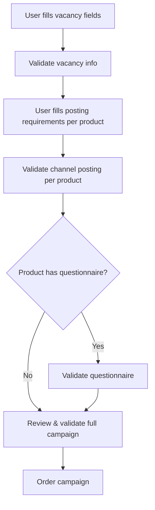

# Validation
> Catch errors before ordering-validate vacancy fields, posting requirements, or an entire campaign without creating it.

## Overview

HAPI provides dedicated validation endpoints so you can check for errors at each stage of the campaign-building process, rather than discovering them only at order time. This lets you build step-by-step UIs that validate as the user progresses.

There are four validation endpoints, each targeting a different scope:

| Endpoint | Scope | Use When |
|----------|-------|----------|
| `POST /campaigns/validate-vacancy-info/` | Vacancy fields only | User finishes filling in job details |
| `POST /campaigns/validate-channel-posting/` | Posting requirements for one product | User completes channel-specific fields for a product |
| `POST /campaigns/validate-questionnaire/` | Questionnaire for one product | User builds a screening questionnaire |
| `POST /campaigns/validate-campaign/` | Entire campaign payload | Final review before ordering |

In addition, you can pass `?validateOnly=true` to the ordering endpoint (`POST /campaigns/order`) for a dry-run validation of the full campaign.

This page covers **vacancy validation** and **full campaign validation**. For channel-specific validation, see [Posting Requirements-Validation](../07-posting-requirements/validation.md). For questionnaire validation, see [Direct Apply-Posting Requirements](../10-direct-apply/posting-requirements.md).

## Validation Flow

A typical integration validates progressively-first the vacancy, then per-product posting requirements, then the full campaign before ordering:

For simpler integrations, you can skip the individual validation steps and validate everything at once with `validate-campaign` or `?validateOnly=true` on the order endpoint.

## Loose Validation

All validation endpoints support the `?loose=true` query parameter. When enabled, only fields listed in `settings.campaigns.loose_validation` may be omitted from the validation payload. Validation still runs for all other fields.

Use `GET /v3/ats/atsuser/me/settings/` to read the configured fields:

| Setting | Applies To |
|---------|------------|
| `settings.campaigns.loose_validation.marketplace.fields` | Marketplace orders |
| `settings.campaigns.loose_validation.job_post.fields` | Job Post orders |

Mixed campaigns use the union of both lists. Empty lists mean no fields may be omitted for that campaign type.

<!-- theme: info -->
> ### Account Configuration Required
> Loose validation must be enabled for your account. Contact your VONQ account manager to enable it.

See [Vacancy Fields-Loose Validation](./vacancy-fields.md#loose-validation) for the possible field paths.

## Endpoints

| Endpoint | Scope |
|----------|-------|
| `POST /campaigns/validate-vacancy-info/` | Vacancy fields only |
| `POST /campaigns/validate-campaign/` | Complete campaign payload |
| `POST /campaigns/order?validateOnly=true` | Dry-run using the order endpoint format |

See [Campaign Validation - Endpoint Reference](./validation.endpoints.md) for full request/response details.

## Other Validation Endpoints

Two additional validation endpoints target channel-specific data for individual products:

### POST /campaigns/validate-channel-posting/

Validates posting requirements and credentials for a single product + contract combination. Use this after the user fills in channel-specific fields for a product.

This endpoint is covered in the posting requirements documentation. See [Posting Requirements-Validation](../07-posting-requirements/validation.md#post-campaignsvalidate-channel-posting) for full details, and [Products-Posting Requirements](../05-products/04-posting-requirements.md) and [Contracts](../06-contracts/01-introduction.md) for the product and contract context.

### POST /campaigns/validate-questionnaire/

Validates a screening questionnaire for products that support it (typically Direct Apply channels). The questionnaire is a posting requirement facet of type `QUESTIONNAIRE`.

See [Direct Apply-Posting Requirements](../10-direct-apply/posting-requirements.md#post-campaignsvalidate-questionnaire) for full details on questionnaire structure and validation.

## Edge Cases & Gotchas

<!-- theme: warning -->
> ### `validate-campaign` Does Not Check Product Orderability
> The `validate-campaign` and `?validateOnly=true` endpoints validate vacancy fields, posting requirements, and payload structure - but they do **not** check whether products are currently orderable for your account. A payload that passes validation can still be rejected by `POST /campaigns/order` with `"orderedProducts: This value is not valid."` if a product is inactive, not visible to your customer, or otherwise restricted. Always handle order-time errors separately from validation errors.

<!-- theme: warning -->
> ### Error Structure Is Not Fully Standardized
> The error format varies between validation endpoints. Vacancy validation returns nested errors matching the request structure. Channel posting validation returns `credentials` and `posting_requirements` sections. Full campaign validation combines both. Always check the `has_errors` boolean first, then parse the `errors` object based on which endpoint you called.

<!-- theme: warning -->
> ### Positional Product Errors
> In `validate-campaign` and `?validateOnly=true` responses, the `orderedProductsSpecs` error array is positional. The first error object corresponds to the first product in your request. If you reorder products in your request, the error positions shift accordingly.

<!-- theme: info -->
> ### Conditional Vacancy Field Requirements
> Some posting requirement facets conditionally require specific vacancy fields. For example, when a channel's `delivery` facet is set to `email`, the `contactInfo.emailAddress` vacancy field becomes required. When set to `url`, the `applicationUrl` field is required. These conditional requirements are enforced during validation-if you see unexpected vacancy field errors, check whether a posting requirement option has introduced additional field requirements.

- **Validate early, validate often**-use the progressive validation flow to catch errors at each step rather than discovering them all at order time. This provides a better user experience.
- **Credential errors are contract issues**-if `validate-campaign` returns credential errors for a product, the contract is missing required credentials. This is a setup issue, not a user input issue. See [Contracts-Notes](../06-contracts/notes.md).
- **Remote validation for questionnaires**-questionnaire validation is performed by the channel's remote service. It may return a `503` if the service is temporarily unavailable.

## Related

- [Vacancy Fields](./vacancy-fields.md)-field reference for the vacancy object validated by `validate-vacancy-info`
- [Ordering](./ordering.md)-full campaign order request and the `?validateOnly=true` parameter
- [Posting Requirements-Validation](../07-posting-requirements/validation.md)-channel-specific validation including `validate-channel-posting`
- [Products-Posting Requirements](../05-products/04-posting-requirements.md)-product specs and facets
- [Contracts](../06-contracts/01-introduction.md)-contract setup and credentials
- [Direct Apply-Posting Requirements](../10-direct-apply/posting-requirements.md)-questionnaire structure and `validate-questionnaire`
