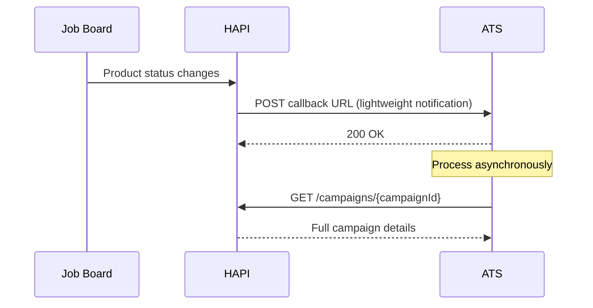
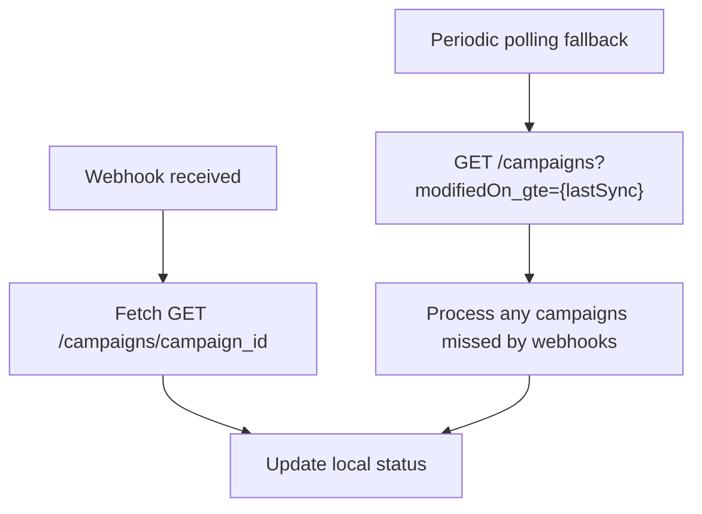

# Webhooks
> Receive campaign status updates pushed to your endpoint-no polling required.

## Overview

Instead of polling the API for status changes, you can receive webhook notifications whenever a campaign is updated. HAPI sends a lightweight HTTP POST to your configured callback URL, and your system fetches the full campaign details in response.

Webhooks are a **push-based** alternative to the **pull-based** polling approach described in [Status & Lifecycle](./status.md). Use webhooks for real-time status tracking without repeated API calls.

## Setup

Campaign webhooks must be enabled by your VONQ account manager. To set up:

1. **Prepare a callback URL**-a publicly accessible HTTPS endpoint on your system that can receive HTTP POST requests.
2. **Contact your account manager**-provide your callback URL. They will configure your account to receive campaign webhook notifications.

There is no self-service subscription endpoint-webhook configuration is managed by VONQ.

## How It Works

1. A product status changes (e.g., goes `online`, expires to `offline`, fails to `not processed`).
2. HAPI sends a lightweight notification to your callback URL.
3. Your endpoint returns `200 OK` immediately.
4. Your system asynchronously calls `GET /campaigns/{campaignId}` to fetch the full campaign data including per-product statuses, delivery dates, job board links, and click metrics.

## Notification Payload

See [Campaign Webhooks - Endpoint Reference](./webhooks.endpoints.md) for the notification payload structure, field descriptions, and callback endpoint requirements.

## Endpoint Requirements

Your callback endpoint must:

- Accept HTTP `POST` requests
- Accept `Content-Type: application/json`
- Return a `2xx` status code to acknowledge receipt
- Respond within a reasonable timeout (30 seconds)
- Handle duplicate deliveries idempotently-use `request_id` to detect duplicates

<!-- theme: danger -->
> ### No Retries
> Campaign notification webhooks are **not retried**. If your endpoint is unavailable or returns a non-2xx status, the notification is lost. Use polling with `GET /campaigns?modifiedOn_gte=...` as a fallback to catch missed updates. See [Status & Lifecycle-Incremental Sync](./status.md#incremental-sync).

## Workflows

### Recommended: Webhooks + Polling Fallback

Because campaign webhooks do not retry, the most reliable approach combines both:

1. **Primary**: Process webhook notifications as they arrive.
2. **Fallback**: Periodically poll `GET /campaigns?modifiedOn_gte={lastSync}` to catch any notifications your endpoint missed (downtime, network issues, etc.).

## Edge Cases & Gotchas

<!-- theme: warning -->
> ### Respond Quickly, Process Later
> Return `200 OK` immediately upon receiving the webhook. Do not make API calls or run heavy processing before responding-fetch campaign details asynchronously after acknowledging receipt.

<!-- theme: warning -->
> ### Notifications Are Not Guaranteed
> Due to the no-retry policy, treat webhooks as a best-effort optimization. Always have a polling fallback to ensure you eventually capture all status changes.

- **Deduplication**-the same `request_id` may arrive more than once in edge cases. Store processed request IDs and skip duplicates.
- **Notification does not mean final state**-a campaign may receive multiple notifications as different products transition. Always fetch the latest state from the API.
- **Other webhook types exist**-Direct Apply and Screening have their own webhook mechanisms with different payloads, file delivery, and retry behavior. See [Direct Apply-Webhooks](../10-direct-apply/webhooks.md) and [Screening-Webhooks](../11-screening/webhooks.md).

## Related

- [Status & Lifecycle](./status.md)-polling-based status tracking and incremental sync
- [Cancellation](./cancellation.md)-cancellation triggers status change notifications
- [Direct Apply-Webhooks](../10-direct-apply/webhooks.md)-application delivery webhooks (separate mechanism)
- [Screening-Webhooks](../11-screening/webhooks.md)-screened candidate delivery webhooks (separate mechanism)
