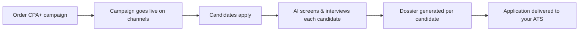
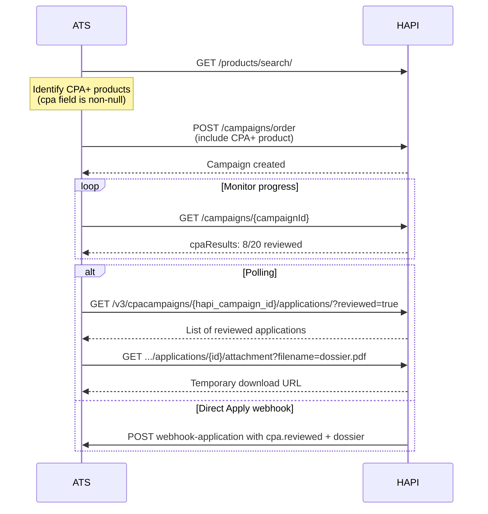
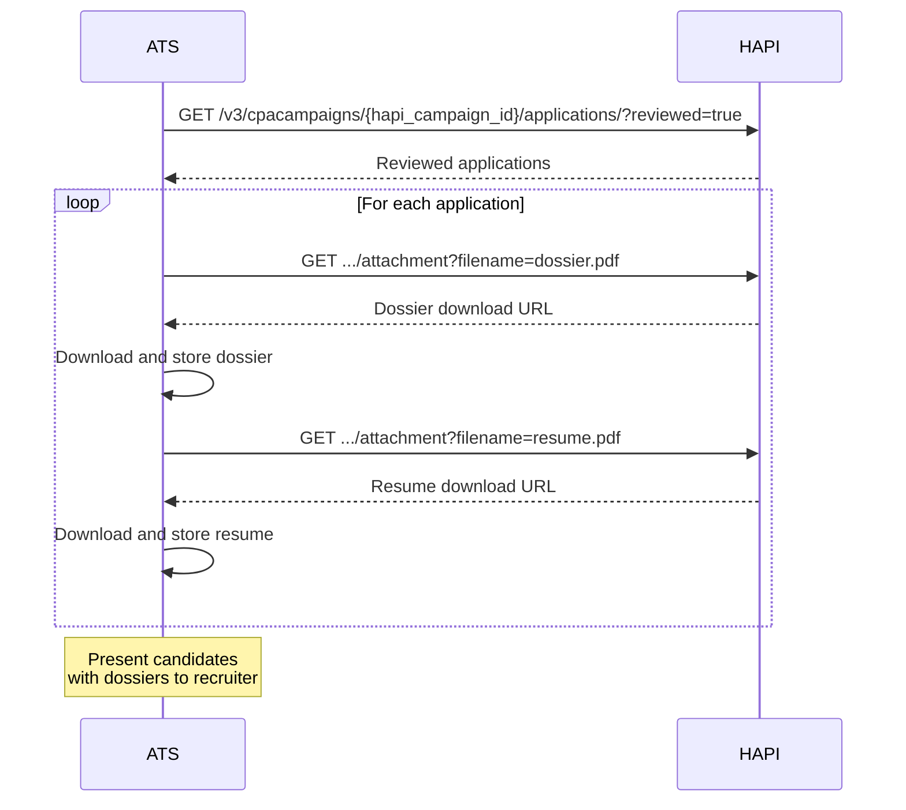

# CPA+
> AI-powered, performance-based hiring-pay per pre-screened candidate instead of per job posting.

## What is CPA+?

**CPA+** (Cost Per Application Plus) is HAPI's AI-powered hiring product that flips the traditional job advertising model. Instead of paying a flat fee for a job posting and hoping the right candidates apply, you pay per qualified application-each one pre-screened by AI before it reaches you.

When a candidate applies through a CPA+ campaign, an AI agent conducts a dynamic screening interview, applies knockout criteria based on the job requirements, and scores the candidate. The result is a **dossier**-a PDF containing the interview transcript, evaluation scores, and an AI-generated summary of how the candidate's skills match the job. Only then is the application delivered to your ATS.

### Why CPA+?

| Traditional Job Posting | CPA+ |
|------------------------|------|
| Pay per posting, regardless of results | Pay per application received |
| Manual screening of every applicant | AI pre-screens and scores candidates |
| Recruiter reviews dozens of unqualified CVs | Recruiter receives interview-ready profiles |
| Time-to-hire measured in weeks | AI screening runs 24/7, reducing time-to-hire |

CPA+ is built for teams that want to spend less time filtering and more time hiring. Every application comes with a structured dossier, so recruiters can make informed decisions faster-without reading through stacks of raw CVs.

### How It Works



1. **Order**-include a CPA+ product in a standard campaign order. CPA+ products appear in the product catalog alongside regular products.
2. **Candidates apply**-candidates find the job on supported channels (e.g., LinkedIn) and submit their application.
3. **AI screening**-an AI agent interviews each candidate, evaluates them against the job requirements, and produces a dossier with scores and a summary.
4. **Delivery**-screened applications are delivered to your ATS, either via [Direct Apply webhooks](#delivery-via-direct-apply) or the [polling endpoints](#endpoints).

### What You Get Per Application

Each CPA+ application includes:

- **Candidate contact info**-name, email, phone number
- **Review status**-whether the application was reviewed by AI (`reviewed: true` or `false`)
- **Dossier PDF**-interview transcript, evaluation scores, and an AI-generated skills-vs-requirements summary
- **Resume**-the candidate's CV in PDF or Word format

All applications are delivered regardless of review outcome (for compliance purposes). Use the `reviewed` filter to focus on candidates that passed AI screening.

## Key Concepts

**CPA+ Product**-a product in the VONQ catalog with a non-null `cpa` object. The `cpa` field contains the hiring goal-the target number of reviewed applications for the campaign.

**Hiring Goal**-the number of AI-reviewed applications you're purchasing. A typical hiring goal is 20 reviewed applications. The campaign runs until the hiring goal is met or the campaign is stopped.

**Application**-a candidate submission that has been processed through the CPA+ pipeline. Each application includes candidate contact info and downloadable files (dossier, resume).

**Reviewed**-indicates the application was reviewed by AI screening. Applications with `reviewed: true` have passed the AI evaluation. Applications with `reviewed: false` are delivered for compliance but did not pass screening criteria.

**Dossier**-a PDF report generated by the AI screening process. Contains the interview transcript, scoring across competencies, and a summary evaluating the candidate against the job requirements.

**`cpaResults`**-aggregate application counts available on the campaign detail response. Tracks total applications and reviewed applications, so you can monitor progress toward the hiring goal.

## Identifying CPA+ Products

CPA+ products have a non-null `cpa` object on the product:

```json
{
  "product_id": "d5e6f7a8-b9c0-1234-ef01-345678901234",
  "title": "CPA+ Standard",
  "cpa": {
    "hiring_goal": 20,
    "hiring_goal_unit": "reviewed_applications"
  },
  "vonq_price": [{ "amount": 0.00, "currency": "EUR" }]
}
```

| Field | Type | Description |
|-------|------|-------------|
| `cpa.hiring_goal` | integer | Target number of reviewed applications |
| `cpa.hiring_goal_unit` | string | Unit for the hiring goal (currently `reviewed_applications`) |

Standard products have `cpa: null`. Use this to distinguish CPA+ products from regular job postings in your UI.

<!-- theme: info -->
> ### Ordering CPA+ Products
> CPA+ products are ordered through the standard campaign ordering flow-include the product ID in your campaign order like any other product. See [Campaign Ordering](./08-campaigns/ordering.md).

## Tracking Campaign Progress

The campaign detail response includes CPA+-specific fields to track progress toward the hiring goal:

```json
{
  "orderedProductsSpecs": [
    {
      "productId": "d5e6f7a8-b9c0-1234-ef01-345678901234",
      "orderedCpa": {
        "hiring_goal": 20,
        "hiring_goal_unit": "reviewed_applications"
      }
    }
  ],
  "postings": [
    {
      "cpaResults": {
        "applications": 15,
        "reviewed_applications": 8
      }
    }
  ]
}
```

| Field | Type | Description |
|-------|------|-------------|
| `orderedCpa.hiring_goal` | integer | Target number of reviewed applications (from the product) |
| `orderedCpa.hiring_goal_unit` | string | Unit for the hiring goal |
| `cpaResults.applications` | integer | Total finalized applications received so far |
| `cpaResults.reviewed_applications` | integer | Applications that passed AI screening |

Use `cpaResults` to show hiring managers a progress indicator (e.g., "8 of 20 reviewed applications received").

## Application Delivery

CPA+ applications can be delivered to your ATS in two ways:

### Delivery via Direct Apply

The recommended approach. Applications are pushed to your webhook endpoint as they arrive, using the same [Direct Apply webhook infrastructure](./10-direct-apply/webhooks.md). The payload is identical to a standard Direct Apply webhook, with an additional `cpa` object:

```json
{
  "requestId": "e3f4a5b6-c7d8-9012-cdef-123456789012",
  "campaignId": "e2f3a4b5-c6d7-8901-bcde-f12345678901",
  "productId": "d5e6f7a8-b9c0-1234-ef01-345678901234",
  "payload": {
    "firstName": "John",
    "lastName": "Smith",
    "cpa": {
      "reviewed": true
    },
    "attachments": [
      { "filename": "dossier.pdf", "type": "DOSSIER" },
      { "filename": "resume.pdf", "type": "RESUME" }
    ]
  },
  "type": "payload"
}
```

The `cpa.reviewed` field indicates whether the application passed AI screening. File delivery follows the same modes configured for your Direct Apply setup (single multipart, split, base64). See [Direct Apply-Webhooks](./10-direct-apply/webhooks.md) for details.

<!-- theme: info -->
> CPA+ and Direct Apply are always different products-a single product never has both enabled. But from a webhook perspective, they share the same infrastructure and payload format.

### Delivery via Polling

Alternatively, retrieve applications on demand using the REST endpoints below. This is useful if you don't have a webhook endpoint configured or prefer a pull-based integration.

### Campaign Webhooks for Progress Updates

Campaign status webhooks can notify you when `cpaResults` stats are updated. This doesn't fire per-application-it triggers when the campaign is updated (which includes stats changes). Use this as a signal to poll for new applications or refresh your progress display.

## Endpoints

| Endpoint | Description |
|----------|-------------|
| `GET /v3/cpacampaigns/{hapi_campaign_id}/applications/` | List all applications for a CPA+ campaign (supports `?reviewed=` filter) |
| `GET /v3/cpacampaigns/{hapi_campaign_id}/applications/{application_id}/` | Retrieve details for a specific application |
| `GET /v3/cpacampaigns/{hapi_campaign_id}/applications/{application_id}/attachment/` | Get a temporary download URL for a dossier or resume file |

See [CPA+ - Endpoint Reference](./09-cpa.endpoints.md) for full request/response details.

## Workflows

### Full CPA+ Integration



The `{campaignId}` returned by `POST /campaigns/order` is the same HAPI campaign identifier used as `{hapi_campaign_id}` in CPA+ endpoints.

### Retrieving and Reviewing Applications



## Edge Cases & Gotchas

<!-- theme: warning -->
> ### All Applications Are Delivered
> For compliance purposes, all applications are delivered regardless of review outcome. Applications with `reviewed: false` did not pass AI screening but are still included. Filter with `?reviewed=true` to show only qualified candidates to recruiters.

<!-- theme: warning -->
> ### Attachment URLs Are Temporary
> Download URLs from the attachment endpoint are short-lived signed links. Always download the file immediately after requesting the URL. If you need the file again later, call the endpoint again for a fresh URL.

<!-- theme: info -->
> ### CPA+ vs Screening
> CPA+ and [Screening](./11-screening/01-introduction.md) are related but different products. Screening is a standalone AI evaluation service where you send candidates for assessment. CPA+ is an end-to-end hiring product-candidates are sourced, screened, and delivered automatically. You don't manage screening jobs or send candidates yourself.

- **Not all applications have dossiers**-the `files` array on each application tells you exactly which files are available. Always check this array before requesting a download.
- **Campaign webhooks for stats**-campaign status webhooks fire when `cpaResults` stats are updated, not per-application. Use this as a trigger to poll for new applications.
- **CPA+ products in bundles**-CPA+ products can appear in bundles. The same identification logic applies-check for a non-null `cpa` field.

## Related

- [Products-Special Products](./05-products/03-special-products.md)-identifying CPA+ products in the catalog
- [Direct Apply-Webhooks](./10-direct-apply/webhooks.md)-receiving CPA+ applications via webhooks
- [Screening](./11-screening/01-introduction.md)-standalone AI screening (different from CPA+)
- [Campaigns-Ordering](./08-campaigns/ordering.md)-ordering campaigns with CPA+ products
