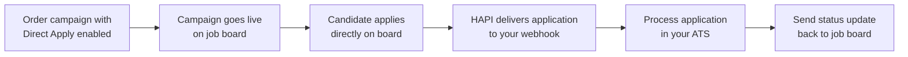

# Direct Apply
> Let candidates apply directly on job boards-receive structured applications and files via webhook.

## What is Direct Apply?

Direct Apply is a VONQ Hiring API (HAPI) feature that enables candidates to apply natively on supported job boards-without being redirected to an external career page. When a candidate submits an application on a board like Indeed or LinkedIn, HAPI delivers the structured application data, questionnaire answers, and file attachments directly to your system via webhook.

This creates a faster, lower-friction candidate experience while giving your ATS immediate access to rich, structured application data.

Direct Apply has two sides:

1. **Ordering**-When ordering a campaign, you enable Direct Apply for a product by selecting the right application method or filling in questionnaire facets. This controls what the candidate sees on the job board.
2. **Receiving**-HAPI delivers candidate applications to your webhook endpoint. You process the data and optionally send status updates back to the job board.

## Prerequisites

Direct Apply requires setup at two levels before it works. Both are handled by your VONQ account manager.

### 1. ATS-Level Onboarding

Your ATS must be onboarded for Direct Apply. This is a one-time setup that includes:

| Setting | Description |
|---------|-------------|
| **Postback URL** | The HTTPS endpoint on your system where HAPI delivers application webhooks |
| **Postback headers** | Custom HTTP headers included in every webhook request (e.g., API keys, bearer tokens for authentication) |
| **File delivery mode** | How candidate files (resumes, cover letters) are delivered: multipart, split, or base64 |
| **Retry configuration** | How many times and how often failed deliveries are retried |

Without this configuration, your system cannot receive Direct Apply applications.

### 2. Channel Activation

Direct Apply must be activated per job board channel. Not every channel supports Direct Apply, and even among those that do, activation may require additional setup (e.g., board-specific agreements or credentials).

Once a channel is activated, its posting requirements will include the relevant Direct Apply facets (such as `applicationMethod` or questionnaire fields). If Direct Apply is not activated for a channel, these facets will not appear in the posting requirements response.

<!-- theme: warning -->
> Contact your VONQ account manager to onboard your ATS and activate Direct Apply on the channels you need. Both steps must be completed before you can use Direct Apply.

## How It Works

1. **Enable Direct Apply**-When ordering a campaign, select the Direct Apply application method or fill in the questionnaire facets in the product's posting requirements. How this works varies by job board (see below).
2. **Configure questionnaire** (optional)-Define custom screening questions that candidates answer on the job board. The questionnaire is one or more posting requirement facets with a stringified JSON value.
3. **Campaign goes live**-The job is posted on the board with native apply enabled.
4. **Candidate applies**-The candidate fills in their details, answers questionnaire questions, and uploads files-all without leaving the job board.
5. **Receive application via webhook**-HAPI delivers the structured payload (candidate data, answers, attachments) to your configured webhook endpoint.
6. **Send application feedback**-When a recruiter acts on the application (qualifies, rejects, hires), your ATS sends the status update to HAPI, which forwards it to the job board. The candidate can then see their status on the board. Some job boards make this mandatory.

### How Direct Apply is Enabled (Varies by Board)

The mechanism for enabling Direct Apply differs across job boards:

- **Some boards** (e.g., Indeed, Seek) expose an `applicationMethod` facet. Selecting `directapply` as the value activates Direct Apply. When selected, additional facets like the questionnaire appear via display rules.
- **Other boards** (e.g., LinkedIn) activate Direct Apply automatically when you fill in any questionnaire facet-there is no separate toggle.

<!-- theme: warning -->
> ### Always Read Facets from the API
> Facet names, question types, and constraints differ by job board and can change over time. Never hardcode facet names or assume a fixed structure. Always read the posting requirements response from the API and build your UI dynamically.

## Key Concepts

**Application Method**-A posting requirement facet that controls how candidates apply on a job board. Selecting `directapply` enables native apply on boards that use this toggle. Not all boards have this facet-some enable Direct Apply implicitly through questionnaire facets.

**Questionnaire**-One or more posting requirement facets that define custom screening questions shown to candidates on the job board. The value is a stringified JSON array of question objects. Facet names vary by board (e.g., `questionnaire`, `customQuestions`). Each board has its own supported question types and limits.

**Question Types**-The types of questions you can include in a questionnaire. Common types are `text` (free text), `choice` (single-select), and `multi-choice` (multi-select). Some boards support additional types like `date`, `file`, or `hier` (hierarchical). Types and limits are returned dynamically by the API.

**Postback URL**-The HTTPS endpoint on your system where HAPI delivers application webhooks. Configured by your account manager at the account level. Can be overridden per-campaign.

**Request ID**-A UUID included in every webhook delivery that links the application payload with its file requests. Use it for deduplication and to correlate files in split delivery mode.

**File Delivery Mode**-How application files (resumes, cover letters) are delivered with the webhook. Four modes exist: single multipart, split requests, base64 single, and base64 split. Configured by your account manager.

**Application Feedback**-Status updates your ATS sends back to HAPI after processing an application. HAPI forwards these to the job board so the candidate can see their application status. Statuses include `delivered`, `qualified`, `cancelled`, `closed_rejected`, and `closed_hired`.

## Supported Job Boards

| Board | Direct Apply Toggle | Questionnaire Support | Notable Constraints |
|-------|--------------------|-----------------------|---------------------|
| Indeed | `applicationMethod` facet | `text`, `choice`, `multi-choice`, `hier`, `date`, `file`, `information` (up to 100 questions) | Conditional logic, required questions, file uploads up to 5MB |
| Seek | `applicationMethod` facet | `text`, `choice`, `multi-choice` (up to 100 questions) | Generous character limits |
| LinkedIn | Implicit (via questionnaire) | `text`, `textarea`, `choice`, `multi-choice`, `date`, `file` (multiple facets) | Conditional logic, required questions, file uploads |
| Naukri | `applicationMethod` facet | `text`, `choice`, `multi-choice` (up to 10 questions, all required) | 150 character limit per question, all questions are required |
| Infojobs | `applicationMethod` facet | `text`, `choice` (max 4 text + 8 choice = 12 questions) | Strict split: max 4 open-text + max 8 closed-choice |

<!-- theme: info -->
> These constraints are returned dynamically by the API. Always read the posting requirements response for the authoritative question types and limits.

## CPA+ Applications

CPA+ and Direct Apply are different products-you will never find a single product that has both enabled. However, CPA+ candidate applications are delivered through the same Direct Apply webhook infrastructure. From a webhook perspective, the payload is identical, with one addition: CPA+ applications include a `payload.cpa` field with `{ "reviewed": true }` indicating the application passed CPA review before delivery.

See [CPA+](../09-cpa.md) for details on CPA+ campaigns.

## What's Next

- [Posting Requirements](./posting-requirements.md)-How to enable Direct Apply and configure questionnaires when ordering a campaign
- [Webhooks](./webhooks.md)-Receiving applications and processing files
- [Application Feedback](./feedback.md)-Sending application status updates back to job boards
