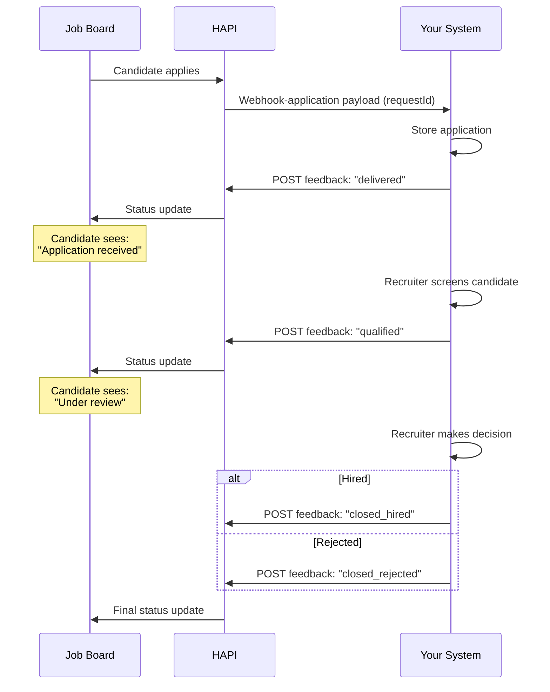

# Application Feedback
> Send application status updates back to the job board so candidates can track their progress.

## Overview

After receiving a candidate application via the Direct Apply webhook, your ATS can send status updates back to HAPI. HAPI forwards these to the job board, where the candidate can see their current application status.

This is a one-way passback from your system to HAPI-not a webhook. You call the endpoint whenever a recruiter takes action on an application (qualifies, rejects, hires).

<!-- theme: warning -->
> ### Some Job Boards Require This
> Certain job boards require application feedback to be sent. If you don't send it, the candidate may not see their application status on the board. Send feedback regardless of the board-HAPI routes it to boards that support it.

For background on Direct Apply, see [Introduction](./01-introduction.md).

## Feedback Statuses

| Status | When to Send |
|--------|-------------|
| `delivered` | Application received and stored in your ATS |
| `qualified` | Candidate passed initial screening or qualification |
| `cancelled` | Application withdrawn by candidate or recruiter |
| `closed_rejected` | Candidate rejected or position filled |
| `closed_hired` | Candidate hired for the position |

You can send multiple status updates for the same application as its status progresses. For example: `delivered` → `qualified` → `closed_hired`.

## Endpoints

| Endpoint | Description |
|----------|-------------|
| `POST /v3/apply-applications/application-feedback/` | Send an application status update (`delivered`, `qualified`, `cancelled`, `closed_rejected`, `closed_hired`) to the job board |

See [Direct Apply-Feedback - Endpoint Reference](./feedback.endpoints.md) for full request/response details.

## Workflows

### Application Feedback Lifecycle

## Edge Cases & Gotchas

<!-- theme: warning -->
> ### Request ID Must Match
> The `request_id` must correspond to a `requestId` you previously received in a Direct Apply webhook. Sending a feedback for an unknown or mismatched `request_id` returns `400`.

- **Multiple updates allowed**-send status updates as the application progresses through your pipeline. Each update overwrites the previous status on the job board.
- **Board-specific display**-not all job boards display every status the same way. Send feedback regardless-HAPI handles routing to boards that support it.
- **Send early**-send `delivered` as soon as you store the application, even before the recruiter reviews it. This confirms receipt to the candidate.

## Related

- [Direct Apply-Introduction](./01-introduction.md)-overview and key concepts
- [Direct Apply-Webhooks](./webhooks.md)-receiving applications (where you get the `requestId`)
- [Direct Apply-Posting Requirements](./posting-requirements.md)-enabling Direct Apply when ordering
