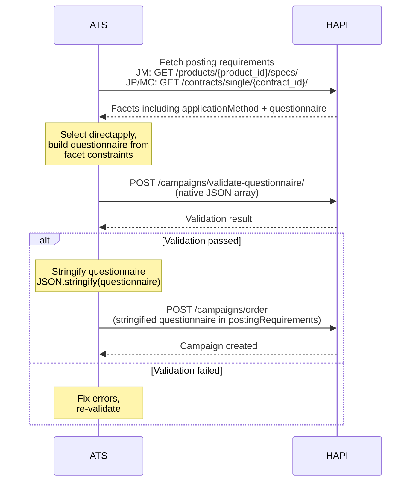

# Posting Requirements
> Enable Direct Apply and configure questionnaires through posting requirement facets.

## Overview

When ordering a HAPI campaign with Direct Apply, two things happen through posting requirements:

1. **Direct Apply is enabled**-either by selecting it as the application method or by filling in a questionnaire facet (depending on the job board).
2. **A questionnaire is configured** (optional)-custom screening questions that candidates answer on the job board.

Both are controlled through standard posting requirement facets. The questionnaire facet, its supported question types, and constraints are all returned dynamically by the API-always read them from the response, never hardcode.

Direct Apply can be used with supported Job Marketing products and My Contract/Job Post products. For Job Marketing products, fetch posting requirements from `GET /products/{product_id}/specs/`. For My Contract/Job Post products, fetch them from the contract with `GET /contracts/single/{contract_id}/`. In campaign orders, My Contract/Job Post products include `contractId`; Job Marketing products do not.

For background on Direct Apply, see [Introduction](./01-introduction.md).

## Enabling Direct Apply

How Direct Apply gets enabled depends on the job board:

**Boards with an `applicationMethod` facet** (Indeed, Seek, Naukri, Infojobs):
- The posting requirements response includes a facet (typically `applicationMethod`) with options like `directapply` and `linkout`.
- Selecting `directapply` enables Direct Apply. When selected, additional facets like the questionnaire may appear via display rules.

**Boards with implicit activation** (LinkedIn):
- There is no `applicationMethod` toggle. Direct Apply activates automatically when you fill in any questionnaire facet (e.g., `customQuestions`).

<!-- theme: warning -->
> ### Always Read Facets Dynamically
> Facet names, option values, and display rules are returned by the API and vary by job board. Never hardcode facet names like `applicationMethod` or `questionnaire`-always read them from the posting requirements response.

### Display Rules

Facets use [display rules](../07-posting-requirements/facets-display-rules.md) to control visibility. A questionnaire facet typically has a rule like:

```json
{
  "display_rules": {
    "show": [
      {
        "op": "equal",
        "facet": "applicationMethod",
        "value": "directapply"
      }
    ]
  }
}
```

This means the questionnaire facet should only be shown in your UI when `applicationMethod` is set to `directapply`. The facet is always present in the API response-display rules tell you when to show it.

Facets also have a `sort` field that dictates their display order. Always respect this ordering in your UI.

### Prerequisite

Your ATS must be onboarded and Direct Apply must be activated for the channel or product. If both are in place and the job board supports it, the questionnaire facet appears in the posting requirements response. See [Prerequisites](./01-introduction.md#prerequisites) for the full setup checklist.

## The Questionnaire Facet

The questionnaire is a posting requirement facet of type `QUESTIONNAIRE`. It defines custom screening questions that candidates answer on the job board.

### Facet Structure

When you fetch posting requirements, the questionnaire facet looks like this:

```json
{
  "name": "questionnaire",
  "label": "Open Questions",
  "type": "QUESTIONNAIRE",
  "sort": 5,
  "questionnaire": {
    "types": ["text", "choice", "multi-choice"],
    "text": {
      "question": { "maxLength": 490, "minLength": 10 }
    },
    "choice": {
      "items": {
        "item": [{ "maxLength": 150, "minLength": 2 }],
        "maxOccurs": 5,
        "minOccurs": 2
      },
      "question": { "maxLength": 490, "minLength": 10 }
    },
    "multi-choice": {
      "items": {
        "item": [{ "maxLength": 150, "minLength": 2 }],
        "maxOccurs": 5,
        "minOccurs": 2
      },
      "question": { "maxLength": 490, "minLength": 10 }
    },
    "questionnaire": {
      "maxQuestions": 12
    }
  },
  "display_rules": {
    "show": [
      {
        "op": "equal",
        "facet": "applicationMethod",
        "value": "directapply"
      }
    ]
  }
}
```

The `questionnaire` object tells you everything you need to build your UI:

| Field | Description |
|-------|-------------|
| `types` | Supported question types for this board (e.g., `text`, `choice`, `multi-choice`) |
| `text.question.minLength` / `maxLength` | Character limits for free-text question text |
| `choice.question.minLength` / `maxLength` | Character limits for choice question text |
| `choice.items.minOccurs` / `maxOccurs` | Min/max number of answer options |
| `choice.items.item[].minLength` / `maxLength` | Character limits for each answer option |
| `questionnaire.maxQuestions` | Maximum number of questions allowed |

<!-- theme: info -->
> The facet name varies by board. For example, LinkedIn uses `customQuestions`. Always use the `name` field from the API response.

### Question Types

Common question types across boards:

| Type | Description | Answer Options |
|------|-------------|---------------|
| `text` | Free-text input | None-candidate types a response |
| `choice` | Single-select | 2+ options, candidate picks one |
| `multi-choice` | Multi-select | 2+ options, candidate picks one or more |

Some boards support additional types like `date`, `file`, `hier` (hierarchical), `textarea`, or `information`. These are returned in the `types` array-build your UI to handle whatever the API returns.

### Building the Questionnaire Value

Each question is an object with this structure:

| Field | Type | Required | Description |
|-------|------|----------|-------------|
| `id` | string | Yes | Unique identifier you define |
| `question` | string | Yes | Question text shown to the candidate |
| `type` | string | Yes | One of the types from the facet's `types` array |
| `answers` | array | For `choice` / `multi-choice` | Answer options |

Each answer option:

| Field | Type | Required | Description |
|-------|------|----------|-------------|
| `id` | string | Yes | Unique identifier for the option |
| `answer` | string | Yes | Option text shown to the candidate |

Example questionnaire with two questions:

```json
[
  {
    "id": "q1",
    "question": "Why are you interested in this role?",
    "type": "text"
  },
  {
    "id": "q2",
    "question": "Do you have a valid work permit?",
    "type": "choice",
    "answers": [
      { "id": "yes", "answer": "Yes" },
      { "id": "no", "answer": "No" }
    ]
  }
]
```

### Stringification

Because posting requirement facets are key-value pairs, the questionnaire value must be a **stringified JSON string**-not a native JSON array.

When submitting the questionnaire in a campaign order, wrap it with `JSON.stringify()`:

```json
{
  "postingRequirements": {
    "applicationMethod": "directapply",
    "questionnaire": "[{\"id\":\"q1\",\"question\":\"Why are you interested in this role?\",\"type\":\"text\"},{\"id\":\"q2\",\"question\":\"Do you have a valid work permit?\",\"type\":\"choice\",\"answers\":[{\"id\":\"yes\",\"answer\":\"Yes\"},{\"id\":\"no\",\"answer\":\"No\"}]}]"
  }
}
```

<!-- theme: danger -->
> ### Common Mistake
> Submitting the questionnaire as a native JSON array instead of a stringified string is the most common integration error. The value must be a string containing JSON, not a JSON array.

## Endpoints

| Endpoint | Description |
|----------|-------------|
| `POST /campaigns/validate-questionnaire/` | Validate a questionnaire against a product's constraints before ordering. Returns per-question error details. |

See [Direct Apply-Posting Requirements - Endpoint Reference](./posting-requirements.endpoints.md) for full request/response details, including the campaign order example.

## Workflows

### Ordering a Campaign with Direct Apply



### Per-Campaign Webhook URL Override

By default, applications are delivered to the postback URL configured by your account manager. You can override this per-campaign by including `directApply.webhookUrl` in the campaign order:

```json
{
  "directApply": {
    "webhookUrl": "https://your-ats.example.com/webhooks/vonq/apply"
  }
}
```

See [Webhooks - Webhook Configuration](./webhooks.md#webhook-configuration) for all webhook settings.

### Example Campaign Order

For a complete `POST /campaigns/order` request body with Direct Apply and a stringified questionnaire, see the [Endpoint Reference](./posting-requirements.endpoints.md#example-campaign-order-with-direct-apply).

## Edge Cases & Gotchas

<!-- theme: danger -->
> ### Stringified vs Native JSON
> Campaign ordering requires a **stringified** questionnaire value. The validate-questionnaire endpoint requires a **native** JSON array. Mixing these up is the most common integration mistake.

<!-- theme: warning -->
> ### Facet Names Vary by Board
> The questionnaire facet name differs across boards (e.g., `questionnaire` on Seek, `customQuestions` on LinkedIn). Always use the `name` field from the posting requirements response when calling the validate-questionnaire endpoint.

<!-- theme: warning -->
> ### Validation Error Keys Are Indices
> Error keys in the validate-questionnaire response are zero-based string indices (`"0"`, `"1"`), not question IDs. Map them back to your questions by position in the array.

<!-- theme: warning -->
> ### LinkedIn Implicit Activation
> LinkedIn does not have an `applicationMethod` facet. Direct Apply activates automatically when you fill in any questionnaire facet. Other boards require explicitly selecting `directapply`.

<!-- theme: info -->
> ### Validate Before Ordering
> Always call `POST /campaigns/validate-questionnaire/` before ordering. It returns detailed per-question error messages, while campaign ordering only returns a generic "The field Questionnaire is invalid" error.

## Related

- [Direct Apply-Introduction](./01-introduction.md)-overview and key concepts
- [Direct Apply-Webhooks](./webhooks.md)-receiving applications and file delivery
- [Direct Apply-Application Feedback](./feedback.md)-sending status updates back to the job board
- [Posting Requirements](../07-posting-requirements/01-introduction.md)-general posting requirements concepts
- [Campaign Validation](../08-campaigns/validation.md)-full campaign validation including `validate-campaign` and `?validateOnly=true`
