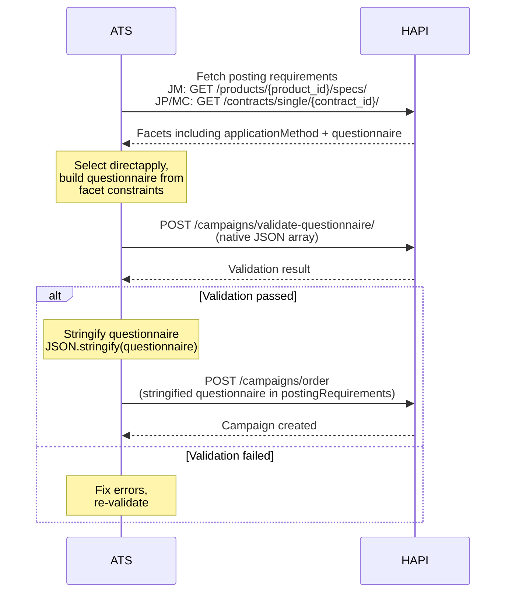

# Posting Requirements
> Enable Direct Apply and configure questionnaires through posting requirement facets.

## Overview

When ordering a HAPI campaign with Direct Apply, two things happen through posting requirements:

1. **Direct Apply is enabled**-either by selecting it as the application method or by filling in a questionnaire facet (depending on the job board).
2. **A questionnaire is configured** (optional)-custom screening questions that candidates answer on the job board.

Both are controlled through standard posting requirement facets. The questionnaire facet, its supported question types, and constraints are all returned dynamically by the API-always read them from the response, never hardcode.

Direct Apply can be used with supported Job Marketing products and My Contract/Job Post products. For Job Marketing products, fetch posting requirements from `GET /products/{product_id}/specs/`. For My Contract/Job Post products, fetch them from the contract with `GET /contracts/single/{contract_id}/`. In campaign orders, My Contract/Job Post products include `contractId`; Job Marketing products do not.

For background on Direct Apply, see [Introduction](./01-introduction.md).

## Enabling Direct Apply

How Direct Apply gets enabled depends on the job board:

**Boards with an `applicationMethod` facet** (Indeed, Seek, Naukri, Infojobs):
- The posting requirements response includes a facet (typically `applicationMethod`) with options like `directapply` and `linkout`.
- Selecting `directapply` enables Direct Apply. When selected, additional facets like the questionnaire may appear via display rules.

**Boards with implicit activation** (LinkedIn):
- There is no `applicationMethod` toggle. Direct Apply activates automatically when you fill in any questionnaire facet (e.g., `customQuestions`).

<!-- theme: warning -->
> ### Always Read Facets Dynamically
> Facet names, option values, and display rules are returned by the API and vary by job board. Never hardcode facet names like `applicationMethod` or `questionnaire`-always read them from the posting requirements response.

### Display Rules

Facets use [display rules](../07-posting-requirements/facets-display-rules.md) to control visibility. A questionnaire facet typically has a rule like:

```json
{
  "display_rules": {
    "show": [
      {
        "op": "equal",
        "facet": "applicationMethod",
        "value": "directapply"
      }
    ]
  }
}
```

This means the questionnaire facet should only be shown in your UI when `applicationMethod` is set to `directapply`. The facet is always present in the API response-display rules tell you when to show it.

Facets also have a `sort` field that dictates their display order. Always respect this ordering in your UI.

### Prerequisite

Your ATS must be onboarded and Direct Apply must be activated for the channel or product. If both are in place and the job board supports it, the questionnaire facet appears in the posting requirements response. See [Prerequisites](./01-introduction.md#prerequisites) for the full setup checklist.

## The Questionnaire Facet

The questionnaire is a posting requirement facet of type `QUESTIONNAIRE`. It defines custom screening questions that candidates answer on the job board.

### Facet Structure

When you fetch posting requirements, the questionnaire facet looks like this:

```json
{
  "name": "questionnaire",
  "label": "Open Questions",
  "type": "QUESTIONNAIRE",
  "sort": 5,
  "questionnaire": {
    "types": ["text", "choice", "multi-choice"],
    "questionnaire": {
      "ordered": true,
      "editable": false,
      "maxQuestions": 12,
      "defaultRequired": true,
      "supportsRequired": true,
      "supportsConditions": false
    },
    "text": {
      "question": { "maxLength": 490, "minLength": 10 }
    },
    "choice": {
      "items": {
        "item": [{ "maxLength": 150, "minLength": 2 }],
        "maxOccurs": 5,
        "minOccurs": 2
      },
      "question": { "maxLength": 490, "minLength": 10 }
    },
    "multi-choice": {
      "items": {
        "item": [{ "maxLength": 150, "minLength": 2 }],
        "maxOccurs": 5,
        "minOccurs": 2
      },
      "question": { "maxLength": 490, "minLength": 10 }
    }
  },
  "display_rules": {
    "show": [
      {
        "op": "equal",
        "facet": "applicationMethod",
        "value": "directapply"
      }
    ]
  }
}
```

The `questionnaire` object tells you everything you need to build your UI:

| Field | Description |
|-------|-------------|
| `types` | Supported question types for this board (e.g., `text`, `choice`, `multi-choice`) |
| `text.question.minLength` / `maxLength` | Character limits for free-text question text |
| `choice.question.minLength` / `maxLength` | Character limits for choice question text |
| `choice.items.minOccurs` / `maxOccurs` | Min/max number of answer options |
| `choice.items.item[].minLength` / `maxLength` | Character limits for each answer option |
| `questionnaire.*` | Constraints and capabilities that apply to the questionnaire as a whole; see below |

<!-- theme: info -->
> The facet name varies by board. For example, LinkedIn uses `customQuestions`. Always use the `name` field from the API response.

### Questionnaire-Wide Constraints

The nested `questionnaire.questionnaire` object defines rules for the questionnaire as a whole. These properties are channel capabilities, so they may be omitted or have different values for different products. Only apply constraints returned by the API; do not hardcode the values from the example.

| Field | Description |
|-------|-------------|
| `ordered` | Whether question order is significant and should be preserved |
| `editable` | Whether the channel reports an existing questionnaire as editable |
| `minQuestions` | Minimum total number of questions |
| `maxQuestions` | Maximum total number of questions |
| `maxOpenQuestions` | Maximum number of open-answer questions, such as `text` questions |
| `maxClosedQuestions` | Maximum number of closed-answer questions; `choice` and `multi-choice` both count toward this limit |
| `defaultRequired` | Default required state for a new question. It is relevant only when `supportsRequired` is `true`. |
| `supportsRequired` | Whether individual questions can be marked as mandatory by using `is_required` |
| `maxSize` | Maximum serialized questionnaire size. Measure the UTF-8 byte size of the final stringified JSON value. |
| `supportsConditions` | Whether the channel supports conditional questions |

<!-- theme: warning -->
> ### Use the Nested Capability Object
> `supportsRequired` and the other questionnaire-wide fields are inside the nested `questionnaire.questionnaire` object. The legacy v1 guide showed `supportsRequired` one level too high in one example.

HAPI returns these capabilities from the channel and passes the questionnaire to the channel for validation. Your integration should enforce the advertised limits before submission and call `POST /campaigns/validate-questionnaire/` for authoritative validation. A property being absent does not advertise support for that capability.

The questionnaire format described here does not define a portable conditional-question payload. Unless a channel-specific integration defines that format, do not emit condition data even when `supportsConditions` is `true`.

### Question Types

The facet's `types` array is the authoritative list for that board. Build your UI from it-do not hardcode a list from this page.

Common question types across boards:

| Type | Description | Answer Options |
|------|-------------|---------------|
| `text` | Free-text input | None-candidate types a response |
| `choice` | Single-select | 2+ options, candidate picks one |
| `multi-choice` | Multi-select | 2+ options, candidate picks one or more |
| `date` | Date picker | None-candidate picks a date; delivered as an ISO 8601 datetime |
| `file` | File upload | None-candidate uploads a file; delivered as an attachment linked to the question `id` |
| `int` | Whole number | None-delivered as a string, e.g. `"8"`. `integer` is accepted as an alias. |
| `float` | Decimal number | None-delivered as a string, e.g. `"32.5"` |

`date`, `file`, `int` and `float` are being rolled out board by board. Only use them when the facet's `types` array lists them. Their delivery format is described in [Direct Apply-Webhooks - Endpoint Reference](./webhooks.endpoints.md#questionnaire-answer-types).

<!-- theme: warning -->
> ### Optional numeric questions on LinkedIn
> LinkedIn validates `int` and `float` answers only when the question is required. For optional questions, LinkedIn accepts invalid input but omits the answer from the application payload. For example, if a candidate enters `abc`, no answer is sent.

Questionnaire validation also accepts `textarea`, `hier` (hierarchical) and `information`. These are reserved and support for these types will be added as we continue expanding Direct Apply.

### Per-Type Constraints

Each type listed in `types` may have a top-level key of the same name in the facet describing its constraints. Today that is a `question` object with the HTML allowed in the question text, plus, for some types, an `attributes` array naming the optional fields you can set on the question:

```json
{
  "types": ["text", "choice", "multi-choice", "file", "date", "int", "float"],
  "text": { "question": { "htmlAllowed": "ul,li,b,i,a,p" } },
  "date": { "question": { "htmlAllowed": "ul,li,b,i,a,p" }, "attributes": ["format", "min", "max"] },
  "int": { "question": { "htmlAllowed": "ul,li,b,i,a,p" }, "attributes": ["min", "max"] },
  "float": { "question": { "htmlAllowed": "ul,li,b,i,a,p" }, "attributes": ["min", "max"] }
}
```

| Attribute | Types | Description |
|-----------|-------|-------------|
| `min` | `date`, `int`, `float` | Lowest value the candidate may enter. A number for `int`/`float`, an ISO 8601 date (`YYYY-MM-DD`) for `date`. |
| `max` | `date`, `int`, `float` | Highest value the candidate may enter, same encoding as `min`. |
| `format` | `date` | Display format hint for the date picker. It does not change the delivered answer, which is always an ISO 8601 datetime. |

Set attributes directly on the question object, alongside `id`, `question` and `type`. Only send attributes the facet lists for that type; a board without `attributes` for a type accepts none. HAPI forwards them to the board unchanged and the board validates them through `POST /campaigns/validate-questionnaire/`.

<!-- theme: warning -->
> ### Attribute Semantics Are Board-Defined
> The list above is our current reading of the facet spec and is not yet confirmed by every board. In particular the `date` `format` values and whether `min`/`max` are inclusive are board-defined. Treat attributes as optional hints, validate the questionnaire before ordering, and expect the delivered answer format documented in the webhook reference regardless of the attributes you set.

### Building the Questionnaire Value

Each question is an object with this structure:

| Field | Type | Required | Description |
|-------|------|----------|-------------|
| `id` | string | Yes | Unique identifier you define |
| `question` | string | Yes | Question text shown to the candidate |
| `type` | string | Yes | One of the types from the facet's `types` array |
| `answers` | array | For `choice` / `multi-choice` | Answer options. Omit for all other types. |
| `is_required` | boolean | No | Whether the candidate must answer the question. Include only when `questionnaire.questionnaire.supportsRequired` is `true`. |
| `min`, `max`, `format` | string / number | No | Per-type constraints. Include only when the facet lists them under that type's `attributes`. See [Per-Type Constraints](#per-type-constraints). |

Each answer option:

| Field | Type | Required | Description |
|-------|------|----------|-------------|
| `id` | string | Yes | Identifier for the option. Keep it unique within the question. |
| `answer` | string | Yes | Option text shown to the candidate |

For `choice` and `multi-choice` questions, the webhook returns both fields for each selected option. Match the response by question `id` and answer `id`; answer IDs are not guaranteed to be unique across different questions. Text answers have no answer ID.

Example questionnaire on a board that lists all types with the attributes shown above:

```json
[
  {
    "id": "question-interest",
    "question": "What interests you about this role?",
    "type": "text",
    "is_required": true
  },
  {
    "id": "question-experience",
    "question": "How much relevant experience do you have?",
    "type": "choice",
    "answers": [
      { "id": "option-less-than-one-year", "answer": "Less than 1 year" },
      { "id": "option-one-to-three-years", "answer": "1 to 3 years" },
      { "id": "option-more-than-three-years", "answer": "More than 3 years" }
    ]
  },
  {
    "id": "question-work-arrangements",
    "question": "Which work arrangements suit you?",
    "type": "multi-choice",
    "answers": [
      { "id": "option-onsite", "answer": "On-site" },
      { "id": "option-hybrid", "answer": "Hybrid" },
      { "id": "option-remote", "answer": "Remote" }
    ]
  },
  {
    "id": "question-start-date-limit",
    "question": "Earliest start date?",
    "type": "date",
    "min": "2026-10-01",
    "is_required": true
  },
  {
    "id": "question-years-experience",
    "question": "Years of relevant experience",
    "type": "int",
    "min": 0,
    "max": 50
  },
  {
    "id": "question-hourly-rate",
    "question": "Expected hourly rate (EUR)",
    "type": "float",
    "min": 0
  },
  {
    "id": "question-portfolio",
    "question": "Upload a portfolio",
    "type": "file"
  }
]
```

When `supportsRequired` is `true`, initialize `is_required` from `defaultRequired` if your questionnaire editor offers that default. Users may then override it per question. When `supportsRequired` is `false` or absent, omit `is_required`; do not send it as `false`.

### Stringification

Because posting requirement facets are key-value pairs, the questionnaire value must be a **stringified JSON string**-not a native JSON array.

When submitting the questionnaire in a campaign order, wrap it with `JSON.stringify()`:

```json
{
  "postingRequirements": {
    "applicationMethod": "directapply",
    "questionnaire": "[{\"id\":\"question-interest\",\"question\":\"What interests you about this role?\",\"type\":\"text\",\"is_required\":true},{\"id\":\"question-experience\",\"question\":\"How much relevant experience do you have?\",\"type\":\"choice\",\"answers\":[{\"id\":\"option-less-than-one-year\",\"answer\":\"Less than 1 year\"},{\"id\":\"option-one-to-three-years\",\"answer\":\"1 to 3 years\"},{\"id\":\"option-more-than-three-years\",\"answer\":\"More than 3 years\"}]},{\"id\":\"question-work-arrangements\",\"question\":\"Which work arrangements suit you?\",\"type\":\"multi-choice\",\"answers\":[{\"id\":\"option-onsite\",\"answer\":\"On-site\"},{\"id\":\"option-hybrid\",\"answer\":\"Hybrid\"},{\"id\":\"option-remote\",\"answer\":\"Remote\"}]}]"
  }
}
```

<!-- theme: danger -->
> ### Common Mistake
> Submitting the questionnaire as a native JSON array instead of a stringified string is the most common integration error. The value must be a string containing JSON, not a JSON array.

## Endpoints

| Endpoint | Description |
|----------|-------------|
| `POST /campaigns/validate-questionnaire/` | Validate a questionnaire against a product's constraints before ordering. Returns per-question error details. |

See [Direct Apply-Posting Requirements - Endpoint Reference](./posting-requirements.endpoints.md) for full request/response details, including the campaign order example.

## Workflows

### Ordering a Campaign with Direct Apply


```mermaid
%%{init: {'sequence': {'useMaxWidth': true}}}%%
sequenceDiagram
    participant ATS
    participant HAPI

    ATS->>HAPI: Fetch posting requirements<br/>JM: GET /products/{product_id}/specs/<br/>JP/MC: GET /contracts/single/{contract_id}/
    HAPI-->>ATS: Facets including applicationMethod + questionnaire

    Note over ATS: Select directapply,<br/>build questionnaire from<br/>facet constraints

    ATS->>HAPI: POST /campaigns/validate-questionnaire/<br/>(native JSON array)
    HAPI-->>ATS: Validation result

    alt Validation passed
        Note over ATS: Stringify questionnaire<br/>JSON.stringify(questionnaire)
        ATS->>HAPI: POST /campaigns/order<br/>(stringified questionnaire in postingRequirements)
        HAPI-->>ATS: Campaign created
    else Validation failed
        Note over ATS: Fix errors,<br/>re-validate
    end
```

### Per-Campaign Webhook URL Override

By default, applications are delivered to the postback URL configured by your account manager. You can override this per-campaign by including `directApply.webhookUrl` in the campaign order:

```json
{
  "directApply": {
    "webhookUrl": "https://your-ats.example.com/webhooks/vonq/apply"
  }
}
```

See [Webhooks - Webhook Configuration](./webhooks.md#webhook-configuration) for all webhook settings.

### Example Campaign Order

For a complete `POST /campaigns/order` request body with Direct Apply and a stringified questionnaire, see the [Endpoint Reference](./posting-requirements.endpoints.md#example-campaign-order-with-direct-apply).

## Edge Cases & Gotchas

<!-- theme: danger -->
> ### Stringified vs Native JSON
> Campaign ordering requires a **stringified** questionnaire value. The validate-questionnaire endpoint requires a **native** JSON array. Mixing these up is the most common integration mistake.

<!-- theme: warning -->
> ### Facet Names Vary by Board
> The questionnaire facet name differs across boards (e.g., `questionnaire` on Seek, `customQuestions` on LinkedIn). Always use the `name` field from the posting requirements response when calling the validate-questionnaire endpoint.

<!-- theme: warning -->
> ### Validation Error Keys Are Indices
> Error keys in the validate-questionnaire response are zero-based string indices (`"0"`, `"1"`), not question IDs. Map them back to your questions by position in the array.

<!-- theme: warning -->
> ### LinkedIn Implicit Activation
> LinkedIn does not have an `applicationMethod` facet. Direct Apply activates automatically when you fill in any questionnaire facet. Other boards require explicitly selecting `directapply`.

<!-- theme: info -->
> ### Validate Before Ordering
> Always call `POST /campaigns/validate-questionnaire/` before ordering. It returns detailed per-question error messages, while campaign ordering only returns a generic "The field Questionnaire is invalid" error.

## Related

- [Direct Apply-Introduction](./01-introduction.md)-overview and key concepts
- [Direct Apply-Webhooks](./webhooks.md)-receiving applications and file delivery
- [Direct Apply-Application Feedback](./feedback.md)-sending status updates back to the job board
- [Posting Requirements](../07-posting-requirements/01-introduction.md)-general posting requirements concepts
- [Campaign Validation](../08-campaigns/validation.md)-full campaign validation including `validate-campaign` and `?validateOnly=true`
