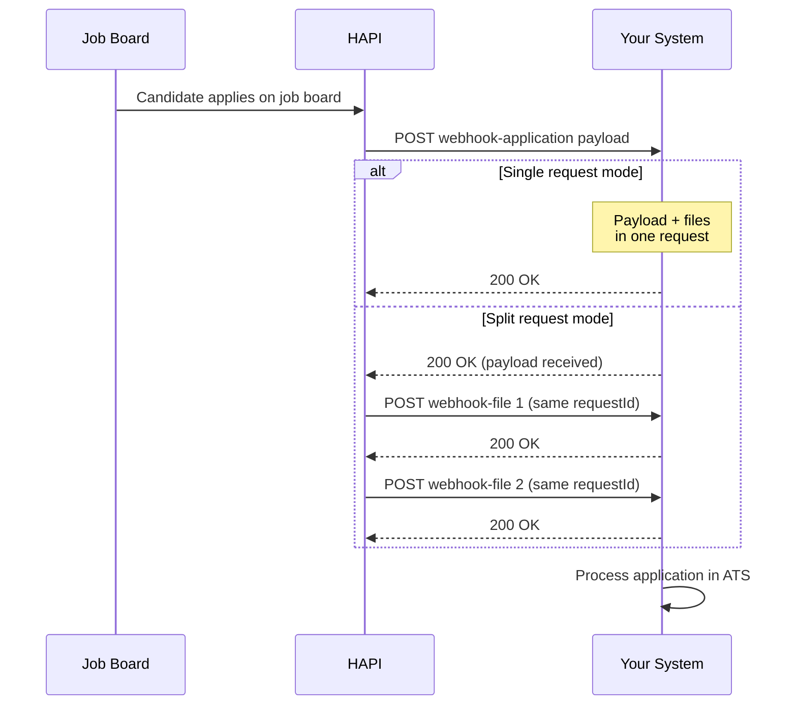

# Webhooks
> Receive candidate applications and files in real time when candidates apply on job boards with Direct Apply enabled.

## Overview

When a candidate applies on a job board with Direct Apply enabled, HAPI delivers the application data and files to your webhook endpoint as an HTTP POST request. This is the primary way to receive Direct Apply applications-there is no polling alternative.

CPA+ campaign candidates are also delivered through the same webhook infrastructure, with an additional `cpa` field in the payload.

For background on Direct Apply, see [Introduction](./01-introduction.md).

## Webhook Configuration

Your webhook endpoint is configured at the ATS level by your VONQ account manager. This is required for Direct Apply to work.

| Setting | Configured By | Description |
|---------|--------------|-------------|
| Postback URL | Account manager | Default HTTPS endpoint for all Direct Apply webhooks |
| Postback headers | Account manager | Custom HTTP headers included in every request (e.g., API keys, bearer tokens) |
| File delivery mode | Account manager | How files are delivered: multipart, split, or base64 (see [File Delivery Modes](#file-delivery-modes)) |
| Retry count & intervals | Account manager | How many times and how often failed deliveries are retried |

You can override the postback URL per-campaign by setting `directApply.webhookUrl` in the campaign order request:

```json
{
  "directApply": {
    "webhookUrl": "https://your-ats.example.com/webhooks/vonq/apply"
  }
}
```

## Payload Structure

The webhook delivers a JSON payload with the candidate's application data, questionnaire answers, and attachment metadata. Top-level fields include `requestId`, `campaignId`, `productId`, `payload`, and `type`.

Key payload fields: `source` (job board identifier), `formattedName`, `questions` (questionnaire answers), `attachments` (file metadata with `filename` and `type`).

<!-- theme: warning -->
> ### Answer Types Differ from Input Types
> Question types change between ordering and delivery: `text` → `OPEN`, `choice` → `SELECT`, `multi-choice` → `MULTISELECT`.

See [Direct Apply-Webhooks - Endpoint Reference](./webhooks.endpoints.md) for the full payload schema, all field tables, attachment type reference, and file delivery mode examples.

## File Delivery Modes

Your account manager configures one of four modes for how files are delivered with the webhook.

| Mode | Description | Best For |
|------|-------------|----------|
| **Single multipart** | JSON + all files in one `multipart/form-data` POST | Recommended-atomic processing |
| **Split requests** | Payload first as JSON, then each file as a separate multipart POST | Endpoints with file size limits |
| **Base64 single** | Everything in one JSON POST with files base64-encoded in `base64Content` | JSON-only systems |
| **Base64 split** | Payload first, then each file as a separate JSON POST with `base64Content` | JSON-only systems with request size limits |

All requests in split mode share the same `requestId`. File requests are sent only after your endpoint returns `2xx` for the payload.

See [Direct Apply-Webhooks - Endpoint Reference](./webhooks.endpoints.md) for full examples of each mode.

## CPA+ Applications

CPA+ candidate applications are delivered through the same Direct Apply webhook. The payload is identical, with one addition: a `cpa` object in the payload (`"cpa": { "reviewed": true }`). CPA+ applications also include a `DOSSIER` attachment type.

CPA+ and Direct Apply are always different products-you will never find a single product with both enabled. But from a webhook perspective, they use the same infrastructure and payload format.

## Retry Behavior

If your endpoint returns a non-2xx status code, HAPI retries the delivery. Retry count and intervals are configured by your account manager.

Between retries, candidate data is stored encrypted. Data is purged after the retry window expires. HAPI does not persist personal candidate data beyond the retry window.

## Workflows

### Receiving a Direct Apply Application



## Edge Cases & Gotchas

<!-- theme: warning -->
> ### Deduplication
> Use `requestId` as your idempotency key. Handle duplicate deliveries gracefully-retries send the same `requestId`.

<!-- theme: warning -->
> ### Answer Type Transformation
> Question types change between ordering and webhook delivery: `text` becomes `OPEN`, `choice` becomes `SELECT`, `multi-choice` becomes `MULTISELECT`. Build your answer processing logic around the webhook types.

<!-- theme: warning -->
> ### Unclassified Attachments
> Not all job boards classify file types. The `type` field in attachments may be `null`. Handle this gracefully in your processing logic.

<!-- theme: warning -->
> ### No Polling Alternative
> Unlike screening, there is no API endpoint to poll for Direct Apply applications. Your webhook endpoint must be available to receive applications.

- **Custom headers on all requests**-postback headers configured by your account manager are included in every request (both payload and file requests).
- **Split mode ordering**-in split mode, the payload request always arrives first. File requests follow only after you return `2xx` for the payload.
- **No persistent candidate data**-HAPI does not persist any personal candidate data. If a retry is needed, the data is fetched again from the job board and re-sent to your endpoint. Between retries, data is stored encrypted and purged after the retry window expires.

## Related

- [Direct Apply-Introduction](./01-introduction.md)-overview and key concepts
- [Direct Apply-Posting Requirements](./posting-requirements.md)-enabling Direct Apply and configuring questionnaires
- [Direct Apply-Application Feedback](./feedback.md)-sending status updates back to the job board
- [CPA+](../09-cpa.md)-CPA+ campaign details
