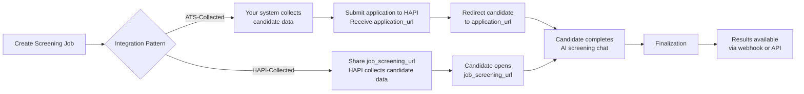

# Screening
> AI-powered candidate evaluation through interactive chat-screen applicants against job-specific criteria and receive scored PDF dossiers.

## What is Screening?

Screening is a standalone feature of the VONQ Hiring API (HAPI) that lets you evaluate candidates using an AI-driven chat conversation. You define a job with optional screening criteria, candidates complete an interactive chat, and HAPI delivers a PDF dossier with AI-generated scores and evaluation summaries.

Screening operates independently from campaign ordering. You can use it on its own or alongside campaigns.

<!-- theme: warning -->
> ### Account Activation Required
> Screening must be enabled for your account by your VONQ account manager. API calls return `403` if screening is not enabled.

## How It Works

HAPI supports two integration patterns for collecting candidate data:

1. **ATS-Collected**-Your system collects candidate information (name, email, phone, resume) and submits it to HAPI. You receive an `application_url` and redirect the candidate to complete the AI chat.

2. **HAPI-Collected**-You create a screening job with public applications enabled. HAPI provides a `job_screening_url` that you share with candidates. HAPI collects their information directly before starting the AI chat.

Both paths converge: the candidate completes an AI-powered screening conversation, and HAPI finalizes the results.

Key behaviors:

- If a candidate returns to the same `application_url`, they resume from where they left off.
- `finalization_time_hours` (1–168, default 168 = 7 days) controls when applications expire. An additional buffer accommodates candidates who are mid-conversation when the timer runs out.
- Requirements are never shown to candidates. The AI uses them internally to guide questions and evaluate answers.
- The AI chat language is automatically detected based on the job description.
- You receive results via webhook notifications or by polling the API.

## Key Concepts

**Screening Job**-A job configured for AI screening. Contains a job description, company information, optional requirements, and settings like `finalization_time_hours`. Created once per vacancy and receives many applications. Immutable after creation-you can only soft-delete a screening job, not update it.

**Application**-A single candidate's screening session. Created via the API (ATS-collected) or via the public URL (HAPI-collected, flagged as `is_external_application`). A candidate can resume their session by returning to the same URL.

**Requirement**-A screening criterion defined with three fields: `summary` (label), `description` (context for the AI), and `question` (text the AI bases evaluation on). Requirements are optional when creating a job and are never shown to candidates-the AI uses them internally to ask targeted questions and score answers.

**Dossier**-An AI-generated PDF containing screening results: candidate answers, an evaluation summary, and scores. Available after finalization when the application status is `screened_success`. Not available on timeout (no collected information to evaluate).

**Finalization**-The point when screening results become available. Triggered when a candidate completes the chat or when `finalization_time_hours` expires. A buffer period extends the deadline for candidates who are mid-conversation.

**Job Status**-Lifecycle states of a screening job:

| Status | Description |
|--------|-------------|
| `created` | Job is active and accepting applications |
| `stopped` | Job automatically stopped after 60 days; no new applications accepted |
| `deleted` | Job soft-deleted by the ATS |

**Application Status**-Lifecycle states of an application: `created`, `screened_success`, `screened_timeout`, `deleted`.

**Application Stage**-Position in the screening funnel: `APPLIED`, `SCREENED`, `INTERVIEWED`. Independent of status.

**Screening Score**-An integer from 0 to 100 (higher is better). `null` until screening completes.

## What's Next

- [Jobs & Applications](./jobs-and-applications.md)-Create screening jobs, submit and manage applications, download dossier PDFs
- [Webhooks](./webhooks.md)-Receive real-time screening result notifications via webhook
