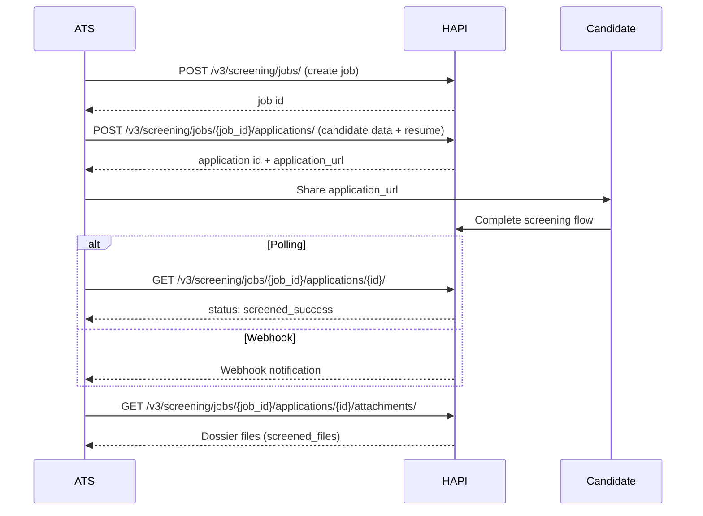
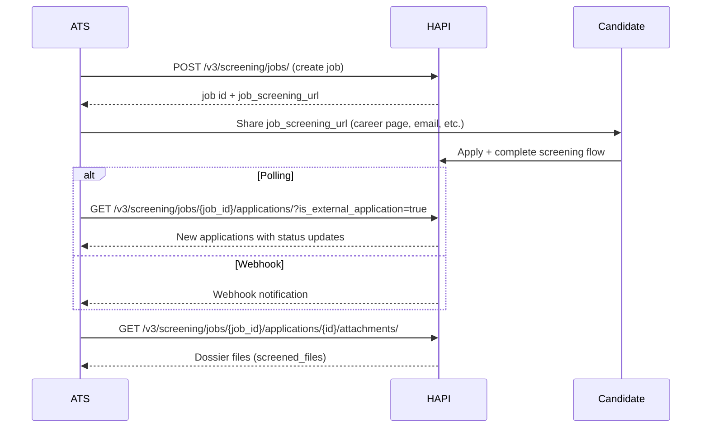

# Jobs & Applications

> Create screening jobs, submit candidate applications, and retrieve AI-enriched dossiers.

## Overview

A **screening job** defines what you are hiring for-the title, description, company info, and evaluation requirements. Once created, a job is immutable: you cannot update it, only soft-delete it.

An **application** represents a single candidate screening session tied to a job. You submit the candidate's contact details and resume, the candidate completes the screening flow, and HAPI returns an enriched dossier with scores and parsed data.

For background on how screening fits into HAPI, see [Screening-Introduction](./01-introduction.md).

## Key Concepts

- **Requirements**-criteria the AI uses to evaluate candidates. Requirements are _not_ shown to candidates. Each requirement has a `question` (required) and optional `summary` and `description`.
- **Finalization**-the point at which screening completes and the dossier becomes available. Controlled by `finalization_time_hours` (default: 168 hours / 7 days).
- **Dossier**-the enriched candidate profile available after successful screening. Includes `screened_payload` (same shape as `initial_payload`, enriched) and `screened_files`.
- **Attachments**-optional files submitted with an application (e.g. resume, cover letter). Accepted extensions: `.pdf`, `.docx`, `.jpg`, `.jpeg`, `.png`, `.txt`. Upload directly via `multipart/form-data` (`files`) or reference remote URLs via JSON (`remote_files`, 10 MB / 10-second download limit). Every entry in `initial_payload.attachments` must correspond to an uploaded or remote file, and vice versa.
- **ATS-collected pattern**-your ATS collects candidate data and submits it via the API. The candidate receives an `application_url` to complete screening.
- **HAPI-collected pattern**-you share the `job_screening_url` and candidates apply directly. These applications have `is_external_application: true`.

## Endpoints

| Endpoint | Description |
|----------|-------------|
| `POST /v3/screening/jobs/` | Create a screening job with title, description, company info, requirements, and settings |
| `GET /v3/screening/jobs/` | List screening jobs (paginated) |
| `GET /v3/screening/jobs/{id}/` | Retrieve full job details including `data`, `requirements`, and `settings` |
| `DELETE /v3/screening/jobs/{id}/` | Soft-delete a screening job |
| `POST /v3/screening/jobs/{job_id}/applications/` | Create a candidate screening application (supports multipart upload or remote file URLs) |
| `GET /v3/screening/jobs/{job_id}/applications/` | List applications with filtering by `status`, `screened_stage`, `is_external_application`, and sorting |
| `GET /v3/screening/jobs/{job_id}/applications/{id}/` | Retrieve full application details including `screened_payload` and `screened_score` |
| `DELETE /v3/screening/jobs/{job_id}/applications/{id}/` | Soft-delete an application |
| `GET /v3/screening/jobs/{job_id}/applications/{id}/attachments/` | List initial and screened files with authenticated and signed download URLs |
| `GET /v3/screening/jobs/{job_id}/applications/{id}/attachments/{file_type}/?filename=<name>` | Download a specific attachment file (`initial` or `screened`), for example `?filename=resume.pdf` |

See [Screening-Jobs & Applications - Endpoint Reference](./jobs-and-applications.endpoints.md) for full request/response details, body parameters, response field tables, and code examples.

## Workflows

### ATS-Collected Pattern

Your ATS collects the candidate's data and resume, then submits everything to HAPI. The candidate receives a link to complete the screening flow.

### HAPI-Collected Pattern

You share the job's public screening URL. Candidates apply directly-no application creation via the API is needed.

## Edge Cases & Gotchas

<!-- theme: warning -->
> ### Phone Number Validation
> Phone numbers must include a country code (e.g. `+31612345678`) unless `skip_phone_validation` is enabled on the job. The default is `true` (validation skipped), but if set to `false`, missing country codes cause a `400` error.

<!-- theme: warning -->
> ### File and Attachment Matching
> Every filename listed in `initial_payload.attachments` must have a corresponding file in `files` (multipart) or `remote_files` (JSON), and every uploaded/remote file must be listed in `attachments`. A mismatch in either direction returns `400`.

<!-- theme: warning -->
> ### Remote File Limits
> Remote files have a 10-second download timeout and a 10 MB size limit. If the remote server is slow or the file is too large, the request fails.

<!-- theme: warning -->
> ### Duplicate Applications
> When `allow_duplicate_applies` is `false` on a job, submitting a second application from the same candidate returns `400`. The default is `true`.

<!-- theme: warning -->
> ### Dossier Availability
> The `screened_payload` and `screened_files` are only available when the application status is `screened_success`. Applications that time out (`screened_timeout`) do not produce a dossier-no collected information is returned.

<!-- theme: warning -->
> ### Deleted Jobs
> Creating an application on a deleted job fails. Always check job `status` before submitting applications if your workflow allows job deletion.

## Related

- [Screening-Introduction](./01-introduction.md)-overview and key concepts
- [Screening-Webhooks](./webhooks.md)-real-time notifications for screening events
- [Authentication](../03-authentication-and-users/authentication.md)-token and JWT authentication details
