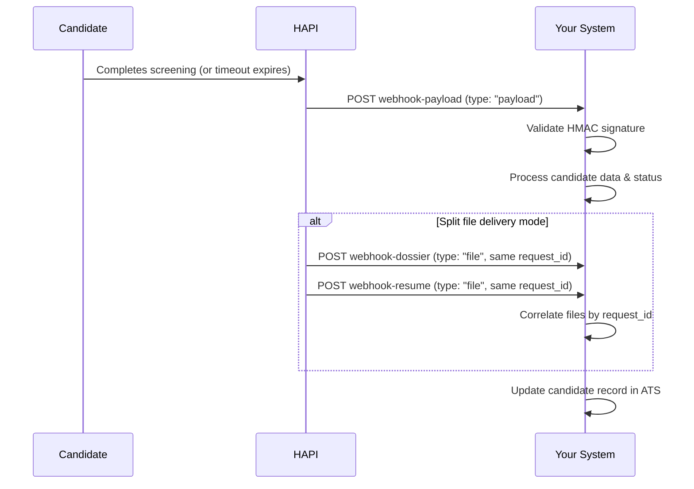

# Screening Webhooks

> Receive screening results in real time when candidates complete AI screening or when the finalization timeout expires.

## Overview

HAPI's screening webhooks push results to your system as soon as they are available, eliminating the need to poll the API. They fire in two situations: when a candidate completes screening (`screened_success`) and when the `finalization_time_hours` window expires without completion (`screened_timeout`).

For background on screening concepts, see [Screening-Introduction](./01-introduction.md).

<!-- theme: warning -->
> Screening webhooks are completely separate from [campaign webhooks](../08-campaigns/webhooks.md) and direct apply webhooks. They use different infrastructure, different payloads, and different configuration.

## Webhook Configuration

The default webhook URL is configured at the account level by your VONQ account manager. You can override it per-job by setting `settings.webhook_url` when [creating a screening job](./jobs-and-applications.md).

The following settings are configured by your account manager-they are not controllable via the API:

| Setting | Description |
|---------|-------------|
| Default webhook URL | Account-level endpoint for all screening webhooks |
| Retry count & intervals | How many times and how often failed deliveries are retried (e.g., 3 retries at 1, 5, and 15 minute intervals) |
| File delivery mode | How attachments are delivered (see [File Delivery Modes](#file-delivery-modes)) |
| HMAC signing secret | Opt-in signing for webhook verification (see [HMAC Signature Verification](#hmac-signature-verification)) |

## When Webhooks Fire

| Status | Trigger | Dossier Available? |
|--------|---------|-------------------|
| `screened_success` | Candidate completed screening | Yes-dossier + results in payload |
| `screened_timeout` | `finalization_time_hours` expired | No-no collected information to generate from |

## Payload Structure

The main webhook request contains candidate data, status, and attachment metadata.

```json
{
  "request_id": "550e8400-e29b-41d4-a716-446655440000",
  "job_id": "a1b2c3d4-e5f6-7890-abcd-ef1234567890",
  "application_id": "d4e5f6a7-b8c9-0123-def1-234567890123",
  "status": "screened_success",
  "metadata": {},
  "payload": {
    "firstName": "Jane",
    "lastName": "Doe",
    "phoneNumbers": [
      { "type": "personal", "number": "+31612345678", "isPreferred": true }
    ],
    "emailAddresses": [
      { "emailAddress": "jane.doe@example.com", "isPreferred": true }
    ],
    "attachments": [
      { "type": "DOSSIER", "filename": "dossier.pdf" },
      { "type": "RESUME", "filename": "resume.pdf" }
    ]
  },
  "type": "payload"
}
```

### Field Reference

| Field | Type | Description |
|-------|------|-------------|
| `request_id` | UUID | Unique ID linking payload and file requests-use for deduplication and correlation |
| `job_id` | UUID | Parent screening job |
| `application_id` | UUID | Specific application |
| `status` | string | `screened_success` or `screened_timeout` |
| `metadata` | object | Passthrough metadata from job creation |
| `payload` | object | Candidate data: name, phone numbers, email addresses, attachments |
| `payload.attachments` | array | File metadata-each entry has `type` and `filename` |
| `type` | string | `"payload"` for the main request, `"file"` for split file requests |

### Attachment Types

| Type | Description | When Present |
|------|-------------|--------------|
| `DOSSIER` | AI screening report PDF | Only on `screened_success` |
| `RESUME` | Candidate's uploaded resume | Only if the candidate uploaded one |

## File Delivery Modes

Your account manager configures one of four modes for how attachments are delivered with the webhook.

### Mode 1: Single Multipart Request

JSON payload and all files in one `multipart/form-data` POST. The JSON is sent in the `json` form field; files are sent as additional form fields.

Best for systems that handle multipart natively.

### Mode 2: Split Requests

The most common default. Attachments are delivered as separate requests:

1. **First POST**-JSON payload with attachment metadata (no file content), `type: "payload"`
2. **Subsequent POSTs**-one per file as `multipart/form-data`, sharing the same `request_id`, `type: "file"`

The payload request always arrives first, followed by the file requests. Use `request_id` to correlate them. Best for systems with request size limits.

<!-- theme: info -->
> ### Recommendation
> If your system can handle it, **single request mode** (Mode 1 or Mode 3) is preferred-you can atomically process the entire webhook in one request.

### Mode 3: Base64 Single Request

Everything in one JSON POST. File content is base64-encoded in each `attachments[].base64Content` field.

Best for JSON-only systems.

### Mode 4: Base64 Split Requests

Like Mode 2, but files are sent as JSON with a `base64Content` field instead of multipart:

1. **First POST**-JSON payload without file content
2. **Subsequent POSTs**-one per file, JSON with `base64Content` field

Best for JSON-only systems with request size limits.

## HMAC Signature Verification

HMAC signing is opt-in. Contact your account manager to enable it and configure a signing secret.

When enabled, each webhook request includes two headers:

- `X-Webhook-Timestamp`-Unix timestamp of when the request was sent
- `X-Webhook-Signature`-HMAC-SHA256 signature

### Verification Steps

1. Extract `X-Webhook-Timestamp` and `X-Webhook-Signature` from the request headers
2. Check that the timestamp is within your tolerance window (recommended: 5 minutes)
3. Re-serialize the JSON body in canonical form: compact separators and sorted keys
4. Compute the expected signature: base64-encoded `HMAC-SHA256(secret, "{timestamp}.{canonical_body}")`
5. Compare signatures using a constant-time comparison

### Python Example

```python
import base64
import hashlib
import hmac
import json
import time

def verify_webhook(payload_bytes: bytes, secret: str, timestamp: str, signature: str, tolerance: int = 300) -> bool:
    # Reject expired timestamps to prevent replay attacks
    if abs(time.time() - int(timestamp)) > tolerance:
        return False

    body = json.loads(payload_bytes)
    canonical = json.dumps(body, separators=(",", ":"), sort_keys=True)
    message = f"{timestamp}.{canonical}"
    expected = base64.b64encode(
        hmac.new(secret.encode(), message.encode(), hashlib.sha256).digest()
    ).decode()
    return hmac.compare_digest(expected, signature)
```

### Signing Behavior Per Delivery Mode

Only JSON bodies are signed. Multipart requests carrying binary file data are not signed-they are linked to the authenticated payload request by `request_id`.

| Delivery Mode | Payload request | File requests |
|---|---|---|
| Single Multipart (Mode 1) | Not signed (multipart binary) | N/A |
| Split Multipart (Mode 2) | Signed (full JSON body) | Not signed (multipart binary) |
| Base64 Single (Mode 3) | Signed (full JSON body) | N/A |
| Base64 Split (Mode 4) | Signed (full JSON body) | Signed (full JSON body) |

## Webhook vs API Polling

| | Webhooks | API Polling |
|-|----------|-------------|
| **Model** | Push-HAPI sends results to your endpoint | Pull-you query HAPI on a schedule |
| **Latency** | Real-time | Depends on poll interval |
| **Requirements** | Publicly accessible HTTPS endpoint | None-works from any backend |
| **Endpoint** | Your configured webhook URL | `GET /v3/screening/jobs/{job_id}/applications/{id}/`-poll until `screened_at` is populated |

You can use both simultaneously. Webhooks for real-time processing, polling as a fallback for missed deliveries.

## Workflows

### Receiving Screening Results (Split Mode)



## Edge Cases & Gotchas

<!-- theme: warning -->
> **No dossier on timeout.** When `status` is `screened_timeout`, the payload contains no attachments-there is no collected information to generate a dossier from.

- **Deduplication**-`request_id` is your idempotency key. Handle duplicate deliveries gracefully.
- **Retry behavior**-retry count and intervals are configured by your account manager, not controllable via the API.
- **HMAC is opt-in**-signing is not enabled by default. Request it from your account manager.
- **Link expiration**-`url_public` links from the attachments API expire after 1 hour.
- **Not the same as campaign webhooks**-screening webhooks use entirely separate infrastructure from [campaign webhooks](../08-campaigns/webhooks.md) and direct apply webhooks.

## Related

- [Screening-Introduction](./01-introduction.md)-concepts and high-level flow
- [Jobs & Applications](./jobs-and-applications.md)-API polling alternative, attachment download endpoints
- [Campaign Webhooks](../08-campaigns/webhooks.md)-different webhook type for campaign notifications
