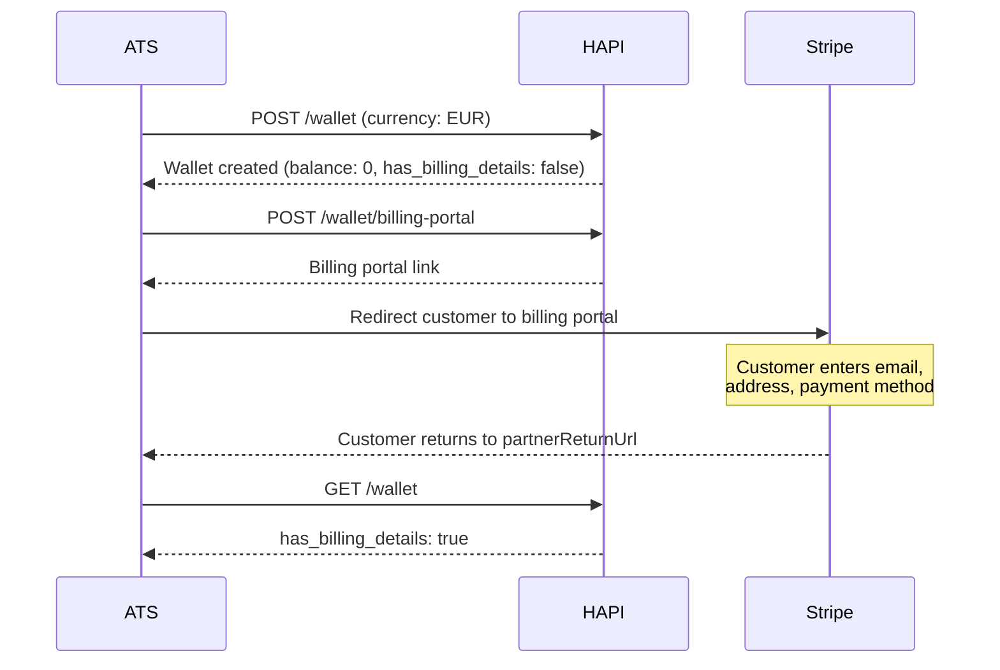
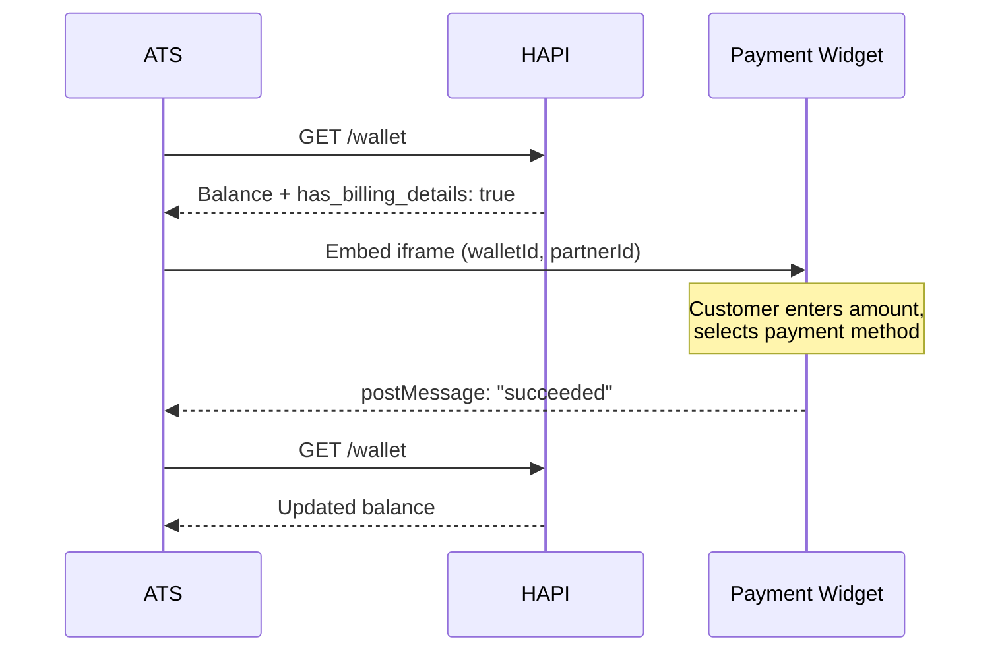
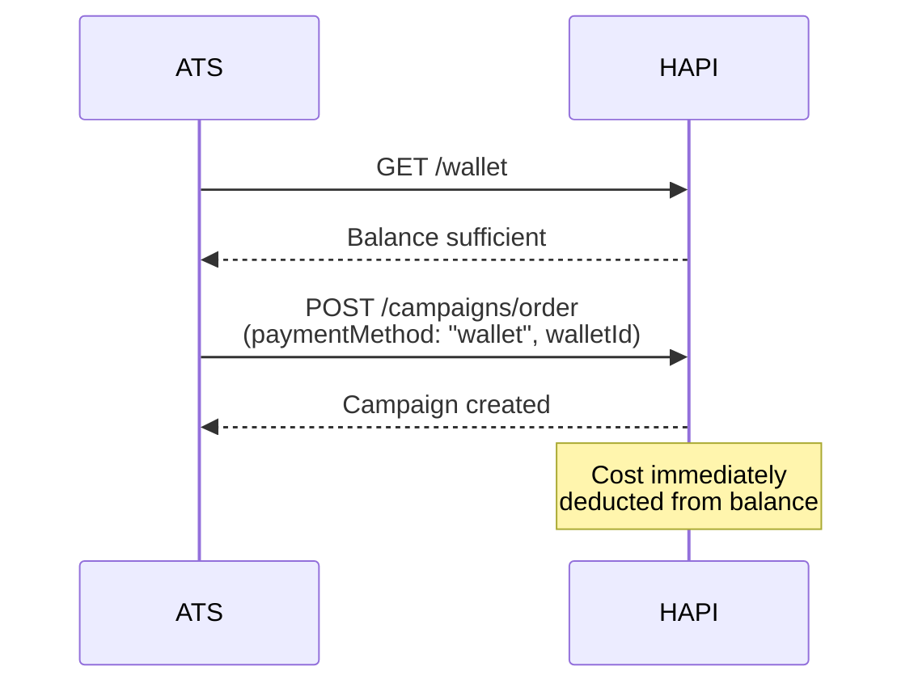
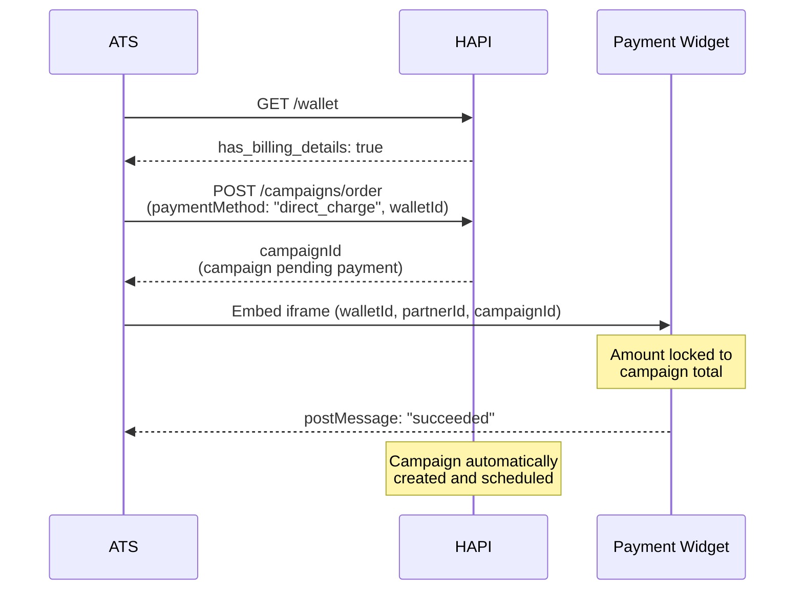
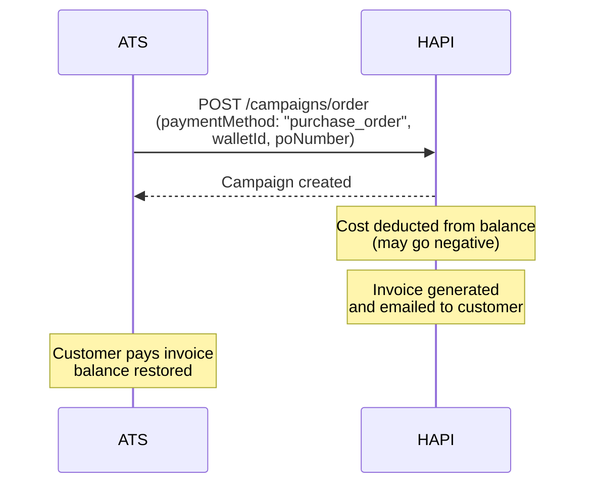

# Wallets & Payments
> Manage wallet-based payments for campaign ordering-top-ups, direct charges, purchase orders, and billing.

## What is a Wallet?

A **wallet** is a stored-value account tied to a single ATS user and a single currency. It is backed by Stripe and serves as the payment mechanism for ordering campaigns through HAPI.

Before ordering paid campaigns, you create a wallet, set up billing details, and fund it-either by topping up in advance or paying per campaign.

Each ATS user has exactly one wallet in one currency. If you need to operate in multiple currencies (e.g., EUR and USD), create separate ATS users for each currency.

<!-- theme: info -->
> ### Account Configuration Required
> Payment capabilities are configured by your VONQ account manager. Not all payment methods are available to all accounts. Check your ATS settings to see what is enabled.

## Key Concepts

**Wallet**-A stored-value account with a balance in a single currency. Created once per ATS user. Balance can be positive (funded), zero, or negative (when using purchase orders with deferred payment).

**Billing Details**-Customer billing information (email, name, address) required before any payment. Managed through the Stripe billing portal. Tracked by the `has_billing_details` flag on the wallet.

**Billing Portal**-A Stripe-hosted page where customers manage their payment methods, invoices, billing address, tax ID, and email. Accessed via a time-limited link: if unused, it expires 5 minutes after generation; after the customer opens it, the session expires within 1 hour of the most recent activity and can last up to 2 hours total.

**Payment Widget**-A Stripe-managed iframe (`/wallet/topup.html`) that handles all card and bank input. PCI-compliant-no sensitive payment data touches your system. Communicates payment status via `postMessage` events.

## Payment Methods

HAPI supports three payment methods when ordering campaigns:

| Method | How It Works | Balance Impact | Best For |
|--------|-------------|----------------|----------|
| `wallet` | Deducts from pre-funded wallet balance | Immediate deduction | Pre-paid accounts, predictable spend |
| `direct_charge` | Charges payment method directly for a specific campaign after the order is submitted | No pre-funded wallet balance needed | Pay-per-campaign, no pre-funding |
| `purchase_order` | Invoice-based-cost deducted now, customer pays invoice later | Balance may go negative | Enterprise accounts, net-30 terms |

### Feature Flags

Your ATS settings control which payment methods are available:

| Flag | Description |
|------|-------------|
| `can_use_wallets` | Wallet top-ups enabled |
| `can_pay_with_direct_charge` | Direct charge enabled |
| `can_pay_with_purchase_order` | Purchase order enabled |
| `ats_managed_payment` | When `true`, the ATS handles payment outside HAPI-no wallet or payment method needed when ordering campaigns |

## Supported Currencies & Payment Types

| Currency | Card | Bank Transfer | SEPA | ACH | Notes |
|----------|------|--------------|------|-----|-------|
| EUR | Yes | Yes | Yes |-| Reverse charge VAT for EU outside NL |
| USD | Yes | Yes |-| Yes | ACH: 4–5 day processing |
| GBP | Yes |-|-|-| Card only |
| AUD | Yes |-|-|-| Card only |

Available payment types depend on currency and Stripe configuration. Check `payment_settings` in your ATS settings for the exact list.

## Wallet Limits

The wallet object includes limits that constrain payment operations:

| Limit | Description |
|-------|-------------|
| `min_topup` | Minimum amount for a single top-up |
| `max_purchase_order` | Maximum amount for a single purchase order |
| `max_outstanding_balance` | Maximum allowed negative balance (prevents unlimited PO liability) |

## Endpoints

| Endpoint | Description |
|----------|-------------|
| `POST /wallet` | Create a wallet for the authenticated ATS user (one per user, fixed currency) |
| `GET /wallet` | Retrieve the wallet-balance, billing status, and payment limits |
| `POST /wallet/billing-portal` | Generate a Stripe billing portal link for the customer to manage billing details, payment methods, and invoices |
| Payment Widget (`/wallet/topup.html`) | Stripe-managed iframe for PCI-compliant card and bank payment input; communicates via `postMessage` |

See [Wallets & Payments - Endpoint Reference](./12-wallets-and-payments.endpoints.md) for full request/response details, response field tables, widget query parameters, and `postMessage` event handling.

## Workflows

### Wallet Setup (One-Time)

### Top-Up (Add Funds)

### Ordering with Wallet Balance

### Direct Charge (Per-Campaign Payment)

### Purchase Order (Invoice-Based)

## Campaign Ordering with Payment

When ordering a campaign, include payment parameters in the request body:

| Field | Type | Required | Description |
|-------|------|----------|-------------|
| `paymentMethod` | string | No | Payment method for the campaign: `wallet`, `purchase_order`, `ats_managed`, or `direct_charge`. Defaults to `ats_managed`. For `wallet`, `direct_charge`, and `purchase_order`, the order must contain at least one product with a price greater than `0`. |
| `walletId` | UUID | Conditional | Wallet to use for `wallet`, `direct_charge`, or `purchase_order` payments |
| `poNumber` | string | Conditional | Purchase order reference number-required for `purchase_order` and included on the invoice |
| `orderReference` | string | No | Vendor reference (max 80 characters) |
| `currency` | string | No | Payment currency (must match wallet currency) |

**Payment-Related Ordering Errors**

| Scenario | Result |
|----------|--------|
| Payment method not enabled for account | Order rejected |
| Billing details incomplete for payment method | Order rejected or payment widget blocked until billing details are completed |
| Wallet balance insufficient (for `wallet` method) | Order rejected |
| Campaign total exceeds `max_purchase_order` | Order rejected |
| Resulting balance would exceed `max_outstanding_balance` | Order rejected |

## Refunds

Refund behavior depends on the payment method and the situation:

| Payment Method | Product Not Processed | Partial Delivery |
|----------------|----------------------|------------------|
| **Wallet** | Cost credited back to wallet (instant) | Partial credit to wallet |
| **Direct Charge** | Refund to bank account (5-10 business days) | Partial refund to bank |
| **Purchase Order** | If unpaid: revised invoice issued. If already paid: refund to bank account (5-10 business days) | Revised invoice or partial bank refund, depending on invoice payment status |

<!-- theme: info -->
> Refund handling varies by case. For complex scenarios (partial deliveries, disputes), contact your VONQ account manager.

## Taxes & Invoicing

Tax treatment depends on the customer's billing address:

| Customer Location | Tax Treatment |
|-------------------|--------------|
| Netherlands | VAT added to invoice |
| EU (outside NL) | Reverse charge applied |
| United States | No tax on invoice |
| Other | Determined by Stripe based on billing address |

If taxes are added to the invoice, the top-up or campaign price amount is **inclusive of tax**-the amount the customer sees in the widget already includes any applicable tax.

## Edge Cases & Gotchas

<!-- theme: warning -->
> ### Billing Details Required First
> You cannot top up, direct-charge, or use purchase orders until billing details are complete. Always check `has_billing_details` on the wallet before initiating payment. If `false`, redirect the customer to the billing portal.

<!-- theme: warning -->
> ### One Wallet, One Currency
> Each ATS user has exactly one wallet in one currency. Currency cannot be changed after creation. For multi-currency operations, use separate ATS users.

<!-- theme: warning -->
> ### Purchase Order Balance Limits
> Purchase orders can push the wallet balance negative, but only up to `max_outstanding_balance`. Orders that would exceed this limit are rejected.

- **Negative wallet balance**-wallet top-ups are blocked while the balance is negative. Outstanding purchase order invoices must be paid before the wallet balance can become positive again.
- **Top-up invoices**-an invoice may be generated when the customer reaches the payment-method screen in the widget. If the customer abandons the top-up, that invoice can be ignored.
- **ACH payments** (USD) take 4–5 business days to process. The payment status shows `processing` during this time.
- **Billing portal links** expire 5 minutes after generation if unused. Generate a new one if the customer doesn't click in time.
- **`ats_managed_payment: true`** means your ATS handles payment outside HAPI. When set, you don't need to provide a wallet or payment method when ordering campaigns.
- **Product failures**-if a product fails processing after ordering, the cost is refunded (to wallet or bank, depending on payment method).

## Related

- [Campaigns-Ordering](./08-campaigns/ordering.md)-campaign ordering flow with payment parameters
- [Authentication-Entities](./03-authentication-and-users/entities.md)-ATS user management
