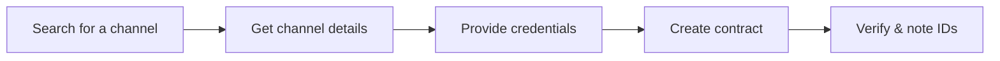
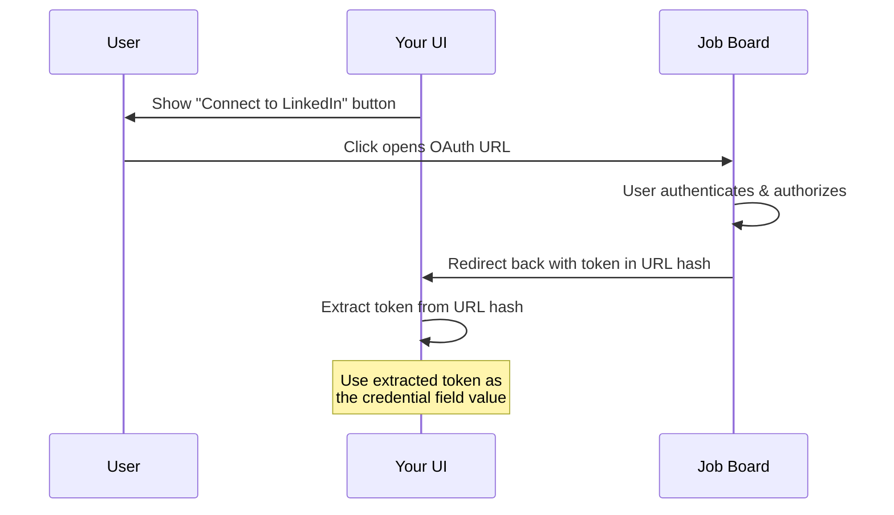

# Setting Up a Contract

> Find a job board channel, provide credentials, and create a contract you can use in campaign orders.

## Goal

By the end of this scenario you will have a working contract for a job board channel. You will know the **contract ID** (for managing the contract) and the **product ID** (for ordering campaigns with it).

## Overview



## Step 1: Search for a Channel

Use the MOC (Multi-Order Channel) endpoint to find channels that support contracts. You can search by name.

**Example: searching for SEEK**

```
GET /products/channels/mocs/?search=seek
```

The response returns a list of channels. Each result includes:

| Field | Why it matters |
|-------|---------------|
| `id` | Channel ID-you will need this for the detail call |
| `name` | Human-readable channel name |
| `mc_enabled` | Always `true` in MOC results (these channels support contracts) |

Pick the channel you want and note its `id`.

<!-- theme: info -->
> ### MC-Only vs MC-Enabled
> Some products are `mc_only`-they can **only** be ordered via a contract. Others are `mc_enabled`-they support contracts but can also be ordered as Job Marketing. The MOC endpoint returns all channels that support contracts regardless.

## Step 2: Get Channel Details

Fetch the full channel details to see what credentials are needed and whether there are setup instructions.

```
GET /products/channels/mocs/{id}/
```

The response includes three critical sections:

### Credential Fields (`contract_credentials`)

An array of fields the user must fill in. For each field, check:

| Check | Meaning |
|-------|---------|
| `url` is present | This is an **OAuth field**-redirect the user to the URL instead of showing a text input |
| `options` is present | Render a **dropdown select** with the provided options |
| Neither | Render a **text input** |

### Setup Instructions

| Field | Check |
|-------|-------|
| `manual_setup_required` | If `true`, the user must complete setup steps on the job board before creating the contract |
| `setup_instructions` | HTML content describing what the user needs to do on the channel's side |
| `description` | General channel description-read carefully, it often contains important context |

<!-- theme: warning -->
> ### Read the Description
> The `description` and `setup_instructions` fields contain channel-specific details that vary widely. Always display them to the user-some channels require manual configuration on the job board's admin panel before credentials will work.

### Product Information

The response also includes the `product` object with a `product_id`. **Note this down**-you will need it when ordering campaigns.

## Step 3: Provide Credentials

How the user provides credentials depends on the field type.

### Standard Credentials (Text Input)

For channels like SEEK, the credential fields are straightforward text inputs (e.g., `organization_id`, `api_key`). The user enters their values directly.

### OAuth Credentials (Redirect Flow)

For channels like LinkedIn, one or more credential fields have a `url` property. These use an OAuth redirect flow:



1. The user clicks a link/button that opens the `url` from the credential field
2. They authenticate on the job board and authorize access
3. The job board redirects back to your application with a token in the URL hash (fragment)
4. Your UI extracts the hash value-this becomes the credential field value
5. Submit this value as the credential when creating the contract

<!-- theme: warning -->
> ### The Token Is in the Hash
> The OAuth token is in the URL **hash** (after `#`), not in query parameters. Make sure your redirect handler reads `window.location.hash`, not `window.location.search`.

## Step 4: Create the Contract

Submit the credentials to create the contract.

```
POST /contracts/
```

```json
{
  "channel_id": 1234,
  "credentials": {
    "organization_id": "your-org-id",
    "api_key": "your-api-key"
  },
  "credentials_validation": "if_supported",
  "followed_instructions": true
}
```

| Field | Notes |
|-------|-------|
| `channel_id` | From step 1 |
| `credentials` | Key-value pairs matching the `contract_credentials` fields from step 2 |
| `credentials_validation` | Set to `"if_supported"`-validates credentials against the channel if possible, creates the contract anyway if not |
| `followed_instructions` | Set to `true` **only** if `manual_setup_required` was `true` for this channel. Setting it to `true` when the channel doesn't require it returns a `400` error |

### Check the Response

The response includes an `errors` array:

- **Empty `errors` array** - the contract was created successfully
- **Non-empty** - something went wrong. Fix the issues and retry

On success, note the **contract ID** from the response-you will need it for campaign ordering.

## Step 5: Verify the Contract

Fetch the full contract details to confirm everything is in order.

```
GET /contracts/single/{contract_id}/
```

The response includes:

| Field | Why it matters |
|-------|---------------|
| `contract_id` | Unique identifier for this contract-use when managing the contract |
| `product.product_id` | The product ID tied to this contract-**use this in `orderedProducts` when ordering campaigns** |
| `channel` | Confirms which channel this contract is for |
| `credentials` | Masked values (`***`)-confirms credentials were stored |
| `posting_requirements` | Channel-specific fields you will need to fill when ordering (see [Contract Posting Requirements](../06-contracts/posting-requirements.md)) |

<!-- theme: danger -->
> ### Product ID vs Contract ID
> These are different and both are needed for campaign ordering:
> - **Contract ID** goes in `orderedProductsSpecs[].contractId`
> - **Product ID** goes in `orderedProducts[]`
>
> Mixing them up is a common mistake. See [Contract Ordering](../06-contracts/ordering.md).

## Step 6: List Your Contracts

You can always list all contracts to see what you have set up.

```
GET /contracts/
```

This returns summary objects for all your contracts, including their channels and statuses. Use filters to narrow results:

- `?channel_id=1234` - filter by channel
- `?channel_name=seek` - filter by channel name
- `?group_id=0` - filter by contract group

<!-- theme: info -->
> ### Summary vs Full Details
> The list endpoint returns summary objects without `credentials` or `posting_requirements`. Use `GET /contracts/single/{contract_id}/` for the full object.

## What You Have Now

After completing this scenario:

- A **contract** storing your encrypted credentials for a job board channel
- The **contract ID** for managing the contract and referencing it in orders
- The **product ID** for including this channel in campaign orders

## What's Next

- [Ordering with Contracts](../06-contracts/ordering.md) - use your contract in a campaign order
- [Contract Posting Requirements](../06-contracts/posting-requirements.md) - fill in channel-specific fields when ordering
- [Job Post Campaign scenario](./job-post-campaign.md) - end-to-end campaign ordering with a contract

## Related

- [Contracts-Introduction](../06-contracts/01-introduction.md) - what contracts are and key concepts
- [Managing Contracts](../06-contracts/managing-contracts.md) - full endpoint reference for contract CRUD
- [Notes](../06-contracts/notes.md) - OAuth details, deletion caveats, channel-specific issues
