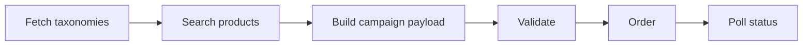
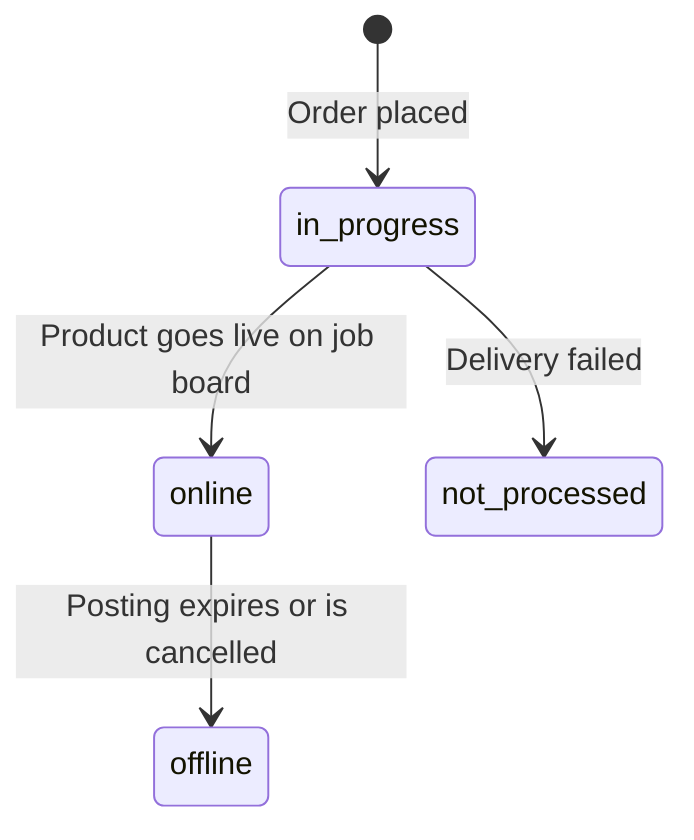
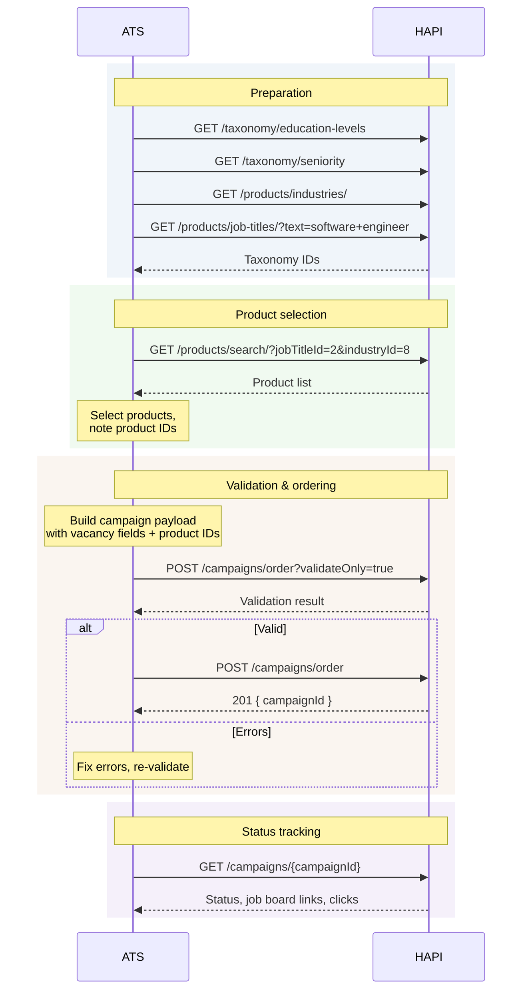

# Job Marketing Campaign

> Search the marketplace, build a campaign payload, validate, and place your first Job Marketing order.

## Goal

By the end of this scenario you will have ordered a Job Marketing (JM) campaign - a vacancy posted on one or more job boards where VONQ manages the channel relationship and you pay per posting.

## What is Job Marketing?

Job Marketing is the simplest ordering model in HAPI. You browse VONQ's marketplace of job boards, pick one or more products, fill in your vacancy details, and submit the order. VONQ handles the delivery to each channel. No contracts, no credentials, no channel setup.

This is different from **Job Post** (My Contract) ordering, where you bring your own job board account and credentials. For that flow, see [Setting Up a Contract](./contract-setup.md) first.

## Overview



## Step 1: Fetch Taxonomies

Before you can search for products or build a campaign, you need taxonomy IDs. HAPI uses education level, seniority, and industry values to classify jobs for HAPI partners.

Fetch them upfront so you can use the IDs in both the product search and the campaign payload:

| Taxonomy | Endpoint | Example value |
|----------|----------|---------------|
| Education level | `GET /taxonomy/education-levels` | `{ "vonqId": "2", "description": "Bachelor / Graduate" }` |
| Seniority | `GET /taxonomy/seniority` | `{ "vonqId": "3", "description": "Mid-Senior level" }` |
| Industry | `GET /products/industries/` | `{ "vonqId": "48", "description": "Academic" }` |

You will also need a **job title ID** for product search:

```
GET /products/job-titles/?text=software+engineer
```

<!-- theme: info -->
> ### Taxonomy Values Are Stable
> Taxonomy IDs rarely change. You can cache them and refresh periodically rather than fetching on every order. See [Taxonomy & Locations](../04-taxonomy.md) for full details including localization.

<!-- theme: warning -->
> ### Core Target Group Fields
> For HAPI partners, populate `educationLevel`, `seniority`, and `industry`. The legacy `jobCategory` field is not resolved through public taxonomy endpoints; leave it as an empty array unless VONQ explicitly provides a value for your integration. See [Vacancy Fields - Loose Validation](../08-campaigns/vacancy-fields.md#loose-validation).

## Step 2: Search for Products

Use the marketplace search to find job boards relevant to your vacancy.

```
GET /products/search/?jobTitleId=2&industryId=8
```

**Example: finding LinkedIn**

```
GET /products/search/?jobTitleId=2&industryId=8&name=linkedin
```

The response returns a paginated list of products. For each product, note:

| Field | Why it matters |
|-------|---------------|
| `product_id` | You will put this in the `orderedProducts` array |
| `title` | Display name for the user |
| `vonq_price` | Cost (amount + currency) |
| `duration` | How long the posting stays live |
| `allow_orders` | Must be `true` - skip products where this is `false` |
| `has_product_specs` | If `true`, this product has posting requirements (see note below) |

Select one or more products and collect their `product_id` values.

<!-- theme: info -->
> ### Posting Requirements on JM Products
> Some JM products have `has_product_specs: true`, meaning they have channel-specific fields (posting requirements) that should be collected before ordering. If a product has specs, fetch them with `GET /products/{product_id}/specs/` and include the values in `orderedProductsSpecs`. See [Posting Requirements](../07-posting-requirements/01-introduction.md) for details.

For a full guide on product search filters and product details, see [Marketplace](../05-products/02-marketplace.md).

## Step 3: Build the Campaign Payload

The campaign order body has four main sections:

```json
{
  "companyId": "customer-123",
  "recruiterInfo": {
    "id": "recruiter-42",
    "name": "Jane Recruiter",
    "emailAddress": "jane@acme.example.com"
  },
  "postingDetails": {
    "title": "Senior Software Engineer",
    "description": "<p>We are looking for a senior engineer...</p>",
    "organization": {
      "name": "Acme Corp",
      "companyLogo": "https://www.example.com/logo.png"
    },
    "workingLocation": {
      "addressLine1": "Keizersgracht 100",
      "postcode": "1015 AA",
      "city": "Amsterdam",
      "country": "NL"
    },
    "yearsOfExperience": 5,
    "employmentType": "permanent",
    "weeklyWorkingHours": { "from": 32, "to": 40 },
    "salaryIndication": {
      "period": "yearly",
      "range": { "from": 65000, "to": 85000, "currency": "EUR" }
    },
    "jobPageUrl": "https://acme.example.com/careers/senior-engineer",
    "applicationUrl": "https://acme.example.com/apply/senior-engineer"
  },
  "targetGroup": {
    "educationLevel": [{ "vonqId": "2", "description": "Bachelor / Graduate" }],
    "seniority": [{ "vonqId": "3", "description": "Mid-Senior level" }],
    "industry": [{ "vonqId": "48", "description": "Academic" }],
    "jobCategory": []
  },
  "orderedProducts": [
    "d1e2f3a4-b5c6-7890-abcd-ef1234567890"
  ]
}
```

Key points:

- **`orderedProducts`** is a flat array of product IDs from step 2
- **`targetGroup`** uses the taxonomy IDs from step 1 - populated fields are arrays with exactly one object
- **`workingLocation`** is just an address and country - no taxonomy lookup needed
- **`companyId`** must match your `X-Customer-Id` header
- **`companyLogo`** is required and must be a publicly reachable URL - the API checks this server-side

### targetGroup - Use Taxonomy Endpoints

Each populated `targetGroup` field takes an array of objects with `vonqId` (string) and `description` (string). The `vonqId` must be a valid taxonomy ID - the `description` is a freeform label for display purposes and is not validated. For HAPI partners, `jobCategory` remains an empty array unless VONQ explicitly provides a value for your integration.

To get valid `vonqId` values, use the [Taxonomy](../04-taxonomy.md) endpoints. Note that the taxonomy response format differs from what `targetGroup` expects:

| Taxonomy response | targetGroup format |
|-------------------|--------------------|
| `id` (integer) | `vonqId` (string) |
| `name` (multilingual array) | `description` (plain string - freeform) |

Use the taxonomy `id` as `vonqId` (converted to string). For `description`, use any human-readable label - typically the `en_GB` value from the taxonomy `name` array.

For the full field reference, see [Vacancy Fields](../08-campaigns/vacancy-fields.md).

## Step 4: Validate

Before ordering, validate your payload to catch errors early. HAPI offers two ways to do this - use either one:

### Option A: Validate Campaign

```
POST /campaigns/validate-campaign/
```

<!-- theme: warning -->
> ### `campaign` Wrapper Required
> The `validate-campaign` endpoint wraps the payload in a `campaign` property - unlike the order endpoint which takes the payload directly.

```json
{
  "campaign": {
    "companyId": "customer-123",
    "recruiterInfo": { ... },
    "postingDetails": { ... },
    "targetGroup": { ... },
    "orderedProducts": [ ... ]
  }
}
```

The response includes a `has_errors` boolean and an `errors` object with per-field details.

### Option B: Dry-Run Order

```
POST /campaigns/order?validateOnly=true
```

Uses the exact same payload as a real order (no wrapper needed) and the same validation logic, but does not create the campaign. Returns the same error format.

Both options validate the same things - vacancy fields, product availability, and posting requirements. Pick whichever fits your integration better.

<!-- theme: info -->
> ### Validate Vacancy Info
> There is also a `POST /campaigns/validate-vacancy-info/` endpoint that validates only the vacancy fields (no products). This is useful if you want to validate as the user fills in the form, before they select products. This endpoint wraps the payload in a `vacancy` property. See [Validation](../08-campaigns/validation.md).

### Handling Errors

If validation fails, the response tells you exactly which fields have issues:

```json
{
  "has_errors": true,
  "errors": {
    "postingDetails": {
      "title": ["This field is required."]
    },
    "targetGroup": {
      "educationLevel": ["This field is required."]
    }
  }
}
```

Fix the errors and validate again until `has_errors` is `false`.

## Step 5: Order

Once validation passes, submit the order:

```
POST /campaigns/order
```

Use the exact same payload. The response returns a `campaignId`:

```json
{
  "campaignId": "a1b2c3d4-e5f6-7890-abcd-ef1234567890"
}
```

That is all you get back - the campaign is now being processed. Use the `campaignId` to check status.

### Payment

By default, payment is `ats_managed` - VONQ invoices your organization separately and no payment fields are needed in the order.

If your account uses wallets, include the `walletId` in the order:

```json
{
  "paymentMethod": "wallet",
  "walletId": "your-wallet-id",
  ...
}
```

See [Wallets & Payments](../12-wallets-and-payments.md) for wallet setup, top-ups, and other payment methods.

## Step 6: Check Status

After ordering, poll for status until the campaign goes live:

```
GET /campaigns/{campaignId}
```



| Status | Meaning |
|--------|---------|
| `in progress` | Products are being delivered to job boards |
| `online` | At least one product is live - check `postings[]` for job board links |
| `offline` | All products have finished or been cancelled |
| `not processed` | A product failed to deliver (permanent - see status fields for details) |

Once a product is `online`, the response includes:

- **`jobBoardLink`** - the live URL on the job board
- **`deliveredOn`** - when the posting went live
- **`clicks`** - cumulative click count

For production integrations, prefer [webhooks](../08-campaigns/webhooks.md) over polling - they notify you immediately when statuses change.

See [Status & Lifecycle](../08-campaigns/status.md) for the full status reference, incremental sync, and edge cases.

## End-to-End Flow



## What You Have Now

After completing this scenario:

- A **campaign** with one or more JM products being delivered to job boards
- A **campaignId** for tracking status, editing, or cancelling
- Job board **links** and **click metrics** once products go live

## What's Next

- [Status & Lifecycle](../08-campaigns/status.md) - track delivery, check job board links
- [Editing](../08-campaigns/editing.md) - update vacancy details on a live campaign
- [Cancellation](../08-campaigns/cancellation.md) - take products offline early
- [Job Post Campaign scenario](./job-post-campaign.md) - ordering with contracts and posting requirements

## Related

- [Taxonomy & Locations](../04-taxonomy.md) - taxonomy endpoints and localization
- [Marketplace](../05-products/02-marketplace.md) - product search filters and product details
- [Vacancy Fields](../08-campaigns/vacancy-fields.md) - full field reference
- [Validation](../08-campaigns/validation.md) - all validation endpoints
- [Ordering](../08-campaigns/ordering.md) - full ordering reference including payment, loose validation, labels
- [Wallets & Payments](../12-wallets-and-payments.md) - wallet setup and payment methods
