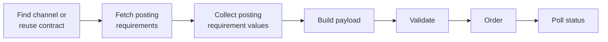
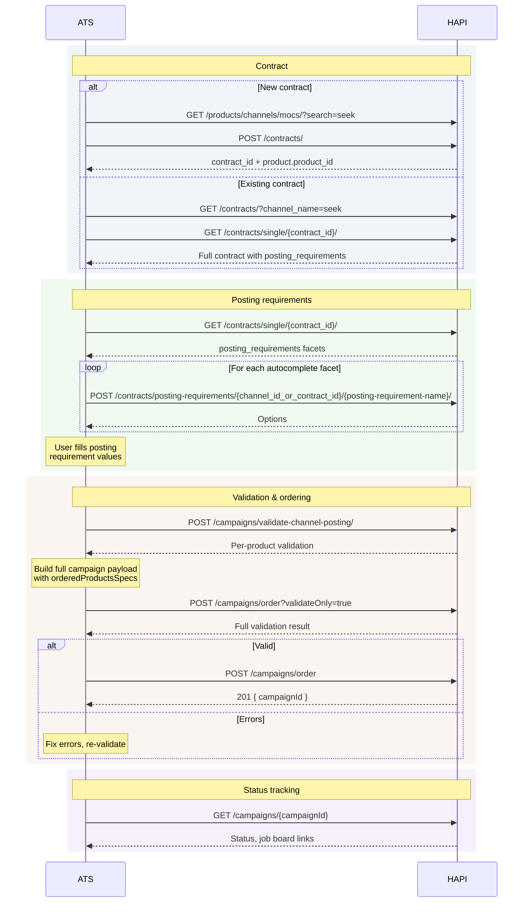
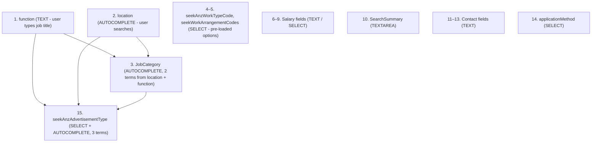

# Job Post Campaign

> Order a campaign using your own job board account - find or reuse a contract, collect posting requirements, validate, and submit.

## Goal

By the end of this scenario you will have ordered a **Job Post** (My Contract) campaign - a vacancy posted on a job board using your own stored credentials, with channel-specific posting requirements filled in.

## What is Job Post?

In the Job Post model (also called My Contract), you bring your own job board account. Your credentials are stored in a **contract**, and VONQ posts jobs on your behalf using those credentials. This is different from [Job Marketing Campaign](./job-marketing-ordering.md), where VONQ manages the channel relationship.

Job Post campaigns require two things that JM campaigns don't:

1. **A contract** - stored credentials for the channel
2. **Posting requirements** - channel-specific fields (location, job category, ad type, etc.) that the job board needs beyond the standard vacancy fields

## Overview



## Step 1: Get a Contract

You need a contract before you can order. Either create a new one or reuse an existing one.

### Option A: Create a New Contract

Search for channels that support contracts, check credential requirements, and create one:

```
GET /products/channels/mocs/?search=seek
```

For the full walkthrough - including OAuth flows, setup instructions, and credential handling - see the [Setting Up a Contract](./contract-setup.md) scenario.

### Option B: Use an Existing Contract

List your contracts and pick one:

```
GET /contracts/
```

Filter by channel or name:

```
GET /contracts/?channel_name=seek
```

<!-- theme: info -->
> ### Summary vs Full Details
> The list endpoint returns summary objects. You will need the full contract object (with posting requirements) in the next step - fetch it with `GET /contracts/single/{contract_id}/`.

### Note the Two IDs

From the contract, you need two different IDs:

| ID | Where to find it | Where it goes in the order |
|----|-------------------|---------------------------|
| **Contract ID** | `contract_id` on the contract object | `orderedProductsSpecs[].contractId` |
| **Product ID** | `product.product_id` on the contract object | `orderedProducts[]` |

<!-- theme: danger -->
> ### Don't Mix These Up
> The contract ID and product ID are different values used in different places. Swapping them is a common integration mistake. See [Ordering with Contracts](../06-contracts/ordering.md) for the full structure.

## Step 2: Fetch Posting Requirements

Almost all channels that support contracts also require posting requirements - channel-specific fields like location, job category, or ad type that the job board needs beyond standard vacancy fields.

Fetch the full contract details:

```
GET /contracts/single/{contract_id}/
```

The `posting_requirements` array contains the facet definitions - the same [facet model](../07-posting-requirements/facets.md) used across HAPI:

```json
{
  "posting_requirements": [
    {
      "name": "location",
      "label": "Location",
      "type": "HIER",
      "required": true,
      "sort": 0,
      "autocomplete": { ... },
      "options": []
    },
    {
      "name": "AdType",
      "label": "Ad Type",
      "type": "SELECT",
      "required": true,
      "sort": 1,
      "options": [
        { "key": "classic", "label": "Classic", "show": ["location"] },
        { "key": "premium", "label": "Premium", "show": ["location", "standOut"] }
      ]
    }
  ]
}
```

Each facet has a `type`, `required` flag, and `sort` order, and may have `options`, `autocomplete`, `display_rules`, and `rules` (validation constraints). Lower `sort` values should be displayed and resolved first.

## Step 3: Collect Posting Requirement Values

Build a form from the facets and collect values from the user.

### Rendering the Form

For each facet, check:

| Check | Action |
|-------|--------|
| `options` is populated | Render a dropdown/select |
| `autocomplete` is non-null and `options` is empty | Fetch options via the autocomplete endpoint first |
| Neither | Render a text input |
| `display_rules` is present | Show/hide the facet based on other field values |

### Autocomplete

For facets with lazy-loaded options (empty `options[]`, non-null `autocomplete`), call the contract-specific autocomplete endpoint:

```
POST /contracts/posting-requirements/{channel_id_or_contract_id}/{posting-requirement-name}/
```

```json
{
  "term": "amster"
}
```

The response returns matching options. The user selects one, and you use its `key` as the posting requirement value.

### Display Rules

Facets may have `display_rules` that control visibility based on other field values. For example, a "Stand Out" facet might only appear when the ad type is "Premium".

Always evaluate display rules when rendering the form. Hidden facets should be **omitted** from the submission - even if they are marked `required`.

For the full operator reference, cascading visibility, and implementation pseudocode, see [Facets - Display Rules](../07-posting-requirements/facets-display-rules.md).

### Build the postingRequirements Object

Collect the values into a flat key-value object where keys match the facet `name` fields:

```json
{
  "location": "amsterdam",
  "AdType": "premium",
  "standOut": "true"
}
```

<!-- theme: warning -->
> ### Keys Must Match Facet Names Exactly
> The keys in `postingRequirements` must exactly match the `name` field from each facet. These are case-sensitive.

## Step 4: Build the Campaign Payload

The payload is the same as a [Job Marketing order](./job-marketing-ordering.md#step-3-build-the-campaign-payload) - vacancy fields, target group, recruiter info - with one critical addition: **`orderedProductsSpecs`**.

```json
{
  "companyId": "customer-123",
  "recruiterInfo": {
    "id": "recruiter-42",
    "name": "Jane Recruiter",
    "emailAddress": "jane@acme.example.com"
  },
  "postingDetails": {
    "title": "Senior Software Engineer",
    "description": "<p>We are looking for a senior engineer...</p>",
    "organization": {
      "name": "Acme Corp",
      "companyLogo": "https://your-cdn.example.com/logos/acme-corp.png"
    },
    "workingLocation": {
      "addressLine1": "Keizersgracht 100",
      "postcode": "1015 AA",
      "city": "Amsterdam",
      "country": "NL"
    },
    "yearsOfExperience": 5,
    "employmentType": "permanent",
    "weeklyWorkingHours": { "from": 32, "to": 40 },
    "jobPageUrl": "https://acme.example.com/careers/senior-engineer",
    "applicationUrl": "https://acme.example.com/apply/senior-engineer"
  },
  "targetGroup": {
    "educationLevel": [{ "vonqId": "2", "description": "Bachelor / Graduate" }],
    "seniority": [{ "vonqId": "3", "description": "Mid-Senior level" }],
    "industry": [{ "vonqId": "48", "description": "Academic" }],
    "jobCategory": [{ "vonqId": "11", "description": "Customer Service" }]
  },
  "orderedProducts": [
    "d2e3f4a5-b6c7-8901-bcde-f12345678901"
  ],
  "orderedProductsSpecs": [
    {
      "productId": "d2e3f4a5-b6c7-8901-bcde-f12345678901",
      "contractId": "a1b2c3d4-e5f6-7890-abcd-ef1234567890",
      "postingRequirements": {
        "location": "amsterdam",
        "AdType": "premium",
        "standOut": "true"
      }
    }
  ]
}
```

### targetGroup - Use Taxonomy Endpoints

Each `targetGroup` field (`educationLevel`, `seniority`, `industry`, `jobCategory`) takes an array of objects with `vonqId` (string) and `description` (string). The API validates `vonqId`; use the matching taxonomy label in `description` so downstream systems and users see the expected text.

To get the valid values, use the [Taxonomy](../04-taxonomy.md) endpoints (e.g., `GET /taxonomy/education-levels`). Note that the taxonomy response format differs from what `targetGroup` expects:

| Taxonomy response | targetGroup format |
|-------------------|--------------------|
| `id` (integer) | `vonqId` (string) |
| `name` (multilingual array) | `description` (plain string) |

Pick the `description` value that matches the `vonqId` from the taxonomy response.

<!-- theme: danger -->
> ### companyLogo Is Required and URL-Validated
> The `organization.companyLogo` field is **required** - omitting it returns `400 "This value should not be blank."`. The URL is also validated server-side: the API fetches the image and rejects URLs that return 404, are unreachable, or don't point to an actual image (returning `"The remote file does not appear to exist"`). Use a stable, publicly accessible CDN URL.

### The Key Difference from Job Marketing

In a JM order, you only need `orderedProducts` (a flat array of product IDs). In a JP order, every product also needs an entry in `orderedProductsSpecs` with:

| Field | Description |
|-------|-------------|
| `productId` | Must match an ID in `orderedProducts` - this is the **product ID** from the contract |
| `contractId` | The **contract ID** - links this product to your stored credentials |
| `postingRequirements` | Flat key-value object with the values you collected in step 3 |

<!-- theme: danger -->
> ### postingRequirements Is Critical
> Missing or incorrect `postingRequirements` is the most common cause of JP order failures. The channel needs these fields to post the job. If you skip them, the order will fail or the product will end up in `not processed` status.

For the full `orderedProductsSpecs` reference, see [Ordering with Contracts](../06-contracts/ordering.md).

## Step 5: Validate

For JP campaigns, validate in two stages:

### Stage 1: Validate Channel Posting (Per Product)

Validate the posting requirements and contract credentials for each product individually:

```
POST /campaigns/validate-channel-posting/
```

```json
{
  "product_id": "d2e3f4a5-b6c7-8901-bcde-f12345678901",
  "contract_id": "a1b2c3d4-e5f6-7890-abcd-ef1234567890",
  "vacancy": [
    { "name": "applicationUrl", "value": "https://acme.example.com/apply/senior-engineer" },
    { "name": "contactInfo.emailAddress", "value": "jane@acme.example.com" }
  ],
  "posting_requirements": [
    { "name": "location", "value": "amsterdam" },
    { "name": "AdType", "value": "premium" },
    { "name": "standOut", "value": "true" }
  ]
}
```

<!-- theme: warning -->
> ### Different Format - Field Names and Structure
> Notice two differences from the order payload:
> 1. **Field names are snake_case**: `product_id`, `contract_id`, `posting_requirements` (not `productId`, `contractId`, `postingRequirements`)
> 2. **Posting requirements use a `{ name, value }` array**, not the flat key-value object used in `orderedProductsSpecs`
>
> The same data, two different shapes and naming conventions.

<!-- theme: info -->
> ### Include Vacancy Fields That Posting Requirements Depend On
> The optional `vacancy` array lets you pass vacancy-level fields (like `applicationUrl` or `contactInfo.emailAddress`) that some channels validate alongside posting requirements. For example, SEEK requires `applicationUrl` when `applicationMethod` is set to `linkout`. Without it, validation returns an error referencing a vacancy field - which can be confusing since this endpoint is primarily for posting requirements. See [Validation - Endpoint Reference](../07-posting-requirements/validation.endpoints.md) for the full list of supported vacancy field names.

This catches credential issues and channel-specific field errors before you attempt the full order.

<!-- theme: warning -->
> ### Server-Side Validation May Require More Fields
> Some facets are marked `required: false` in their definition but are still required by the channel's server-side validation. For example, SEEK requires `basisCode`, `SalaryMin`, `applicationMethod`, and `seekAnzAdvertisementType` even though these facets are not flagged as required. Always use `validate-channel-posting` to catch these - don't rely solely on the `required` flag.

See [Posting Requirements - Validation](../07-posting-requirements/validation.md) for details.

### Stage 2: Validate Full Campaign

Validate the complete payload - vacancy fields, products, and posting requirements together:

```
POST /campaigns/order?validateOnly=true
```

Or equivalently, use the dedicated validation endpoint. Note that `validate-campaign` wraps the payload in a `campaign` property:

```
POST /campaigns/validate-campaign/
```

```json
{
  "campaign": {
    "companyId": "customer-123",
    "recruiterInfo": { ... },
    "postingDetails": { ... },
    "targetGroup": { ... },
    "orderedProducts": [ ... ],
    "orderedProductsSpecs": [ ... ]
  }
}
```

This catches cross-field issues that per-product validation cannot detect. Always run this as a final check before ordering.

## Step 6: Order

Once validation passes:

```
POST /campaigns/order
```

Use the exact same payload from step 4. The response returns a `campaignId`.

### Payment

Same as JM - `ats_managed` is the default (no payment fields needed). For wallet-based payment, include `walletId`. See [Wallets & Payments](../12-wallets-and-payments.md).

<!-- theme: warning -->
> ### Contract Group Constraint
> When ordering multiple JP products in one campaign, all contracts must belong to the same contract group. Mixing contracts from different groups returns `403 Forbidden`. See [Contract Groups](../06-contracts/managing-contracts.md#contract-groups).

## Step 7: Check Status

Poll for status until the campaign goes live:

```
GET /campaigns/{campaignId}
```

| Status | Meaning |
|--------|---------|
| `in progress` | Products are being delivered to job boards |
| `online` | At least one product is live |
| `offline` | All products have finished or been cancelled |
| `not processed` | A product failed - check `statusDescription` and `statusSolution` for details |

For JP campaigns, `not processed` often means credential issues or posting requirement errors that weren't caught during validation. Check the status fields and the contract.

See [Status & Lifecycle](../08-campaigns/status.md) for the full reference. For production integrations, prefer [webhooks](../08-campaigns/webhooks.md) over polling.

## End-to-End Flow



## Worked Example: SEEK (Australia / New Zealand)

This section walks through ordering a Job Post campaign on SEEK, one of the more complex channels. SEEK has approximately 20 posting requirement facets with autocomplete dependencies and conditional display rules. The process below illustrates how to resolve them step by step.

<!-- theme: warning -->
> ### Values Are Illustrative
> Autocomplete keys - especially `seekAnzAdvertisementType` - are dynamic. They represent a priced ad product at a specific point in time and vary based on the combination of function, location, and job category. Always resolve values fresh via the autocomplete endpoints for each order.

### Determining Required Fields from the Contract

Before collecting values, work through the contract's `posting_requirements` array:

1. **Sort by the `sort` property.** Facets typically arrive pre-sorted, but always respect the `sort` order - it determines the natural fill sequence and ensures dependent facets appear after their parents.
2. **Evaluate `display_rules` to determine initial visibility.** Some facets are hidden by default and only appear based on other selections (e.g., branding fields like `brandingId` and `usp1`–`usp3` only appear when a branded ad type is selected). Hidden facets should be omitted from submission, even if marked `required: true`.
3. **Walk through visible facets in order**, resolving autocomplete dependencies as you go. The resolution chain matters - some facets cannot be resolved until their parent facets have values.

### SEEK Resolution Chain

SEEK's facets form a dependency chain. Resolve them in this order:



### Facet-by-Facet Walkthrough

| # | Facet | Type | How to Resolve |
|---|-------|------|----------------|
| 1 | `function` | TEXT | Free text input - the job title as it should appear on SEEK (e.g., `"QA Engineer"`). This value feeds into downstream autocomplete calls. |
| 2 | `location` | AUTOCOMPLETE | Search-based. Call the contract autocomplete endpoint with a `term` (e.g., `"Sydney"`). The user selects from the returned options. The selected `key` looks like `seekAnz:location:seek:2vArzkyio#Sydney NSW 2000 AU`. |
| 3 | `JobCategory` | AUTOCOMPLETE (2 terms) | Depends on `location` and `function`. Pass `term` as an array: `["{location_key}", "{function_text}"]`. No additional user input is needed - the available categories are scoped by location and function, since not all job categories are available in every region. The returned keys contain a `§` character (U+00A7) as a separator - pass it verbatim as a JSON string; do not URL-encode or transform it. |
| 4 | `seekAnzWorkTypeCode` | SELECT | Pre-loaded options in the facet definition (e.g., `FullTime`, `PartTime`, `Contract`, `Casual`). |
| 5 | `seekWorkArrangementCodes` | SELECT | Pre-loaded options (e.g., `Office`, `Remote`, `Hybrid`). |
| 6 | `basisCode` | SELECT | Salary basis and period (e.g., `Salaried\|\|Year`, `Salaried\|\|Month`, `Hourly`). |
| 7 | `SalaryMin` / `SalaryMax` | TEXT | Numeric values. The facet's `message` field contains a validation hint: min must be lower than max, and values may contain exactly 2 decimal places separated by `.` (e.g., `"10000"` or `"10000.00"`). These constraints are also enforced server-side during validation. |
| 8 | `salaryCurrency` | AUTOCOMPLETE (lazy-loaded) | Call the autocomplete endpoint with a search term (e.g., `"AUD"`). |
| 9 | `displaySalaryInformation` | SELECT | `"0"` = hide salary on the listing, `"1"` = display salary. |
| 10 | `SearchSummary` | TEXTAREA | A short summary shown in SEEK search results. |
| 11–13 | `personContactsName` / `Email` / `Role` | TEXT | Contact details for the listing. |
| 14 | `applicationMethod` | SELECT / AUTOCOMPLETE | How candidates apply (e.g., `linkout` = redirect to your `applicationUrl`). |
| 15 | `seekAnzAdvertisementType` | SELECT + AUTOCOMPLETE (3 terms) | The ad product tier. This is the most complex facet - it depends on `function`, `location`, and `JobCategory`. Pass all three as a `term` array: `["{function_text}", "{location_key}", "{jobCategory_key}"]`. The returned options represent priced ad products - the price differs for, say, a management role in Sydney versus a junior role in a regional area. Selecting a branded tier triggers additional facets (`brandingId`, `usp1`–`usp3`) via display rules. |

### Example `postingRequirements` for SEEK

```json
{
  "function": "QA Engineer",
  "location": "seekAnz:location:seek:2vArzkyio#Sydney NSW 2000 AU",
  "JobCategory": "seekAnz:jobCategory:seek:2WejkktVM§seekAnz:jobCategory:seek:3AXwHk3Km#Accounts Officers/Clerks",
  "seekAnzWorkTypeCode": "Casual",
  "seekWorkArrangementCodes": "Remote",
  "basisCode": "Salaried||Month",
  "SalaryMin": "10000",
  "SalaryMax": "20000",
  "salaryCurrency": "AUD",
  "displaySalaryInformation": "0",
  "SearchSummary": "QA Engineer",
  "personContactsName": "Jane Recruiter",
  "personContactsEmail": "jane@acme.example.com",
  "personContactsRole": "Recruiter",
  "applicationMethod": "linkout",
  "seekAnzAdvertisementType": "global:adProduct:seekApi:exampleAdProductKey1234567890"
}
```

<!-- theme: warning -->
> ### Do Not Hard-Code These Values
> The keys shown above - particularly `location`, `JobCategory`, and `seekAnzAdvertisementType` - must be resolved fresh from the autocomplete endpoints for each order. The `seekAnzAdvertisementType` key represents a priced ad product that changes over time and varies by the combination of function, location, and job category.

## What You Have Now

After completing this scenario:

- A **Job Post campaign** using your own job board credentials
- Posting requirements filled and validated against the channel
- A **campaignId** for tracking status, editing, or cancelling

## What's Next

- [Status & Lifecycle](../08-campaigns/status.md) - track delivery and check job board links
- [Editing](../08-campaigns/editing.md) - update a live campaign
- [Cancellation](../08-campaigns/cancellation.md) - take products offline early
- [Mixed Campaign scenario](./mixed-campaign.md) - combining JM and JP products in one order

## Related

- [Setting Up a Contract](./contract-setup.md) - full contract creation walkthrough
- [Job Marketing Campaign](./job-marketing-ordering.md) - simpler JM ordering flow (no contracts)
- [Ordering with Contracts](../06-contracts/ordering.md) - full `orderedProductsSpecs` reference
- [Contract Posting Requirements](../06-contracts/posting-requirements.md) - autocomplete, defaults, contract vs product posting requirements
- [Facets](../07-posting-requirements/facets.md) - facet types, validation rules
- [Facets - Display Rules](../07-posting-requirements/facets-display-rules.md) - conditional visibility operators and implementation
- [Validation](../08-campaigns/validation.md) - all validation endpoints
- [Vacancy Fields](../08-campaigns/vacancy-fields.md) - full field reference
