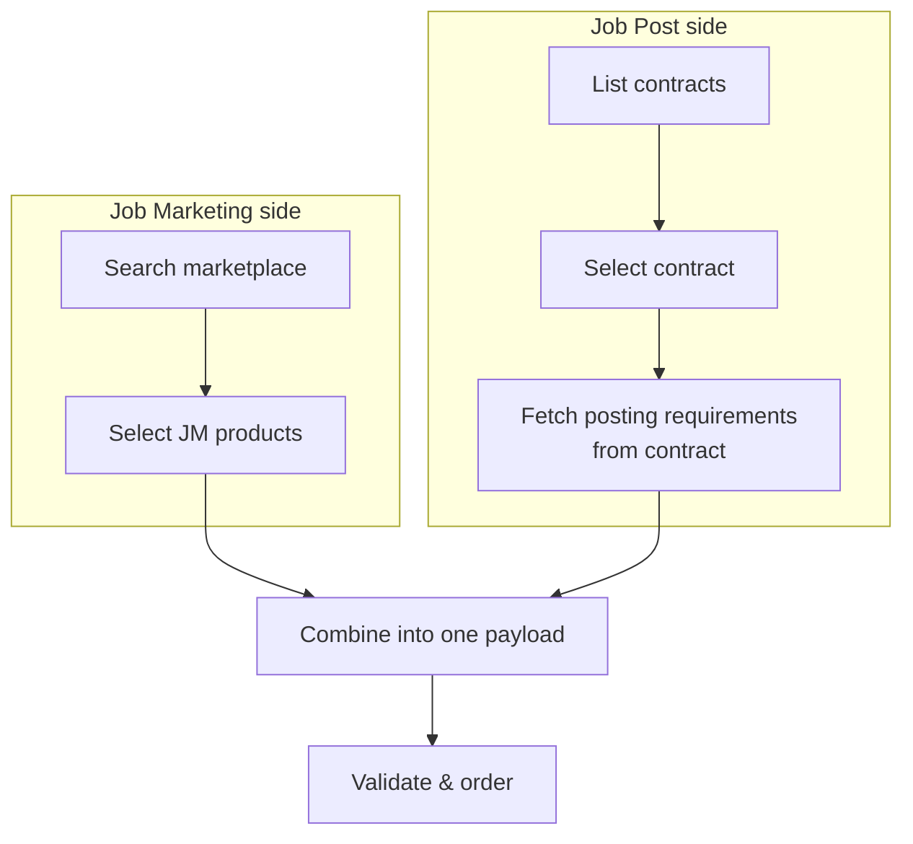

# Mixed Campaign

> Combine Job Marketing and Job Post products in a single campaign order.

## What is a Mixed Campaign?

A mixed campaign includes both **Job Marketing** (JM) and **Job Post** (JP) products in the same order. One API call, one `campaignId`, one vacancy - distributed across both VONQ-managed channels and your own job board accounts.

Everything you learned in the [Job Marketing Campaign](./job-marketing-ordering.md) and [Job Post](./job-post-campaign.md) scenarios applies. The only difference is how you assemble the payload.

## How It Works



The rule is simple:

- **JM products** go in `orderedProducts` only - no `orderedProductsSpecs` entry needed. Posting requirements (if any) come from the **product**.
- **JP products** go in both `orderedProducts` **and** `orderedProductsSpecs` (with `contractId` + `postingRequirements`). Posting requirements come from the **contract**, not the product - fetch them via `GET /contracts/single/{contract_id}/`.

### Where the IDs Come From

<!-- theme: danger -->
> ### MC Products Are Not in the Marketplace Search
> My Contract product IDs (`mc_only: true`) are **not returned by `GET /products/search/`** - they are filtered out server-side. The only way to obtain the product ID is from the contract object. See [Marketplace - Contract-Only Products](../05-products/02-marketplace.md#contract-only-products).

For JP products, two IDs come from the contract - do not mix them up:

| ID | Source | Where It Goes |
|----|--------|---------------|
| **Product ID** | `GET /contracts/single/{contract_id}/` → `product.product_id` | `orderedProducts[]` **and** `orderedProductsSpecs[].productId` |
| **Contract ID** | `GET /contracts/single/{contract_id}/` → `contract_id` | `orderedProductsSpecs[].contractId` |

For JM products, the product ID comes from the marketplace search (`GET /products/search/`) and only goes in `orderedProducts[]`.

The full relationship:

```
┌─ Marketplace search ──────────────────────────────────┐
│  JM product_id ─────────────────► orderedProducts[0]  │
└───────────────────────────────────────────────────────┘

┌─ Contract (GET /contracts/single/{contract_id}/) ──────────────┐
│  product.product_id ────────────► orderedProducts[1]   │
│                      └──────────► specs[0].productId   │
│  contract_id ───────────────────► specs[0].contractId  │
│  posting_requirements ──(fill)──► specs[0].postingReq  │
└────────────────────────────────────────────────────────┘
```

## Payload Structure

```json
{
  "companyId": "customer-123",
  "recruiterInfo": { ... },
  "postingDetails": { ... },
  "targetGroup": { ... },

  "orderedProducts": [
    "d1e2f3a4-b5c6-7890-abcd-ef1234567890",
    "d2e3f4a5-b6c7-8901-bcde-f12345678901"
  ],

  "orderedProductsSpecs": [
    {
      "productId": "d2e3f4a5-b6c7-8901-bcde-f12345678901",
      "contractId": "a1b2c3d4-e5f6-7890-abcd-ef1234567890",
      "postingRequirements": {
        "location": "amsterdam",
        "AdType": "classic"
      }
    }
  ]
}
```

Notice:
- `d1e2f3a4...` (JM) appears in `orderedProducts` only
- `d2e3f4a5...` (JP) appears in both `orderedProducts` and `orderedProductsSpecs`

The vacancy fields (`postingDetails`, `targetGroup`, `recruiterInfo`) are shared across all products - you fill them in once.

## Constraints

<!-- theme: warning -->
> ### Contract Group Constraint
> If you include multiple JP products, all their contracts must belong to the same contract group. JM products are not affected by this constraint.

<!-- theme: info -->
> ### Loose Validation for Mixed Campaigns
> If you use `?loose=true`, HAPI combines `settings.campaigns.loose_validation.marketplace.fields` and `settings.campaigns.loose_validation.job_post.fields`. Only fields in that union may be omitted. Retrieve these settings from [GET /v3/ats/atsuser/me/settings/](../03-authentication-and-users/authentication.endpoints.md).

## Validation

Validate the same way as a JP campaign:

1. **Per JP product** - `POST /campaigns/validate-channel-posting/` for each JP product's posting requirements
2. **Full campaign** - `POST /campaigns/order?validateOnly=true` to validate everything together

JM products are validated as part of the full campaign validation - no separate step needed.

## Worked Example

For a complete channel-specific walkthrough - including the posting requirements resolution chain, facet-by-facet guidance, and a minimum viable `postingRequirements` payload - see the [SEEK worked example in the Job Post Campaign scenario](./job-post-campaign.md#worked-example-seek-australia--new-zealand).

## Related

- [Job Marketing Campaign](./job-marketing-ordering.md) - JM-only flow
- [Job Post Campaign](./job-post-campaign.md) - JP-only flow with posting requirements, includes a SEEK worked example
- [Ordering](../08-campaigns/ordering.md) - full ordering reference
- [Ordering with Contracts](../06-contracts/ordering.md) - `orderedProductsSpecs` details and mixed-product examples
