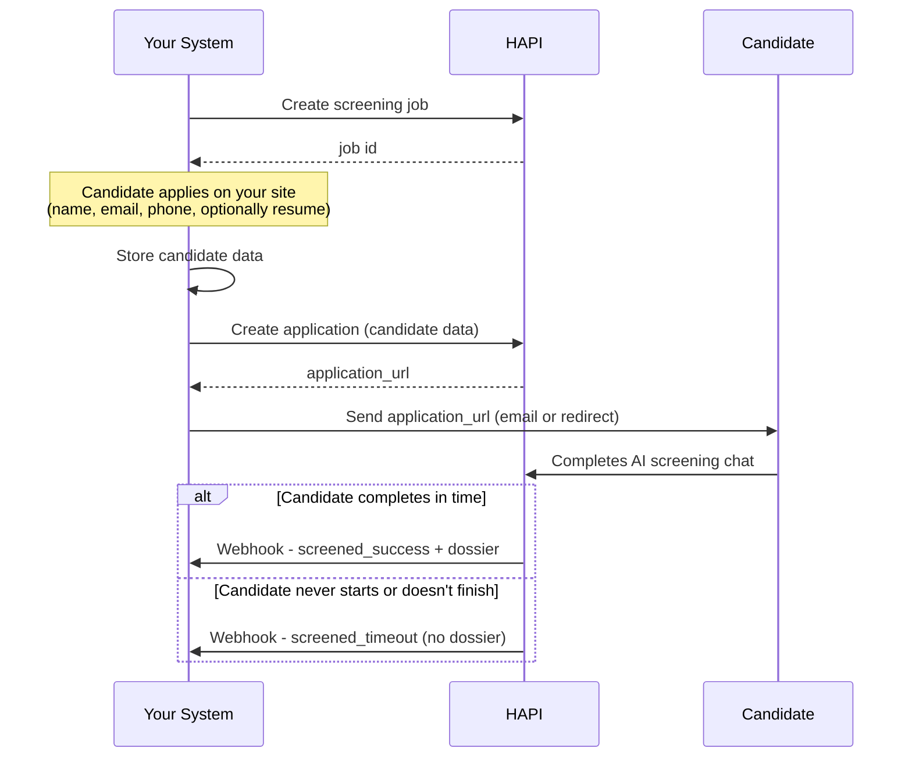
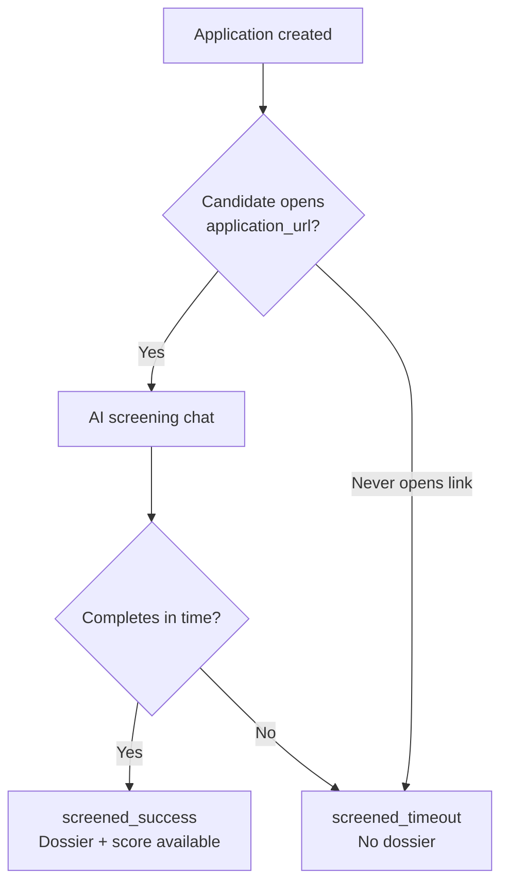

# Screening

> Create a screening job, submit candidates, and receive AI-scored dossiers.

## Goal

By the end of this scenario you will have a screening job running, candidates going through the AI interview, and scored dossier PDFs coming back to your system.

## What is Screening?

Screening is an AI-powered candidate evaluation feature. You define a job with screening criteria, candidates complete an interactive AI chat, and HAPI delivers a scored PDF dossier. It operates independently from campaigns.

<!-- theme: warning -->
> ### Account Activation Required
> Screening must be enabled by your VONQ account manager. API calls return `403` if not enabled.

For the full concept reference, see [Screening - Introduction](../11-screening/01-introduction.md).

## Overview



## Step 1: Create a Screening Job

```
POST /v3/screening/jobs/
```

```json
{
  "data": {
    "job": {
      "title": "Senior Software Engineer",
      "description": "<p>We are looking for a senior engineer...</p>"
    },
    "company": {
      "name": "Acme Corp",
      "logo_url": "https://your-company.example.com/logo.png"
    }
  },
  "requirements": [
    {
      "summary": "Python experience",
      "description": "At least 3 years of professional Python development",
      "question": "How many years of Python experience do you have?"
    },
    {
      "summary": "System design",
      "question": "Can you describe a complex system you have designed?"
    }
  ],
  "settings": {
    "finalization_time_hours": 72,
    "webhook_url": "https://your-ats.example.com/webhooks/vonq/screening"
  }
}
```

| Field | Description |
|-------|-------------|
| `data.job.title` / `data.job.description` | The AI uses these to guide the conversation and ask relevant questions |
| `data.company.name` / `data.company.logo_url` | Company branding shown in the screening chat. `logo_url` must be a publicly reachable image URL |
| `requirements` | Optional screening criteria - **never shown to candidates**. The AI uses them internally to ask targeted questions and score answers |
| `settings.finalization_time_hours` | How many hours a candidate has to complete the screening (1–168, default 168 = 7 days). See [Finalization & Timeout](#finalization--timeout) |
| `settings.webhook_url` | Override the default webhook URL for this job |

The response gives you the **job ID** for all subsequent calls.

<!-- theme: info -->
> ### Jobs Are Immutable
> Once created, a screening job cannot be updated - only soft-deleted. Create a new job if you need to change requirements or settings.

## Step 2: Collect Candidate Data on Your Side

On your website or ATS, the candidate fills in their details:

- First name
- Last name
- Phone number
- Email address
- Resume (optional)

You store this on your end first, then submit it to HAPI.

## Step 3: Create the Application in HAPI

```
POST /v3/screening/jobs/{job_id}/applications/
```

Without a resume (minimum required fields):

```json
{
  "initial_payload": {
    "firstName": "Jane",
    "lastName": "Doe",
    "phoneNumbers": [
      { "type": "personal", "number": "+31612345678", "isPreferred": true }
    ],
    "emailAddresses": [
      { "emailAddress": "jane.doe@example.com", "isPreferred": true }
    ]
  }
}
```

With a resume (remote URL):

```json
{
  "initial_payload": {
    "firstName": "Jane",
    "lastName": "Doe",
    "phoneNumbers": [
      { "type": "personal", "number": "+31612345678", "isPreferred": true }
    ],
    "emailAddresses": [
      { "emailAddress": "jane.doe@example.com", "isPreferred": true }
    ],
    "attachments": [
      { "filename": "resume.pdf", "type": "RESUME" }
    ]
  },
  "remote_files": [
    { "filename": "resume.pdf", "remoteUrl": "https://example.com/resumes/jane-doe-cv.pdf" }
  ]
}
```

<!-- theme: info -->
> ### Attachments Are Optional
> You can create an application without any resume or files. The AI screening chat works with or without a resume - if provided, the AI uses it as additional context for evaluating the candidate.

The response includes an **`application_url`** - the screening chat URL for this specific candidate.

## Step 4: Send the Candidate to the Screening Chat

Deliver the `application_url` to the candidate. How you do this is up to you:

- **Redirect** - send them directly after they apply on your site
- **Email** - include the link in a confirmation email
- **In-app** - show it in a candidate portal

The candidate opens the link and completes the AI-powered screening conversation. The AI asks questions based on your job description and requirements, evaluates the answers, and generates a scored dossier.

<!-- theme: info -->
> ### Resumable Sessions
> If a candidate returns to the same `application_url`, they resume from where they left off. The link stays valid until finalization.

## Step 5: Receive Results

Once the candidate finishes (or the timeout expires), HAPI notifies you.

### Via Webhook (Recommended)

HAPI sends a POST to your webhook URL with the candidate data, screening status, and dossier attachment metadata.

### Via Polling

```
GET /v3/screening/jobs/{job_id}/applications/{id}/
```

Poll until `status` changes from `created` to `screened_success` or `screened_timeout`.

You can also list all applications for a job:

```
GET /v3/screening/jobs/{job_id}/applications/
```

This returns all applications with their current status, score, and timestamps - useful for building a dashboard or syncing results in bulk.

### Successful Screening

When status is `screened_success`:

| Field | Description |
|-------|-------------|
| `screened_score` | Integer 0–100 (higher is better) |
| `screened_payload` | Enriched candidate data from the AI conversation |

Download the dossier PDF via the attachments endpoint:

```
GET /v3/screening/jobs/{job_id}/applications/{id}/attachments/
```

The `DOSSIER` attachment is the AI-generated screening report.

See [Screening - Webhooks](../11-screening/webhooks.md) for webhook payload structure and file delivery modes.

## Finalization & Timeout

The `finalization_time_hours` setting controls how long a candidate has to complete the screening from the moment the application is created.



| Outcome | Status | Dossier? | When it happens |
|---------|--------|----------|-----------------|
| Candidate completes the chat | `screened_success` | Yes | As soon as the conversation ends |
| Candidate starts but doesn't finish in time | `screened_timeout` | No | After `finalization_time_hours` expires (with a buffer for mid-conversation candidates) |
| Candidate never opens the link | `screened_timeout` | No | After `finalization_time_hours` expires |

<!-- theme: warning -->
> ### No Dossier on Timeout
> When the status is `screened_timeout`, there is no dossier - HAPI has no collected information to evaluate. Your system should handle this gracefully (e.g., mark the candidate as "screening expired" in your ATS).

<!-- theme: info -->
> ### Buffer for Active Candidates
> If a candidate is mid-conversation when the timer runs out, HAPI provides an additional buffer period so they can finish. The timeout only applies hard when the candidate hasn't started or has been idle.

## What You Have Now

After completing this scenario:

- A **screening job** with AI evaluation criteria
- Candidates going through the AI screening chat via `application_url`
- **Scored dossier PDFs** for candidates who complete, and **timeout notifications** for those who don't

## Related

- [Screening - Introduction](../11-screening/01-introduction.md) - concepts, integration patterns, key terms
- [Screening - Jobs & Applications](../11-screening/jobs-and-applications.md) - full endpoint reference, file uploads, filtering, HAPI-collected pattern
- [Screening - Webhooks](../11-screening/webhooks.md) - webhook payload, file delivery modes, HMAC verification
